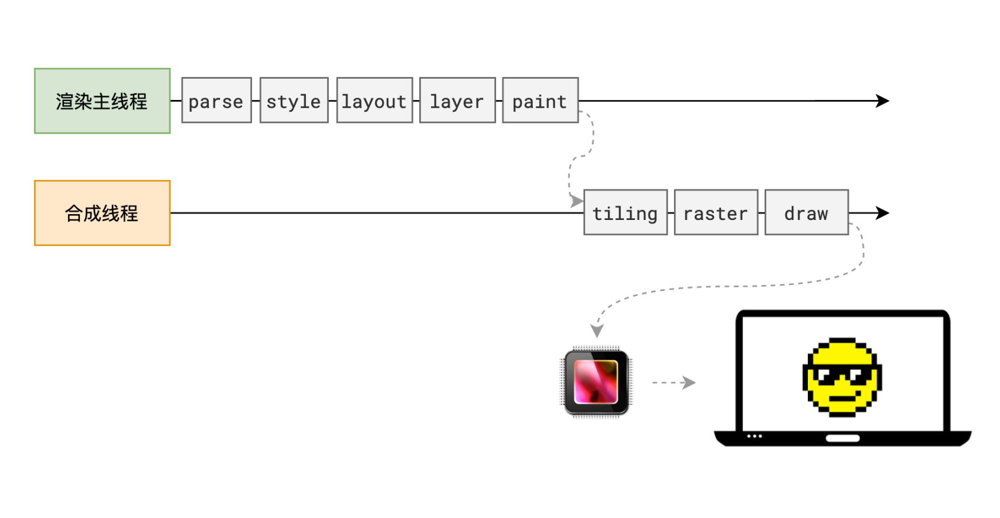

# 常见 HTML 面试题

## 1. 什么是 HTML？

HTML（HyperText Markup Language）是一种用于创建网页和网上信息的标准标记语言。它由一系列的元素组成，这些元素可以告诉浏览器如何展示内容。HTML 文档由嵌套的标签组成，每个标签都具有特定的意义和功能。

HTML 用于定义网页的结构和内容，浏览器通过解析 HTML 文件来显示网页。它可以帮助开发人员创建结构化的文档，并控制页面的外观和行为。HTML 还可以与其他技术结合使用，如 CSS（Cascading Style Sheets）和 JavaScript，来实现更复杂的交互效果。HTML 是构建网页和网上信息的基础。

## 2. `DOCTYPE`有什么用？

DOCTYPE 是 document type (文档类型) 的缩写。<!DOCTYPE>声明位于文档的最前面，处于标签之前，它不是 html 标签。主要作用是告诉浏览器的解析器使用哪种 HTML 规范或者 XHTML 规范来解析页面。

DOCTYPE 声明的目的是：防止浏览器在渲染文档时，进入“怪异模式”渲染。“<!DOCTYPE html>" 确保浏览器按照标准模式进行渲染，而不是使用一个不符合规范的渲染模式。

在 HTML 中<!DOCTYPE>常见声明类型共有 8 种，其中 HTML5 有 1 种，HTML 4.01 和 XHTML 1.0 都有 3 种，XHTML 1.1 有 1 种。

## 3. 标准模式与兼容模式各有什么区别？

- 标准模式：浏览器按照 W3C 标准解析执行代码，在兼容模式下，页面以宽松的向后兼容的方式显示，模拟老式浏览器的行为以防止站点无法工作。
- 兼容模式：浏览器以怪异模式（Quirks mode）解析执行代码，它有可能出现一些旧式浏览器不支持的渲染效果。

## 4. meta 标签干什么的，都有什么属性和作用？

meta 标签是 HTML 文档中最重要的标签之一，它用于描述网页的元数据（metadata）和提供有关页面内容的附加信息。它不会显示在页面上，但是对于机器是可读的，并告诉机器该如何解析这个页面。在 HTML 中，meta 标签通常位于 head 元素内部，用于定义页面的标题、字符集、关键词、作者等信息。

常见的 meta 属性有：

- charset：指定 HTML 文档的字符编码，如 utf-8、gbk 等；
- name：用于定义元数据的名称，如 keywords、description 等；
- content：用于定义与 name 属性相关的内容，如关键字、描述等；
- http-equiv：用于定义 HTTP 响应头信息，如 refresh、set-cookie 等；
- scheme：用于定义元数据的格式化模式，如 date、time 等；
- property：用于定义 Open Graph 元数据，如 og:title、og:image 等；

## 5. 说说你对 HTML 语义化的理解 ？

语义化 HTML 是指使用具有明确含义的 HTML 标签来组织和结构化页面内容，使 HTML 更易于开发人员和机器的阅读和理解。

**为什么要语义化 ?**

- 为了在没有 CSS 的情况下，页面也能呈现出很好地内容结构、代码结构，易于阅读；
- 提升用户体验：如 title、alt 属性用于名词解释或图片内容说明，以及 label 标签的灵活运用等；
- 有利于 SEO 优化：与搜索引擎建立良好沟通，有助于爬虫抓取更多的有效信息，爬虫依赖于标签来确定上下文和各个关键字的权重；
- 可访问性：帮助辅助技术（如视障用户的屏幕阅读器、屏幕阅读器）更好的阅读和转译你的网页，利于无障碍阅读；
- 国际化：全球只有 13%的人口是英语母语使用者，因此遵循 W3C 标准通用的语义化标签可以让各国开发者更容易弄懂你网页的结构；
- 可维护性：语义化更具可读性，减少网页间的差异性，方便后期开发和维护；

**在写 HTML 代码时，语义化实践中应该注意什么 ？**

- 尽可能少的使用无语义的标签 div 和 span；
- 在语义不明显时，既可以使用 div 或者 p 时，尽量用 p, 因为 p 在默认情况下有上下间距，对兼容特殊终端有利；
- 不要使用纯样式标签，如：b、font、u 等，改用 css 设置；
- 需要强调的文本，可以包含在 strong 或 em 标签中，strong 默认样式是加粗（不要用 b），em 是斜体（不要用 i 标签）；
- 使用表格时，标题要用 caption，表头用 thead，主体部分用 tbody 包围，尾部用 tfoot 包围。表头和一般单元格要区分开，表头用 th，单元格用 td；
- 表单域要用 fieldset 标签包起来，并用 legend 标签说明表单的用途；
- 每个 input 标签对应的说明文本都需要使用 label 标签，并且通过为 input 设置 id 属性，在 lable 标签中设置 for=someld 来让说明文本和相对应的 input 关联起来。
- 不仅写 html 结构时，要用语义化标签，给元素写 css 类名时，JS 类名、方法名、变量命名等也要遵循语义化原则。不随意取名，不利于后期的代码重构和维护。同时，也最好不要用汉语拼音命名。

## 6. HTML5 新增了哪些语义化标签 ？

- \<header>：用于定义页面的头部区域，通常包含网站名称、导航栏等。
- \<nav>：用于定义页面的导航部分，通常包含链接列表等。
- \<article>：用于定义独立的文章或内容块，通常包含标题、作者等信息。
- \<section>：用于定义页面中的区块或部分，通常包含标题和内容。
- \<aside>：用于定义页面的侧边栏或相关内容，通常包含广告、相关链接等。
- \<footer>：用于定义页面的底部区域，通常包含版权信息、联系方式等。
- \<details>：用于定义可折叠的详细信息区域，通常与 \<summary> 标签一起使用。
- \<dialog>：用于定义对话框或弹出窗口，通常与 JavaScript 配合使用。
- \<main>：用于定义页面的主要内容区域。
- \<figure>：用于定义图片、图表等独立的内容。
- \<figcaption>：用于定义 figure 元素的标题或说明。
- \<summary>：用于定义 details 元素的摘要或标题。
- \<mark>：定义带有记号的文本，用于突出显示文本，通常与 CSS 配合使用。

## 7. 你了解哪些 HTLML5 新特性？

**新增的有：**

- 语义化标签（header、nav、main、section、article、aside、details、figcaption、figure、mark、summary、time、footer 等）
- Canvas 画布和 SVG 矢量图
- 拖放（Drag and drop）
- 音频、视频（audio、video）
- 地理定位（Geolocation）
- 本地离线存储（localStorage）长期存储数据，关闭浏览器后不丢失。
- 会话储存（sessionStorage）数据在关闭浏览器后自动删除。
- 表单控件（calendar、date、time、email、url、search）
- 新 API（Web Worker、Web Socket）
- 新的文档属性（document.visibilityState）

**移除的元素有：**

- 纯表现的元素：basefont，big，center，font, s，strike，tt，u
- 对可用性产生负面影响的元素：frame，frameset，noframes

## 8. form 表单的属性说一说

- HTML 表单用于搜集不同类型的用户输入
- 单纯的 form 标签没有任何作用，我们通过设置 form 标签的属性值以及为它添加子元素，从而达到上传数据以及和服务器进行通讯交互的目的。
- `<form>`标签的属性规定了当前网页上传数据的地址和方式。

| form 属性      | 描述                                                                                                                                                                                                                                                                                                                                                                                                                     |
| -------------- | ------------------------------------------------------------------------------------------------------------------------------------------------------------------------------------------------------------------------------------------------------------------------------------------------------------------------------------------------------------------------------------------------------------------------ |
| action         | 规定提交表单时将表单数据发送到何处，如果 action 的值为空或者#，则数据交由本页面处理。                                                                                                                                                                                                                                                                                                                                    |
| method         | method 即方法，规定发送表单数据时要使用的 HTTP 方法                                                                                                                                                                                                                                                                                                                                                                      |
| name           | Form 标签元素自身并没有数据传输，它的 name 属性只是提供了一种在脚本中引用表单的方法。对 form 进行标记，为 form 取个名字与此同时，form 标签元素内的数据都是通过 name 来传递的，只有设置了 name 属性的表单元素才能在提交表单时传递它们的值。                                                                                                                                                                               |
| accept-charset | 规定了服务器使用哪一种字符集编码来处理本页面所上传的数据。常用的有“UTF-8”、“ISO-8859-1"、"gb2312"等                                                                                                                                                                                                                                                                                                                      |
| enctype        | 规定在发送到服务器之前应该如何对表单数据进行编码 ① application/x-www-form-urlencoded： 在发送前编码所有字符（默认值）把 "+" 转换为空格，并且把特殊字符转换为 ASCII 十六进制值。在不涉及文件传输时，一般使用这种方式；② multipart/form-data： 不对字符编码，在使用包含文件上传控件的表单时（如：文档，图片、视频、MP3 等）必须使用该值；③ text/plain：将内容设置为纯文本的形式，空格转换为 "+" 加号，但不对特殊字符编码； |
| target         | target 属性规定在何处打开 action URL，① \_blank 在新窗口中打开；② \_self 默认，在相同的框架中打开；③ \_parent 在父框架集中打开；④ \_top 在整个窗口中打开；⑤ framename 在指定的框架中打开                                                                                                                                                                                                                                 |
| autocomplete   | ① 规定浏览器应该自动完成表单（默认：开启）当用户在字段开始键入时，浏览器基于之前键入过的值，显示出在 ② 该字段中填写过的选项，从而简化用户的输入；③ autocomplete 只有两个值，on 和 off，分别对应启用和关闭这个功能。默认值为 on                                                                                                                                                                                           |
| novalidate     | 规定当提交表单时不对其进行验证，通过将 novalidate=novalidate 属性放置到 form 元素上，form 元素的原生校验特征就会忽略，这样就可以防止它同 JavaScript 的校验方法起冲突                                                                                                                                                                                                                                                     |

## 9. HTML5 中有哪些新的表单输入类型？

HTML5 引入了多种新的表单输入类型，这些新类型不仅提升了用户输入的友好性，还增强了表单数据的验证能力。以下是 HTML5 中新增的主要表单输入类型及其简要描述：

1. **email**：用于电子邮件地址的输入。浏览器会自动验证输入值是否符合电子邮件的标准格式[@1@][@2@][@3@]。

- 使用示例：`<input type="email" name="useremail" placeholder="example@example.com" required>`

2. **url**：用于 URL 地址的输入。浏览器会自动验证输入值是否符合 URL 的标准格式[@1@][@2@][@3@]。

- 使用示例：`<input type="url" name="website" placeholder="https://example.com" required>`

3. **number**：用于数值的输入。可以限制数值的范围、步长等[@1@][@2@][@3@]。

- 使用示例：`<input type="number" name="quantity" min="1" max="10" step="1" required>`

4. **range**：用于一定范围内数字值的输入，通常显示为滑动条。可以设定最小值、最大值等[@1@][@2@][@3@]。

- 使用示例：`<input type="range" name="age" min="18" max="60" step="1">`

5. **date**：用于日期选择。浏览器会提供日期选择器[@1@][@2@][@3@]。

- 使用示例：`<input type="date" name="bday" required>`

6. **time**、**month**、**week**：分别用于时间、月份及周的选择[@2@][@3@]。

- 使用示例（time）：`<input type="time" name="meetingtime">`
- 使用示例（month）：`<input type="month" name="bdaymonth">`
- 使用示例（week）：`<input type="week" name="weekofbirth">`

7. **datetime-local**：用于选择日期和时间（无时区）[@2@][@3@]。

- 使用示例：`<input type="datetime-local" name="bdaytime">`

8. **search**：用于搜索字段，表现类似常规文本字段，但可能在某些浏览器或设备上有特殊表现[@2@][@3@]。

- 使用示例：`<input type="search" name="searchterm" placeholder="Search...">`

9. **color**：用于颜色选择。通常显示为颜色选择器[@1@][@3@]。

- 使用示例：`<input type="color" name="favcolor">`

10. **tel**：用于电话号码的输入。尽管不会进行自动验证，但可以提供更合适的输入方式（如虚拟键盘）[@2@][@3@]。
    - 使用示例：`<input type="tel" name="phone" placeholder="Enter your phone number">`

这些新的输入类型不仅改善了用户体验，还简化了表单验证的工作，是现代 Web 开发中不可或缺的一部分。

## 10. 说一下 href 和 src 的区别

href 用于建立当前页面与引用资源之间的关系，而 src 会替换当前元素。

遇到 href，页面会并行加载后续内容，而 src 则需要浏览器加载完毕 src 的内容才会继续往下走。

src 是 source 的缩写，指向外部资源的位置

- 指向的内容将会嵌入到文档中当前标签所在位置或下载并应用到文档内；如 js 脚本，img 图片和 iframe 等元素。
- 当浏览器解析到该元素时，会暂停其他资源的下载和处理，直到将该资源加载、编译、执行完毕，图片和框架等元素也如此，类似于将所指向资源嵌入当前标签内。这也是为什么将 js 脚本放在底部而不是头部。

href 是 Hypertext Reference 的缩写，指向网络资源所在位置

- 建立和当前元素（锚点）或当前文档（链接）之间的链接，如果我们在文档中添加\<link href="common.css" rel="stylesheet"/>那么浏览器会识别该文档为 css 文件，就会并行下载资源并且不会停止对当前文档的处理。
- 这也是为什么建议使用 link 方式来加载 css，而不是使用@import 方式。

## 11. `<script>` 标签放在 `<head>` 的优缺点

在 HTML 文档中，`<script>` 标签用于引入外部 JavaScript 文件或编写内联 JavaScript 代码。将 `<script>` 标签放置在 `<head>` 中有以下优缺点：

**优点：**

**1. 保持文档完整性**
将 `<script>` 标签放在 `<head>` 中可以确保在页面内容加载之前，脚本已被加载和解析。这对于那些依赖于脚本以正确显示或初始化页面元素的情况非常有用。

**2. 避免页面内容闪烁**
如果脚本在页面内容之后加载，可能会引起页面内容的闪烁，因为脚本可能会修改已经渲染的页面内容。将脚本放在 `<head>` 中可以减少这种闪烁。

**3. 控制加载顺序**
将 `<script>` 标签放在 `<head>` 中可以确保在页面的其余部分渲染之前，脚本已被加载和执行，从而控制资源的加载顺序。

**缺点：**

**1. 阻塞解析**
将 `<script>` 标签放在 `<head>` 中会导致 HTML 解析器阻塞，直到脚本被下载和执行完毕。这可能会延迟页面的渲染，影响用户体验。

**2. 延迟页面交互**
如果脚本文件很大或者网络连接慢，将 `<script>` 标签放在 `<head>` 中可能会延迟用户与页面的交互，因为用户需要等待脚本加载和执行完成才能看到页面内容。

**3. 难以动态加载资源**
将 `<script>` 标签放在 `<head>` 中可能会使得动态加载资源（如根据用户操作加载的脚本）变得困难，因为浏览器会尝试在页面渲染之前加载所有脚本。

**最佳实践：**

为了避免上述缺点，可以采取以下措施：

**1. 使用 `defer` 属性**
将 `<script>` 标签放在 `<head>` 中，并使用 `defer` 属性，这样脚本会在页面解析完毕后、`DOMContentLoaded` 事件触发前执行，不会阻塞页面渲染。

**2. 使用 async 属性**
如果脚本不需要依赖于页面的其余部分，可以使用 async 属性，这样脚本会异步加载，不会阻塞页面解析。

**3. 将脚本放在 \<body> 的底部**
将 \<script> 标签放在 \<body> 标签的底部，这样页面内容会在脚本加载和执行之前渲染，可以提高用户体验。

## 12. 行内元素和块级元素的区别

HTML4 中，元素被分成两大类：inline （内联元素）与 block （块级元素）。

1. 格式上，默认情况下，行内元素不会以新行开始，而块级元素会新起一行。
2. 内容上，默认情况下，行内元素只能包含文本和其他行内元素。而块级元素可以包含行内元素和其他块级元素。
3. 行内元素与块级元素属性的不同，主要是盒模型属性上：行内元素设置 width 无效，height 无效（可以设置 line-height），设置 margin 和 padding 的上下不会对其他元素产生影响。

## 13. HTML5 元素的分类

HTML4 中，元素被分成两大类: inline（内联元素）与 block（块级元素）。但在实际的开发过程中，因为页面表现的需要，前
端工程师经常把 inline 元素的 display 值设定为 block （比如 a 标签），也经常把 block 元素的 display 值设定为
inline 之后更是出现了 inline-block 这一对外呈现 inline 对内呈现 block 的属性。因此，简单地把 HTML 元素划分为
inline 与 block 已经不再符合实际需求。

HTML5 布局元素的分类，以及它们的作用：

**1. Metadata（元数据）**
元数据元素提供了关于 HTML 文档的信息，这些信息通常不直接显示在页面上，但对搜索引擎、浏览器行为和其他网页有影响。

- \<meta>：定义文档的元数据，如字符集、页面描述、关键词等。
- \<title>：定义文档的标题，显示在浏览器标签页上。
- \<link>：链接外部资源，如 CSS 文件。
- \<script>：嵌入或引用 JavaScript 脚本。

**2. Flow（流式内容）**
流式内容元素构成了文档的主体，它们按照在 HTML 文档中出现的顺序进行布局。

- \<p>：定义段落。
- \<div>：用于将内容分组，通常用于应用 CSS 样式。
- \<span>：用于对文本范围内的一小部分进行分组和样式化。
- \<article>、\<section>、\<aside>、\<header>、\<footer>：这些语义化元素定义了文档的不同部分和区域。

**3. Sectioning（区段）**
区段元素用于定义文档中的独立部分，每个部分都有自己的标题。

- \<article>：表示独立的、自包含的内容区域，如博客文章。
- \<section>：表示文档中的一个区段，通常包含一个标题。
- \<nav>：用于定义导航链接。
- \<header>：表示一个页面或一个页面区域的头部。
- \<footer>：表示一个页面或一个页面区域的底部。

**4. Heading（标题）**
标题元素用于定义文档的标题和子标题。

\<h1> 到 \<h6>：定义六级不同的标题，其中 \<h1> 是最高级别的标题。

**5. Phrasing（短语）**
短语内容元素用于定义文本级别的语义，它们可以包含在流式内容元素中。

- \<a>：定义超链接。
- \<strong>：表示重要的文本。
- \<em>：表示强调的文本。
- \<span>：用于对文本范围内的一小部分进行分组和样式化。
- \：嵌入图像。

**6. Embedded（嵌入内容）**
嵌入内容元素用于在 HTML 文档中包含非 HTML 内容，如视频、音频、图片和插件。

- \<audio>：用于在网页中嵌入音频内容。
- \<video>：用于在网页中嵌入视频内容。
- \<canvas>：用于绘制图形和动画。
- \<iframe>：用于嵌入另一个文档。

**7. Interactive（交互内容）**
交互内容元素用于创建用户可以与之交互的元素。

- \<button>：用于创建按钮。
- \<input>：用于创建不同类型的输入字段，如文本框、复选框、单选按钮等。
- \<select>：用于创建下拉选择框。
- \<textarea>：用于创建多行文本输入框。
- \<label>：用于创建表单元素的标签。
- \<menu>：用于创建菜单或工具栏。

通过这些元素的组合使用，开发者可以创建出结构清晰、语义丰富的 HTML5 页面布局。这些布局不仅有助于提升用户体验，还对搜索引擎优化（SEO）有积极作用。

## 14. 页面导入样式时，使用 link 和 @import 有什么区别？

link 和 @import 都是 CSS 中用于导入样式文件的方式，它们之间有以下区别：

1. 从属关系区别。 @import 是 CSS 提供的语法规则，只有导入样式表的作用；link 是 HTML 提供的标签，不仅可以加载 CSS 文件，还可以定义 RSS、rel 连接属性、引入网站图标等。
2. 加载顺序区别。加载页面时，link 标签引入的 CSS 被同时加载；@import 引入的 CSS 将在页面加载完毕后被加载。
3. 兼容性区别。@import 是 CSS2.1 才有的语法，故只可在 IE5+ 才能识别；link 标签作为 HTML 元素，不存在兼容性问题。
4. DOM 可控性区别。可以通过 JS 操作 DOM ，插入 link 标签来改变样式；由于 DOM 方法是基于文档的，无法使用 @import 的方式插入样式。

## 15. 你对浏览器的理解？

浏览器的主要功能是将用户选择的 web 资源呈现出来，它需要从服务器请求资源，并将其显示在浏览器窗口中，资源的格式通常是 HTML，也包括 PDF、image 及其他格式。用户用 URI（Uniform Resource Identifier 统一资源标识符）来指定所请求资源的位置。

HTML 和 CSS 规范中规定了浏览器解释 html 文档的方式，由 W3C 组织对这些规范进行维护，W3C 是负责制定 web 标准的组织。

但是浏览器厂商纷纷开发自己的扩展，对规范的遵循并不完善，这为 web 开发者带来了严重的兼容性问题。

简单来说浏览器可以分为两部分，shell 和 内核。

其中 shell 的种类相对比较多，内核则比较少。shell 是指浏览器的外壳：例如菜单，工具栏等。主要是提供给用户界面操作，参数设置等等。它是调用内核来实现各种功能的。内核才是浏览器的核心。内核是基于标记语言显示内容的程序或模块。也有一些 浏览器并不区分外壳和内核。从 Mozilla 将 Gecko 独立出来后，才有了外壳和内核的明确划分。

## 16. 介绍一下你对浏览器内核的理解？

主要分成两部分：渲染引擎和 JS 引擎。

渲染引擎的职责就是渲染，即在浏览器窗口中显示所请求的内容。默认情况下，渲染引擎可以显示 html、xml 文档及图片，它也可以借助插件（一种浏览器扩展）显示其他类型数据，例如使用 PDF 阅读器插件，可以显示 PDF 格式。

JS 引擎：解析和执行 javascript 来实现网页的动态效果。

最开始渲染引擎和 JS 引擎并没有区分的很明确，后来 JS 引擎越来越独立，内核就倾向于只指渲染引擎。

## 17. 常见的浏览器内核比较

**Trident：** 这种浏览器内核是 IE 浏览器用的内核，因为在早期 IE 占有大量的市场份额，所以这种内核比较流行，以前有很多网页也是根据这个内核的标准来编写的，但是实际上这个内核对真正的网页标准支持不是很好。但是由于 IE 的高市场占有率，微软也很长时间没有更新 Trident 内核，就导致了 Trident 内核和 W3C 标准脱节。还有就是 Trident 内核的大量 Bug 等安全问题没有得到解决，加上一些专家学者公开自己认为 IE 浏览器不安全的观点，使很多用户开始转向其他浏览器。

**Gecko：** 这是 Firefox 和 Flock 所采用的内核，这个内核的优点就是功能强大、丰富，可以支持很多复杂网页效果和浏览器扩展接口，但是代价是也显而易见就是要消耗很多的资源，比如内存。

**Presto：** Opera 曾经采用的就是 Presto 内核，Presto 内核被称为公认的浏览网页速度最快的内核，这得益于它在开发时的天生优势，在处理 JS 脚本等脚本语言时，会比其他的内核快 3 倍左右，缺点就是为了达到很快的速度而丢掉了一部分网页兼容性。

**Webkit：** Webkit 是 Safari 采用的内核，它的优点就是网页浏览速度较快，虽然不及 Presto 但是也胜于 Gecko 和 Trident，缺点是对于网页代码的容错性不高，也就是说对网页代码的兼容性较低，会使一些编写不标准的网页无法正确显示。WebKit 前身是 KDE 小组的 KHTML 引擎，可以说 WebKit 是 KHTML 的一个开源的分支。

**Blink：** 谷歌在 Chromium Blog 上发表博客，称将与苹果的开源浏览器核心 Webkit 分道扬镳，在 Chromium 项目中研发 Blink 渲染引擎（即浏览器核心），内置于 Chrome 浏览器之中。其实 Blink 引擎就是 Webkit 的一个分支，就像 webkit 是 KHTML 的分支一样。Blink 引擎现在是谷歌公司与 Opera Software 共同研发，上面提到过的，Opera 弃用了自己的 Presto 内核，加入 Google 阵营，跟随谷歌一起研发 Blink。

## 18. 浏览器的渲染原理？



浏览器渲染是一个将 HTML、CSS 和 JavaScript 转换为用户可以看到和交互的网页的过程。这个过程大致可以分为以下几个步骤：

**1. 解析 HTML 文档**
在得到 HTML 文件后，渲染引擎会解析 HTML 文件，生成浏览器可以理解的 DOM 树。

**2. 解析 CSS 样式**
在解析 HTML 的同时，渲染引擎会解析 CSS 文件，生成浏览器可以理解的样式规则，解析 HTML 和 CSS 是并行进行的。浏览器会根据 CSS 文件生成 CSSOM（CSS Object Model）树。

**3. 创建 Render Tree（渲染树）**
解析完 HTML 和 CSS 后，渲染引擎会根据 CSSOM 计算出计算出每个元素的最终样式。这个过程会做一些单位换算，比如 px 转成 pt、百分比转成绝对值等， CSS 样式规则按照优先级、选择器类型、权重计算出最终的样式值，而没有值的属性，如果可以继承，则从父节点继承；如果不能继承，则使用默认值。最终形成一颗渲染树。渲染树是一个包括了所有可见元素的树状结构。

**4. 布局（Layout）**
DOM 节点有了样式，但是位置信息（宽、高）还没有确定，所以渲染引擎会进入布局阶段。布局阶段，浏览器会根据 DOM 树和样式计算出每个元素的几何位置信息。对于可视区外的 DOM 节点，会跳过布局阶段。会为伪元素生成内容，比如 :before 和 :after。所以布局树与 DOM 树不⼀定是⼀⼀对应的。

**5. 分层 - Layer**
布局阶段结束后，渲染引擎会进入分层阶段。分层的作用是：如果某个 DOM 节点有层叠上下文（z-index），则会单独生成一个图层，这个图层就是该 DOM 节点的层。默认 HTML 根节点是根层，其他图层都是其子层。

层叠上下文可以通过 z-index 属性生成，也可以通过 transform、opacity 等属性生成。

**5. 绘制（Painting）**
绘制阶段会遍历分层后的图层，为每⼀层⽣成如何绘制的指令，然后发送给合成线程。这是渲染主线程最后⼀个阶段，剩下的事情都交给合成线程处理。

**6. 分块（Tiling）**
合成线程会将每⼀个图层分为多个小的区域，这些区域叫做图块。分块的作用是：如果某个 DOM 节点需要重绘，但是该节点在另一个图层中，那么这个 DOM 节点不会发送给该图层的合成线程，而是发送给根层，由根层合并后发送给合成线程。分块的工作是交给多个线程并行执行，以提高效率。

**7. 光栅化（Raster）**
合成线程会将图块转换成像素，这个过程叫做光栅化。优先处理靠近视口的图块，因为用户能直接看到的内容越早生成，显示效果越好。这个过程会用到 GPU 硬件加速，并且结果会缓存到 GPU 内存中，供后续步骤使用。

**8. Draw**
合成线程计算出每个位图在屏幕上的确切位置，然后发送给 GPU 进行绘制。

### 什么是回流（reflow）？

reflow 是指浏览器为了重新渲染部分或全部的文档，重新计算文档中的元素位置和几何尺寸的过程。

常见造成回流的场景：

1. 添加或删除可见的 DOM 元素。
2. 元素位置改变。
3. 元素尺寸改变。
4. 内容改变。
5. 浏览器窗口尺寸改变。
6. 属性改变。
7. 获取某些属性。

### 什么是重绘（repaint）？

repaint 是指浏览器为了绘制新的一帧而重新渲染前一帧的内容，通常会导致整个文档的重新绘制，但是 reflow 会导致 repaint 的。

常见造成重绘的场景：

1. 颜色改变。
2. 背景图片改变。
3. 字体大小改变。
4. 字体样式改变。

### 为什么 transform 效率⾼？

transform 不会触发浏览器的重排和重绘，只会触发合成层的合成和层级的重新排序。

## 19. 如何减少重绘和回流？

1. 使用 CSS 样式表，避免使用内联样式。
2. 避免使用复杂的 CSS 选择器，如后代选择器、子选择器和通用选择器等。
3. 使用 transform 属性代替 top、left 等位置属性。
4. 使用 visibility 属性代替 display 属性，因为 display 属性会影响布局。

## 20. 渲染过程中遇到 JS 文件怎么处理？（浏览器解析过程）

HTML 解析过程中遇到 JS 代码时，会暂停 HTML 的解析，先执行 JS 代码。如果 JS 需要下载，会等待下载执⾏完后才能继续 HTML 的解析，预解析线程可以分担⼀点下载 JS 的任务。但是 JS 如果使用 defer 属性，会等到 HTML 解析完成后执行 JS 代码；如果使用 async 属性，会异步下载 JS 代码，不会阻塞 HTML 的解析，下载完成后立即执行 JS 代码。

HTML 解析过程中遇到 CSS 代码时，为了提⾼解析效率，浏览器会启动⼀个预解析器率先下载和解析 CSS 文件，CSS 的下载和解析是异步的，不会阻塞 HTML 的解析。

## 21. 什么是文档的预解析？

文档的预解析（Preloading 扫描）是浏览器在解析 HTML 文档时并行进行的一种优化策略。当浏览器解析 HTML 时，它会在构建 DOM 树的同时，预先扫描文档以发现外部资源，如 CSS 样式表、JavaScript 文件和图片等。一旦这些资源被识别，浏览器可以提前开始加载这些资源，而不是等到 DOM 树完全构建完毕后才开始。

以下是预解析的几个关键点：

- **并行下载：** 预解析允许浏览器并行下载这些外部资源，这可以减少页面加载的总时间。
- **提前发现资源：** 通过预解析，浏览器可以在执行 JavaScript 或应用 CSS 之前发现并开始加载关键资源。
- **优化加载顺序：** 预解析有助于浏览器确定资源加载的优先级，例如，它可以先加载对页面渲染至关重要的 CSS 和 JavaScript 文件。
- **不影响 DOM 构建：** 预解析是在 DOM 构建的同时进行的，不会阻塞 DOM 树的构建过程。
- **提高渲染效率：** 预解析可以确保在需要渲染页面时，所需的资源已经可用或正在加载中，从而减少渲染过程中的延迟。
- **节省时间：** 如果浏览器在解析 HTML 时才遇到资源链接，它需要先完成当前的 DOM 构建工作，才能开始加载这些资源。预解析通过提前发现这些资源，节省了这一过程的时间。

预解析是现代浏览器用来提高网页加载性能的一种技术，它与浏览器的渲染优化紧密相关。通过预解析，浏览器可以更有效地管理资源加载，从而提供更快的用户体验。

## 22. CSS 如何阻塞文档解析？

CSS 不会阻塞 HTML 文档的解析，但它可以阻塞页面的渲染。当浏览器在解析 HTML 文档时遇到一个外部 CSS 文件的链接（通过 `<link>` 标签引入），它会异步请求该 CSS 文件。这意味着 HTML 的解析不会因为 CSS 文件的加载而暂停，但是一旦 CSS 文件被加载并解析，浏览器会使用这些样式信息来渲染页面。

如果 CSS 文件没有被及时加载，浏览器可能会延迟渲染页面，直到 CSS 文件被下载并解析完成。这是因为 CSS 样式对于正确地显示页面内容是必要的，特别是在没有样式的情况下，页面的布局和元素的外观可能会受到影响。

以下是几个关键点：

1. **异步加载**：外部 CSS 文件是异步加载的，这意味着 HTML 解析不会被阻塞。

2. **渲染阻塞**：尽管 CSS 文件的加载不会阻塞 HTML 解析，但它会阻塞渲染。浏览器可能会等待 CSS 文件加载完成，以确保页面能够按照预期的样式显示。

3. **解析顺序**：浏览器会按照在 HTML 文档中遇到的顺序解析资源。如果 CSS 文件在文档中较晚被引用，它对初始渲染的阻塞可能性较小。

4. **性能影响**：为了减少 CSS 对渲染的阻塞，可以采取以下措施：

   - 使用 `<link rel="preload">` 来预加载关键 CSS 文件。
   - 将 CSS 放在文档的 `<head>` 中，以便尽早加载。
   - 使用媒体查询将非关键样式放在单独的文件中，这些文件可以稍后加载。
   - 优化 CSS 文件的大小，减少加载时间。

5. **FOUC**：如果页面内容在样式加载之前被渲染，可能会导致“无样式内容闪烁”（Flash of Unstyled Content，简称 FOUC）。为了避免 FOUC，确保关键 CSS 尽快可用，或者使用 JavaScript 来控制样式的应用。

总之，CSS 不会阻塞 HTML 的解析，但为了确保页面按照预期的样式显示，它会阻塞页面的渲染。通过合理的资源加载策略，可以减少这种阻塞对用户体验的影响。

## 23. JS 如何阻塞文档解析？

JavaScript 对文档解析的阻塞程度取决于脚本的类型和位置。以下是几种不同情况：

**1. 内联脚本**
内联脚本（直接在 HTML 文档中使用 `<script>` 标签包含的 JavaScript 代码）会阻塞文档解析。当浏览器遇到内联脚本时，它会立即执行这些脚本，这意味着文档解析会被暂停，直到脚本执行完毕。

**2. 外部脚本**
外部脚本（通过 `<script src="..."></script>` 引入的 JavaScript 文件）默认情况下也会阻塞文档解析。浏览器会下载并执行这些脚本，但在下载过程中文档解析会暂停。脚本执行完毕后，文档解析才会继续。

**3. `async` 属性**
如果一个外部脚本使用了 `async` 属性（`<script src="..." async></script>`），它会异步加载。这意味着文档解析不会被阻塞，脚本会在后台下载。一旦下载完成，脚本会立即执行，这可能会阻塞渲染，但不会影响文档解析。

**4. `defer` 属性**
使用 `defer` 属性的外部脚本（`<script src="..." defer></script>`）也会异步加载，但与 `async` 不同的是，`defer` 脚本会等到整个文档解析完毕后才会执行。多个 `defer` 脚本会按照它们在文档中出现的顺序执行。

**5. 阻塞渲染**
虽然 JavaScript 不会阻塞文档解析，但它可以阻塞渲染。如果 JavaScript 改变了 DOM 结构或样式，浏览器可能需要等到脚本执行完毕后才能完成渲染。

**6. 阻塞解析的原因**
JavaScript 阻塞文档解析的主要原因是为了确保脚本能够访问到它依赖的 DOM 元素。如果脚本依赖于页面上的元素，浏览器需要确保这些元素在脚本执行前已经解析完毕。

**最佳实践**
为了避免阻塞文档解析，可以采取以下措施：

- 将 `<script>` 标签放在文档的 `<head>` 中，并使用 `defer` 属性。
- 对于不影响页面渲染的脚本，可以使用 `async` 属性。
- 将内联脚本移动到文档底部，或将其转换为外部脚本并放在文档底部。
- 使用非阻塞的方式加载脚本，如动态创建 `<script>` 标签并插入到文档中。

通过这些方法，可以减少 JavaScript 对文档解析的阻塞，从而提高页面的加载性能。

## 24. 渲染页面时常见哪些不良现象？（浏览器渲染过程）

在浏览器渲染页面的过程中，可能会遇到一些不良现象，这些现象会影响页面的加载速度和用户体验。以下是一些常见的不良现象：

1. **白屏问题**：有时候，浏览器在渲染页面时会出现白屏，这通常是由于浏览器需要先构建 DOM 树和 CSSOM 树，构建完成后再进行渲染。如果 CSS 文件放在 HTML 文件的尾部，且文件较大或网络较慢，浏览器可能会在 CSS 文件加载完成之前不渲染页面，导致白屏。此外，如果 JavaScript 文件放在文档的头部并且没有异步或延迟属性，它们会阻塞 DOM 的解析，导致页面渲染延迟，也可能出现白屏现象 。

2. **样式闪烁（FOUC）**：Flash of Unstyled Content（FOUC）是指在页面加载过程中，用户可能会看到无样式的内容闪现，这是因为 CSS 文件加载和解析需要时间，如果在 CSS 文件加载完成之前 HTML 内容已经加载，用户就会看到没有应用样式的内容。然后，一旦 CSS 加载完成并应用，页面会突然呈现出正确的样式 。

3. **重排（Reflow）和重绘（Repaint）**：重排是指浏览器重新计算元素的几何属性（位置、大小等），这通常发生在 DOM 结构变化时，如添加或删除可见的 DOM 元素、元素尺寸改变等。重绘是指在元素外观改变时（如颜色变化）但不涉及几何属性变化的情况下，浏览器需要重新绘制元素。频繁的重排和重绘会严重影响页面性能 。

4. **页面加载缓慢**：页面加载时间过长会导致用户体验不佳，影响因素包括网络延迟、页面大小、脚本执行时间和资源加载等 。

5. **布局错乱**：布局错乱是指页面元素的位置或尺寸不正确，可能是由于 CSS 样式冲突、浏览器兼容性问题或 DOM 结构不合理造成的 。

6. **内存泄漏**：浏览器渲染过程中的内存泄漏会降低浏览器性能，导致页面崩溃或冻结 。

为了减少这些不良现象，可以采取以下措施：

- 减少 DOM 操作，避免频繁地修改页面结构或样式。
- 优化网络请求，使用 CDN、压缩技术和缓存策略。
- 优化页面大小，压缩图像、移除不必要的脚本和样式。
- 合理使用脚本，避免在页面加载时执行大量脚本，并考虑使用延迟加载或异步加载策略。
- 优化 CSS 样式，减少 CSS 选择器的嵌套层级，使用媒体查询根据设备和屏幕大小调整样式，并避免使用过多的动画和特效。
- 使用浏览器开发工具，如 Chrome DevTools 或 Firefox Developer Tools，分析页面性能，识别和修复渲染问题 。

## 25. DOMContentLoaded 事件和 Load 事件的区别？

`DOMContentLoaded` 事件和 `load` 事件是浏览器提供的两种不同的事件，它们在页面加载过程中的不同时间点触发，并且有不同的使用场景。

**DOMContentLoaded 事件：**

- **触发时机**：`DOMContentLoaded` 事件在浏览器解析完所有 HTML 文档后触发，不需要等待样式表、图片和子框架完成加载。这个事件标志着初始的 HTML 文档已经被完全加载和解析，DOM 树已经建立，但不一定包括样式表、图像和子框架等其他资源。
- **用途**：通常用于初始化脚本，比如设置事件监听器、修改 DOM 结构等，因为此时 DOM 已经可用，但页面可能还没有完全加载完毕。
- **示例代码**：

  ```javascript
  document.addEventListener('DOMContentLoaded', (event) => {
    console.log('DOM fully loaded and parsed');
  });
  ```

**Load 事件：**

- **触发时机**：`load` 事件在页面完全加载后触发，包括所有的 DOM、样式表、脚本、图像等资源都已加载完成。这个事件是窗口（`window`）对象的事件，意味着它在页面的加载过程结束时触发。
- **用途**：通常用于执行页面加载后的最终操作，比如在所有资源都已加载完成后进行页面功能测试、数据初始化等。
- **示例代码**：

  ```javascript
  window.addEventListener('load', (event) => {
    console.log('Page is fully loaded');
  });
  ```

**主要区别：**

- **资源加载完成度**：`DOMContentLoaded` 只关心 HTML 文档的加载和解析，而 `load` 需要等待包括图片、样式表等所有资源加载完成。
- **触发时间**：`DOMContentLoaded` 事件的触发时间早于 `load` 事件。
- **适用场景**：如果需要在页面结构可用后立即执行脚本，而不关心其他资源是否加载完成，使用 `DOMContentLoaded`；如果需要确保所有资源都已加载完成再执行脚本，使用 `load`。
- **阻塞行为**：`load` 事件会等待图片、样式表等资源加载完成，如果这些资源加载缓慢，可能会造成页面的渲染和交互被延迟。而 `DOMContentLoaded` 不会等待这些资源，可以更快地响应用户操作。

理解这两个事件的区别对于编写有效和响应迅速的 Web 应用程序至关重要。

## 26. 如何处理 HTML5 新标签的浏览器兼容问题？

处理 HTML5 新标签的浏览器兼容问题可以采用以下几种方法：

1. **使用 JavaScript 创建元素**：对于不支持 HTML5 新标签的浏览器，可以使用 JavaScript 来创建这些元素。例如，使用`document.createElement('article')`来在 DOM 中创建`<article>`元素，这样这些元素就可以通过 CSS 进行样式化，并且可以被 JavaScript 脚本所访问。

2. **使用 HTML5 Shiv 或 Modernizr**：

   - **HTML5 Shiv**：这是一个 JavaScript 库，用于在旧版本的 Internet Explorer（主要是 IE8 及以下版本）中提供对 HTML5 元素的基本支持。它通过在 DOM 中添加这些元素来模拟 HTML5 的行为。
   - **Modernizr**：这是一个更全面的 JavaScript 库，用于检测浏览器对 HTML5 和 CSS3 特性的支持情况。它不仅可以处理 HTML5 新元素的兼容性问题，还可以为开发者提供关于其他 HTML5 和 CSS3 特性支持的信息。

3. **使用 CSS Hack 或条件注释**：对于特定的浏览器（如旧版 IE），可以使用 CSS Hack 或条件注释来提供特定的样式或脚本。例如，可以使用条件注释来为 IE8 及以下版本的浏览器提供特定的 HTML5 元素样式。

4. **利用 Polyfill**：Polyfill 是一段代码（通常是 JavaScript），用于在旧浏览器中提供对现代浏览器特性的支持。例如，有些 Polyfill 可以使旧浏览器支持 HTML5 的`<canvas>`或`<video>`元素。

5. **优雅降级和渐进增强**：

   - **优雅降级**：先构建完整的功能，然后针对不支持 HTML5 的浏览器进行功能削减。
   - **渐进增强**：先构建基本的功能，然后针对支持 HTML5 的浏览器增加额外的功能。

6. **使用浏览器自带的兼容模式**：有些浏览器提供了兼容模式，可以模拟旧版本的浏览器行为。这可以帮助开发者在开发过程中测试和修复兼容性问题。

7. **教育和引导用户**：如果目标用户群体中有很多人使用旧版本的浏览器，可以通过网站消息、教程或弹窗来教育和引导他们升级到现代浏览器。

8. **避免使用不被广泛支持的 HTML5 特性**：在开发过程中，可以查阅相关文档（如 Can I Use），了解哪些 HTML5 特性在目标浏览器中得到了广泛支持，哪些特性可能存在问题，并据此做出开发决策。

通过上述方法，可以确保 HTML5 新标签在不同浏览器中具有更好的兼容性，从而提供更一致的用户体验。

## 27. 前端需要注意哪些 SEO ？

在前端开发中，为了优化搜索引擎优化（SEO），需要注意以下几个关键点：

1. **元标签优化**：正确使用元标签，如`<title>`、`<meta name="description">`、`<meta name="keywords">`等，尽管关键词元标签的影响已经减弱，但标题和描述标签仍然非常重要。

2. **语义化的 HTML 结构**：使用 HTML5 语义化标签，如`<header>`、`<footer>`、`<article>`、`<section>`、`<nav>`、`<aside>`等，有助于搜索引擎理解页面内容。

3. **响应式设计与移动优先**：确保网站能够适应不同设备，特别是移动设备，因为越来越多的用户通过手机访问网站。

4. **页面加载速度**：优化页面加载速度，包括压缩图片、合并和压缩 CSS 和 JavaScript 文件、使用浏览器缓存等，因为页面加载速度是搜索引擎排名的重要因素之一。

5. **结构化数据的实施**：使用结构化数据标记（如 Schema.org），帮助搜索引擎更好地理解网页内容，并可能在搜索结果中以丰富的摘要形式展示。

6. **可爬行的 URL 结构**：创建简洁、有意义的 URL，避免使用动态参数和过长的 URL，以提高搜索引擎的可爬行性。

7. **内部链接结构**：合理使用内部链接，帮助搜索引擎理解网站结构和内容关联性，同时也有助于用户导航。

8. **避免 JavaScript 输出重要内容**：搜索引擎可能无法解析 JavaScript 生成的内容，因此重要内容应直接以 HTML 形式呈现。

9. **图片优化**：为图片添加`alt`属性，提供图片的描述性文本，有助于搜索引擎理解图片内容，同时提高可访问性。

10. **避免使用 iframe**：搜索引擎通常不会抓取 iframe 中的内容，因此重要内容不应放在 iframe 中。

11. **持续监测网站性能**：使用工具如 Google Analytics 和 Google Search Console 来跟踪网站的表现和搜索排名。

12. **定期更新内容**：搜索引擎偏好新鲜和定期更新的内容，保持内容的时效性和相关性。

13. **使用 sitemap.xml**：创建站点地图帮助搜索引擎了解网站的结构并抓取所有重要页面。

14. **管理爬虫和索引**：使用 robots.txt 文件控制搜索引擎爬虫的访问权限，避免抓取不必要的页面。

15. **分析与调整**：根据分析工具的结果，发现问题并制定改进计划，持续优化 SEO 策略。

通过上述措施，可以提高网站的搜索引擎排名，增加网站的可见性和用户参与度。SEO 是一个持续的过程，需要耐心和细致的维护，但其带来的长期收益是值得投入时间和精力的。

## 28. cookies、sessionStorage 和 localStorage 的区别

`cookies`、`sessionStorage` 和 `localStorage` 是客户端存储的三种不同方式，它们都用于在用户的浏览器上保存数据，但每种方式都有其特定的用途、特点和限制。

**cookies**
`cookies` 是最古老的存储方式，通常由服务器端设置，并随 HTTP 请求自动发送回服务器。

- **存储大小**：一般限制为 4KB 左右。
- **有效期**：可以设置过期时间，如果未设置，则为浏览器会话期间有效。
- **作用域**：不在同一个域名下无法共享。
- **安全性**：容易被 XSS 攻击读取，因此敏感信息不应存储在 cookies 中。
- **自动传输**：每次 HTTP 请求都会自动包含对应的 cookies。
- **用途**：主要用于跟踪用户会话，如身份验证和个人设置。

**sessionStorage**
`sessionStorage` 是 HTML5 引入的，仅在当前浏览器窗口（或标签页）中有效，数据在页面会话期间存在。

- **存储大小**：一般为 5MB 左右。
- **有效期**：数据在页面会话期间有效，浏览器窗口关闭后数据被清除。
- **作用域**：同源的同一个浏览器窗口（或标签页）下共享。
- **数据传输**：数据不会自动发送给服务器，仅在客户端使用。
- **用途**：适用于临时数据存储，如表单数据的暂存。

**localStorage**
`localStorage` 也是 HTML5 引入的，用于长期存储数据，没有过期时间。

- **存储大小**：一般为 5MB 左右。
- **有效期**：数据持久保存，直到主动删除或浏览器清除缓存。
- **作用域**：同源的任何窗口（或标签页）下共享。
- **数据传输**：数据不会自动发送给服务器，仅在客户端使用。
- **用途**：适用于需要长期存储的数据，如主题设置、用户偏好等。

**主要区别：**

- **存储大小**：`localStorage` 和 `sessionStorage` 通常比 `cookies` 提供更大的存储空间。
- **有效期**：`cookies` 可以设置过期时间，`sessionStorage` 仅在会话期间有效，而 `localStorage` 则持久保存。
- **作用域和共享**：`cookies` 在整个域名下共享，`sessionStorage` 仅在同一浏览器窗口共享，`localStorage` 在同源的所有窗口共享。
- **安全性**：`cookies` 需要小心 XSS 攻击，而 `localStorage` 和 `sessionStorage` 存储在客户端，相对更安全。
- **数据传输**：`cookies` 会自动随着 HTTP 请求发送给服务器，而 `localStorage` 和 `sessionStorage` 仅在客户端使用，不会发送给服务器。

根据应用场景的不同，开发者可以选择最合适的方式来存储和管理数据。

## 29. iframe 的优缺点？

`iframe` 是 HTML 中用来在当前页面内嵌入另一个文档的一个元素。以下是 `iframe` 的优缺点：

### 优点

1. **内容嵌入**：可以在当前页面中嵌入另一个页面的内容，例如视频、地图、文档等。
2. **隔离样式和脚本**：`iframe` 中的内容与父页面的样式和脚本是隔离的，不会相互影响。
3. **同源策略**：`iframe` 可以加载跨域资源，不受同源策略的限制，只要服务器允许。
4. **安全性**：可以用于显示第三方内容，而不会影响到主页面的安全性。
5. **模块化**：可以将页面分割成多个独立的部分，每个部分都可以独立加载和更新。

### 缺点

1. **SEO 不友好**：搜索引擎可能无法索引或理解 `iframe` 中的内容，影响网站的搜索引擎优化。
2. **性能问题**：加载 `iframe` 可能会增加页面加载时间，尤其是当 `iframe` 内容很大或加载缓慢时。
3. **用户体验**：`iframe` 可能会破坏父页面的布局和样式，影响用户体验。
4. **交互性限制**：`iframe` 中的内容与父页面的交互受到限制，例如滚动、焦点管理等。
5. **安全风险**：如果 `iframe` 来源不受信任，可能会带来安全风险，如点击劫持攻击。
6. **无法访问跨域数据**：由于同源策略，无法通过 JavaScript 访问或操作跨域 `iframe` 中的内容。
7. **响应式设计挑战**：`iframe` 的尺寸固定，可能不适应响应式设计，导致在不同设备上的显示问题。
8. **辅助功能问题**：屏幕阅读器和其他辅助技术可能无法正确处理 `iframe` 中的内容，影响残障用户的访问。
9. **代码复杂性**：使用 `iframe` 可能会使代码结构变得复杂，尤其是在处理多个 `iframe` 时。

总的来说，`iframe` 在需要内嵌第三方内容时非常有用，但需要权衡其对性能、用户体验和 SEO 的潜在影响。在现代 web 开发中，通常会寻找替代方案，如使用 API 获取数据并以 JavaScript 的方式动态渲染内容，以获得更好的性能和用户体验。

## 30. Label 的作用是什么？是怎么用的？

`<label>` 标签在 HTML 中的作用是为表单元素定义标签，它能够提高表单的可访问性，使用户体验更加友好。以下是 `<label>` 标签的作用和使用方法：

### 作用

1. **提高可访问性**：`<label>` 标签为视觉障碍用户提供了更好的访问方式，因为它可以与表单控件（如 `<input>`、`<textarea>`、`<select>` 等）形成关联。

2. **增强用户体验**：点击 `<label>` 标签可以自动将焦点移动到与之关联的表单控件上，这使得用户更容易填写表单。

3. **语义化标签**：使用 `<label>` 标签可以明确地标识表单控件的用途，增强了 HTML 文档的语义性。

4. **样式化**：`<label>` 标签的内容可以像其他文本一样被样式化，方便设计师进行视觉设计。

### 使用方法

`<label>` 标签通常与 `for` 属性一起使用，`for` 属性的值应与相应表单控件的 `id` 属性值相匹配。如果 `<label>` 标签内嵌套了表单控件，则无需 `for` 属性。

#### 示例 1：使用 `for` 属性

```html
<label for="username">用户名：</label>
<input type="text" id="username" name="username" />

<label for="password">密码：</label>
<input type="password" id="password" name="password" />
```

在这个示例中，`<label>` 标签通过 `for` 属性与对应的 `<input>` 元素关联起来。

#### 示例 2：内嵌套表单控件

```html
<label>
  <input type="checkbox" name="terms" value="accepted" />
  我接受服务条款
</label>
```

在这个示例中，复选框 `<input>` 被直接嵌套在 `<label>` 标签内，因此无需 `for` 属性。用户点击标签文本“我接受服务条款”时，复选框的状态会改变。

使用 `<label>` 标签的最佳实践是为每个表单控件提供一个对应的 `<label>` 标签，这样可以确保表单的可访问性和用户体验。

## 31. HTML5 的 form 的自动完成功能是什么？

HTML5 的表单自动完成功能是一种浏览器功能，它允许浏览器根据用户之前输入的数据自动填充表单字段。这个功能主要用于提高用户体验，减少用户在填写表单时的工作量，尤其是在需要填写大量信息时。

### 自动完成的工作原理：

当用户在某个表单中输入数据并提交后，浏览器会存储这些数据。当用户再次访问包含相同表单字段的其他页面时，浏览器可以自动填充这些字段。例如，如果用户之前填写过他们的姓名、电子邮件地址和电话号码，那么在他们下次访问需要填写这些信息的表单时，浏览器会提供自动完成的建议。

### 如何在 HTML5 中使用自动完成：

HTML5 提供了一些新的属性来控制表单自动完成功能：

1. **autocomplete 属性**：这个属性可以添加到 `<form>` 标签或任何表单相关元素（如 `<input>`、`<select>` 等）中。它可以设置为 `on`（启用自动完成）或 `off`（禁用自动完成）。

```html
<form action="/submit" method="post" autocomplete="on">
  <label for="name">姓名：</label>
  <input type="text" id="name" name="name" autocomplete="on" />

  <label for="email">电子邮件：</label>
  <input type="email" id="email" name="email" autocomplete="on" />

  <button type="submit">提交</button>
</form>
```

在这个示例中，表单的自动完成功能被启用，浏览器将尝试自动填充姓名和电子邮件字段。

2. **autocomplete 属性的值**：`autocomplete` 属性还可以接受一些特定的值，用于指定浏览器应该自动填充哪些类型的数据。例如：

- `username`
- `current-password`
- `new-password`
- `one-time-code`
- `cc-name`
- `cc-number`
- `cc-exp`
- `cc-csc`
- 等等。

这些值帮助浏览器理解字段的预期内容，并提供相应的自动完成数据。

### 注意事项：

- 用户的浏览器设置可以影响自动完成功能。用户可以禁用浏览器的自动完成功能，或者在某些情况下手动选择是否填充数据。
- 出于安全考虑，对于敏感信息（如密码字段），即使设置了自动完成，某些浏览器也可能不会提供自动完成建议。
- 自动完成功能依赖于浏览器的实现，不同的浏览器可能在自动完成数据的存储和管理上有所不同。

总的来说，HTML5 的表单自动完成功能是一种有用的工具，可以提高表单填写的效率和用户体验。然而，开发者应该谨慎使用，并考虑到用户的隐私和安全。

## 32. 如何实现浏览器内多个标签页之间的通信？

在现代浏览器中，由于安全和隐私的原因，直接在不同标签页之间进行通信是受到限制的。不过，有几种方法可以实现间接通信：

1. **使用 LocalStorage 和 SessionStorage**

- `localStorage` 和 `sessionStorage` 提供了一种在同源窗口（包括不同标签页和 iframe）之间共享数据的方式。当在一个标签页修改了存储的数据时，其他标签页的存储事件（`storage`事件）会被触发。
- 例如，在一个标签页中：

  ```javascript
  // 设置一个值
  localStorage.setItem('key', 'value');
  ```

- 在另一个标签页中监听 `storage` 事件：

  ```javascript
  window.addEventListener('storage', function (event) {
    if (event.key === 'key') {
      console.log('Value has changed:', event.newValue);
    }
  });
  ```

2. **使用 Broadcast Channel API**

- `Broadcast Channel API` 允许同源的不同浏览上下文（如标签页、窗口、iframe 等）之间进行简单的消息传递。
- 示例：

  ```javascript
  const channel = new BroadcastChannel('my-channel');
  channel.postMessage('Hello to other tabs');

  channel.onmessage = function (event) {
    console.log('Received message:', event.data);
  };
  ```

3. **使用 Shared Worker**

- `Shared Worker` 可以在多个浏览上下文之间共享，并且可以在它们之间进行通信。不过，需要注意的是，Shared Worker 与 `localStorage`、`sessionStorage` 不同，它不是基于事件的，而是允许直接通信。
- 示例：

  ```javascript
  // main.js
  const myWorker = new SharedWorker('worker.js');
  myWorker.port.start();
  myWorker.port.onmessage = function (event) {
    console.log('Received from worker:', event.data);
  };
  myWorker.port.postMessage('Hello from main thread');
  // worker.js
  onconnect = function (e) {
    const port = e.ports[0];
    port.onmessage = function (event) {
      console.log('Received from main thread:', event.data);
      port.postMessage('Hello from worker');
    };
  };
  ```

4. **使用服务器作为中介**

- 通过服务器进行通信是一种传统的方法。不同标签页可以通过 AJAX 请求向服务器发送消息，并从服务器接收消息。
- 这种方法需要后端支持，并且涉及到网络请求，因此可能会有延迟。

5. **使用 Window.postMessage**

- 如果你能够控制打开的新标签页或窗口，可以使用 `window.open` 方法打开一个新窗口，并在原窗口和新窗口之间使用 `postMessage` 方法进行通信。
- 示例：

  ```javascript
  // 原窗口
  const newWindow = window.open();
  newWindow.postMessage('Hello to new window', '*');

  // 新窗口
  window.addEventListener('message', function (event) {
    console.log('Received from original window:', event.data);
  });
  ```

6. **使用 WebRTC**

- 对于需要实时通信的应用，可以使用 WebRTC API 在浏览器标签页之间建立直接的点对点连接。

选择哪种方法取决于具体的应用场景、性能要求以及是否需要后端支持。在设计通信机制时，还需要考虑到安全性和隐私保护。

## 33. 页面可见性（Page Visibility API） 可以有哪些用途？

页面可见性（Page Visibility API）是一种浏览器 API，它提供了一些事件和属性，让你可以知道文档何时变为可见或隐藏，以及查看页面的当前可见性状态。以下是页面可见性 API 的一些用途：

1. **节省资源和提高性能**：通过避免在页面不可见时执行不必要的任务，如轮询服务器、执行动画等，从而节省资源和提高性能。

2. **视频和音频播放控制**：当用户将标签页放到后台时，可以暂停视频或音频播放，当用户返回标签页时，可以恢复播放。

3. **轮询服务器更新**：对于显示信息仪表盘的应用程序，可以避免在页面不可见时轮询服务器进行更新。

4. **页面预渲染检测**：页面可以检测何时正在预渲染，以便可以准确地计算页面浏览量。

5. **设备待机模式下的行为调整**：当设备进入待机模式（用户按下电源键关闭屏幕）时，网站可以关闭设备声音。

6. **自动保存表单数据**：如果用户在表单上输入了大量数据，在填写过程中离开了页面，可以自动保存表单数据，以便以后再次访问。

7. **游戏应用程序**：对于基于 Web 的游戏，可以暂停和恢复游戏，以便玩家在离开游戏时不会丢失任何进度。

8. **网页埋点统计分析**：使用 Page Visibility API 可以收集更准确的访问次数，以便更好地分析用户行为。

9. **网页性能测量**：使用 Page Visibility API 可以测量页面加载时间和页面卸载时间，帮助优化网站性能。

10. **页面缓存管理**：如果网站被用户退出，通过记录缓存状态，可以更好地管理页面的缓存，以便下次更快地访问。

Page Visibility API 通过`document.hidden`属性和`visibilitychange`事件提供了页面的可见性状态。当页面从可见变为不可见或从不可见变为可见时，会触发`visibilitychange`事件，开发者可以根据这个事件来执行相应的操作或行为。这个 API 对于现代 Web 开发非常有用，尤其是在需要优化用户体验和页面性能的场景中。

## 34. \ 的 title 和 alt 有什么区别？

`` 标签的 `title` 属性和 `alt` 属性都与图像的描述有关，但它们的用途和重要性有所不同：

### `alt` 属性

- **目的**：`alt`（alternative text）属性为图像提供替代文本。当图像因为某些原因（如文件缺失、加载失败、被屏幕阅读器截获）无法显示时，`alt` 文本会被展示给用户。
- **可访问性**：`alt` 文本对于提高网页的可访问性至关重要，因为它为视觉障碍用户提供了图像信息。
- **搜索引擎优化**：`alt` 文本也对搜索引擎优化（SEO）有益，因为搜索引擎使用这些文本来理解图像内容，并可能在图像搜索中使用它们。
- **必要性**：`alt` 属性是 `` 标签的推荐属性，特别是对于重要内容的图像，`alt` 属性是必需的。

### `title` 属性

- **目的**：`title` 属性提供了关于图像的额外信息，通常在用户将鼠标悬停在图像上时显示。
- **附加信息**：`title` 可以包含图像的版权信息、拍摄日期、艺术家的名字或其他任何相关信息。
- **用户体验**：`title` 属性可以增强用户体验，为用户提供更多关于图像的背景信息。
- **非必需**：与 `alt` 属性不同，`title` 属性不是必需的，它主要用于提供额外信息，而不是作为图像内容的替代。

### 示例

```html

```

在这个示例中：

- `alt` 文本“一只猫坐在沙发上”会在图像无法显示时提供给用户，确保内容的可访问性。
- `title` 文本“© 2024 by Photographer”会在用户将鼠标悬停在图像上时显示，提供图像的版权信息。

总的来说，`alt` 属性是出于可访问性和 SEO 的考虑而必需的，而 `title` 属性则用于提供额外的信息，增强用户体验。

## 35. attribute 和 property 的区别是什么？

在 HTML 和 DOM（Document Object Model）中，属性（attribute）和属性（property）是两个密切相关但又有所区别的概念。以下是它们的主要区别：

### Attribute（HTML 属性）

- **定义**：Attribute 是定义在 HTML 标签中的键值对，它们是关于元素的元数据，可以用于控制元素的外观、行为或包含有关内容的信息。
- **作用域**：Attribute 直接定义在 HTML 标签中，是静态的，并且在页面加载时由浏览器解析。
- **例子**：`<input type="text" name="username" value="example">`中的`type`、`name`和`value`都是 attribute。

### Property（DOM 属性）

- **定义**：Property 是 DOM 元素对象的属性，它们是动态的，可以通过 JavaScript 访问和修改。
- **作用域**：Property 存在于 JavaScript 环境中，是实时的，可以在页面加载后通过脚本更改。
- **例子**：在上面的`<input>`元素中，通过 JavaScript 可以访问或修改`element.type`、`element.name`和`element.value`，这些就是 property。

### 主要区别

1. **存储位置**：Attribute 存储在 HTML 标签中，而 Property 存储在 DOM 元素对象中。
2. **动态性**：Property 可以通过 JavaScript 动态访问和修改，而 Attribute 通常在 HTML 中定义后就不变（除非通过脚本修改）。
3. **访问方式**：通常通过`element.getAttribute('name')`和`element.setAttribute('name', 'value')`来访问和修改 Attribute，而直接通过`element.property`来访问和修改 Property。
4. **布尔属性**：HTML 中的一些布尔属性（如`disabled`、`checked`、`readonly`）在 DOM 中通常对应同名的 Property，但这些 Property 的值是布尔类型的，而不是字符串。
5. **反射**：某些 HTML 属性会反映到 DOM 中成为 Property，但不是所有的 DOM Property 都有对应的 HTML attribute 定义。
6. **IDL 属性**：DOM 中的一些属性是由接口定义的语言（IDL）定义的，它们可能没有任何对应的 HTML attribute。

理解 Attribute 和 Property 的区别对于 Web 开发人员来说非常重要，因为它涉及到如何通过 JavaScript 与 HTML 元素交互。

## 36. 对 web 标准、可用性、可访问性的理解

Web 标准、可用性和可访问性是构建现代网站和 Web 应用时必须考虑的三个核心概念。它们共同确保了互联网内容的质量和用户体验。

### Web 标准

Web 标准是指一系列由万维网联盟（W3C）和其他标准组织制定的规范和协议，用于指导 Web 开发者如何创建和维护网站和 Web 应用。这些标准包括：

- **HTML**：用于定义网页内容的结构。
- **CSS**：用于设置网页内容的样式和布局。
- **JavaScript**：一种脚本语言，用于实现网页的交互性。
- **HTTP**：超文本传输协议，用于在 Web 服务器和浏览器之间传输数据。
- **DOM**：文档对象模型，它定义了如何通过编程方式操作 HTML 文档的结构、样式和内容。

遵循 Web 标准可以确保网站在不同的浏览器和设备上具有一致的表现，提高网站的可维护性和扩展性。

### 可用性

可用性（Usability）是指网站或 Web 应用的易用性，它涉及到用户使用网站时的效率、效果和满意度。可用性高的 Web 产品具有以下特点：

- **直观的导航**：用户可以轻松地找到他们想要的信息或功能。
- **清晰的设计**：界面简洁明了，没有太多干扰用户注意力的元素。
- **一致性**：网站的整体风格和操作方式保持一致，帮助用户形成直觉。
- **反馈**：用户的操作能够得到及时的反馈，如按钮点击效果、表单提交结果等。
- **容错性**：网站能够妥善处理用户的错误操作，提供撤销或重新操作的机会。

可用性的目标是确保所有用户，无论他们的技术熟练程度如何，都能有效地使用网站。

### 可访问性

可访问性（Accessibility）是指网站或 Web 应用能够被所有用户访问和使用的程度，包括那些有残疾或特殊需求的用户。可访问性考虑的因素包括：

- **视觉**：为色盲或视力受限用户提供替代文本、高对比度模式等。
- **听力**：为听力受限用户提供字幕或手语翻译。
- **运动**：为运动能力受限用户提供键盘导航、简化的表单操作等。
- **认知**：为认知能力受限用户提供清晰的语言、结构化的内容和帮助提示。

可访问性不仅是一项法律要求，也是一项道德责任，它确保了所有人都能平等地获取和使用 Web 资源。

总结来说，Web 标准是构建网站的技术基础，可用性关注于提供良好的用户体验，而可访问性则关注于确保所有用户都能使用网站，无论他们的能力如何。这三者相辅相成，共同推动了 Web 的健康发展。

## 37. HTML5 新增的表单元素有？

HTML5 新增了一些表单元素，为网页表单的创建提供了更多功能和灵活性。

**1. `<datalist>`元素**

- **功能**：为输入框提供一个预定义选项的下拉列表。用户可以从中选择，也可以自行输入其他内容。
- **示例**：

```html
<input list="fruits" />
<datalist id="fruits">
  <option value="Apple"></option>
  <option value="Banana"></option>
  <option value="Cherry"></option>
</datalist>
```

**2. `<keygen>`元素（已被弃用）**

- **功能（在未弃用时）**：用于生成密钥对。主要用于在网页上安全地进行数据传输，例如在 HTTPS 连接建立时，服务器可以使用`<keygen>`元素生成的公钥来加密数据，然后只有拥有相应私钥（由浏览器生成并保存）的客户端才能解密。
- **示例（历史示例，仅供参考）**：

```html
<form action="demo_keygen.asp" method="get">
  Username: <input type="text" name="usr_name"><br>
  Encryption: <keygen name="security"><br>
  <input type="submit">
</form>
```

**3. `<output>`元素**

- **功能**：用于表示计算或用户操作的结果。它可以与 JavaScript 一起使用，以显示动态计算的结果，例如计算两个输入框中的数字之和。
- **示例**：

```html
<form oninput="x.value = parseInt(a.value)+parseInt(b.value)">
  <input type="number" id="a" value="0" /> + <input type="number" id="b" value="0" /> =
  <output name="x" for="a b"></output>
</form>
```

**4. `<progress>`元素**

- **功能**：用于表示任务的进度。可以显示一个进度条来直观地展示任务（如文件上传、视频加载等）的完成情况。
- **示例**：

```html
<progress value="30" max="100"></progress>
```

**5. `<meter>`元素**

- **功能**：用于表示在已知范围内的标量测量值，例如磁盘使用情况、查询结果的相关性等。
- **示例**：

```html
<meter value="60" min="0" max="100">60%</meter>
```

## 38. disabled 和 readonly 的区别？

在 HTML 表单元素中，`disabled`和`readonly`都可以限制用户对表单元素的操作，但它们之间存在一些重要的区别。

**语义和用途：**

1. **`disabled`**

- **语义**：表示表单元素被禁用，处于不可用状态。通常用于表示某个功能当前不可操作，例如在某些条件未满足时，相关的输入框或按钮不能被使用。
- **用途示例**：在一个用户注册页面，如果用户没有同意服务条款，提交按钮可能被设置为`disabled`，直到用户勾选同意条款后才启用。

2. **`readonly`**

- **语义**：表示表单元素为只读状态，用户可以查看其内容，但不能修改。主要用于显示不可编辑但需要用户查看的数据。
- **用途示例**：在一个订单详情页面，订单编号的输入框可能被设置为`readonly`，用户可以看到订单编号，但不能修改它。

**对表单提交的影响：**

1. **`disabled`**

- 当表单包含`disabled`的表单元素时，这些元素的值不会被包含在表单提交的数据中。浏览器不会将`disabled`元素的值发送到服务器端。
- 例如，一个`disabled`的`<input type = "text">`元素，无论其初始值是什么，在表单提交时都不会被发送。

2. **`readonly`**

- `readonly`元素的值会被包含在表单提交的数据中。如果该元素的值被改变（例如通过 JavaScript 改变），新的值会被提交。
- 例如，一个`readonly`的`<input type = "text">`元素，其初始值会被包含在表单提交的数据中。

**样式和交互性：**

1. **`disabled`**

- 在样式方面，大多数浏览器会将`disabled`的元素显示为灰色或者使用其他视觉上表示不可用的样式。
- 交互性上，`disabled`元素不能获得焦点，用户不能通过鼠标或键盘操作与之交互（如点击、输入等）。

2. **`readonly`**

- 样式上，`readonly`元素通常没有特殊的视觉表示（除了可能根据应用的整体样式风格有一些区别），看起来和普通可编辑元素类似。
- 交互性上，`readonly`元素可以获得焦点，但用户不能修改其内容。例如，用户可以使用鼠标或键盘选中`readonly`的文本内容进行复制操作。
