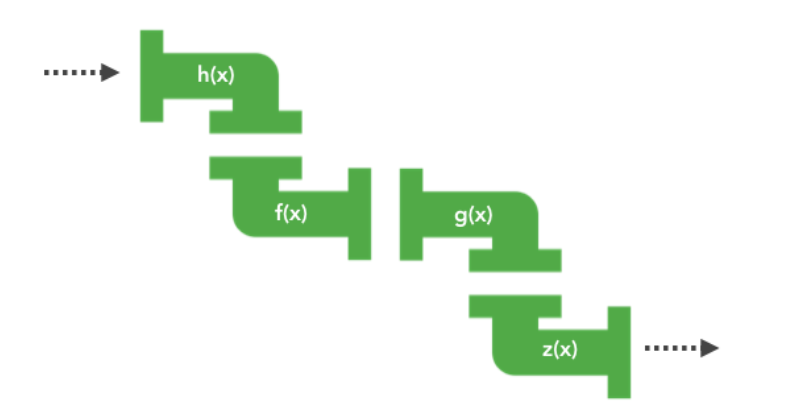

# 常见 JS 面试题

## 1. 解释事件委托

事件委托是将事件监听器添加到父元素，而不是每个子元素单独设置事件监听器。当触发子元素时，事件会冒泡到父元素，监听器就会触发。这种技术的好处是：

- 内存占用减少，因为只需要一个父元素的事件处理程序，而不必为每个后代都添加事件处理程序。
- 无需从已删除的元素中解绑处理程序，也无需将处理程序绑定到新元素上。

但是使用事件委托也是存在局限性：

- focus、blur 这些事件没有事件冒泡机制，所以无法进行委托绑定事件。
- mousemove、mouseout 这样的事件，虽然有事件冒泡，但是只能不断通过位置去计算定位，对性能消耗高，因此也是不适合于事件委托的。

## 2. 什么是事件模型？

事件模型可以分为三种：

- 原始事件模型（DOM0 级）
- 标准事件模型（DOM2 级）
- IE 事件模型（基本不用）

**原始事件模型**

原始事件模型是 JavaScript 最早的事件处理模型，它使用的是事件监听器（event listener）来添加和删除事件处理程序。例如：

```javascript
var btn = document.getElementById('myBtn');
btn.onclick = function () {
  console.log('Hello World!');
};
```

不过这种方式，只支持冒泡，不支持捕获，并且同一个类型的事件只能绑定一次。

**标准事件模型**

标准事件模型是 DOM 事件模型，它使用 addEventListener() 和 removeEventListener() 方法来添加和删除事件处理程序。

在该事件模型中，一次事件共有三个过程:

- 事件捕获阶段：事件从 document 一直向下传播到目标元素, 依次检查经过的节点是否绑定了事件监听函数，如果有则执行
- 事件处理阶段：事件到达目标元素, 触发目标元素的监听函数
- 事件冒泡阶段：事件从目标元素冒泡到 document, 依次检查经过的节点是否绑定了事件监听函数，如果有则执行

```javascript
addEventListener(eventType, handler, useCapture);
removeEventListener(eventType, handler, useCapture);
```

eventType 指定事件类型，handler 是事件处理函数，useCapture 是一个布尔值，表示事件是否在捕获或冒泡阶段执行，true 表示在捕获阶段执行，false 表示在冒泡阶段执行（默认）。

**IE 事件模型**

IE 事件模型共有两个过程:

- 事件处理阶段：事件到达目标元素, 触发目标元素的监听函数。
- 事件冒泡阶段：事件从目标元素冒泡到 document, 依次检查经过的节点是否绑定了事件监听函数，如果有则执行

## 3. 解释 this 在 JavaScript 中的工作原理

this 关键字是 JavaScript 中最复杂的特性之一。它用于引用函数的作用域，在函数内部，this 的值取决于函数的调用方式。

this 取值符合以下规则：

- 在调用函数时使用 new 关键字，函数内的 this 是一个全新的对象。
- 如果 apply、call 或 bind 方法用于调用、创建一个函数，函数内的 this 就是作为参数传入这些方法的对象。
- 当函数作为对象里的方法被调用时，函数内的 this 是调用该函数的对象。比如当 obj.method()被调用时，函数内的 this 将绑定到 obj 对象。
- 如果调用函数不符合上述规则，那么 this 的值指向全局对象（global object）。浏览器环境下 this 的值指向 window 对象，但是在严格模式下('use strict')，this 的值为 undefined。
- 如果符合上述多个规则，则较高的规则（1 号最高，4 号最低）将决定 this 的值。
- 如果该函数是 ES2015 中的箭头函数，将忽略上面的所有规则，this 被设置为它被创建时的上下文。

或许可以从 JavaScript 执行上下文视角理解 this，执行上下文（execution context）是 JavaScript 引擎创建的一个内部对象，每个执行上下文都有自己的 this 值。执行上下文主要分为三种——全局执行上下文、函数执行上下文和 eval 执行上下文。在全局执行上下文中的 this 是指向全局对象。在函数执行上下文中，this 是调用该函数的对象。

不过有两个例外：

- 构造函数中的 this 指向创建的实例对象。
- 箭头函数中的 this 是它被创建时的上下文。

## 4. 解释原型继承

JavaScript 中的对象有一个内部属性（`__proto__`），称为原型，它指向另一个对象。这个原型对象也有一个自己的原型，直到遇到 null 为止，这个链被称为原型链。所有函数默认都有 prototype 属性，这个属性是一个对象，它的值被设置为另一个对象。这个对象的用途是包含可以由特定类型的所有实例共享的属性和方法。当调用构造函数创建一个新实例后，该实例内部将包含一个内部指针，指向构造函数的 prototype。这意味着我们不需要在代码中再创建原型了，因为 JavaScript 会为我们自动完成这一过程。

而当试图访问一个对象的属性时，如果没有在该对象上找到，它还会搜寻该对象的原型，以及该对象的原型的原型，依次层层向上搜索，直到找到一个名字匹配的属性或到达原型链的末尾。这种行为是在模拟经典的继承，但是与其说是继承，不如说是委托。

## 5. 什么是闭包，为什么使用闭包？

闭包是函数和声明该函数的词法环境的组合。**词法作用域**中使用的域，是变量在代码中声明的位置所决定的。当 JS 引擎发现内部函数定义中包含外部函数中使用的变量时，它会把所有被引用的变量复制到一个新对象中，这个新对象被称为闭包。这个对象随内部函数的创建而存在，直到内部函数销毁后，该对象才会被垃圾回收器回收。

为什么使用闭包？

- 利用闭包实现数据私有化或模拟私有方法。这个方式也称为模块模式（module pattern）。
- 部分参数函数（partial applications）柯里化（currying）.

缺点：

- 闭包会使得函数中的变量都保存在内存中，内存消耗很大。

## 6. 如何理解作用域链？

我们把通过作用域查找变量的链条称为作用域链，作用域链是通过词法作用域来确定的，而词法作用域反映了代码的结构。其中**词法作用域**就是指作用域是由代码中函数声明的位置来决定的，所以词法作用域是静态的作用域，通过它就能够预测代码在执行过程中如何查找标识符。在程序运行中，如果使用了一个在当前作用域中不存在的变量，这时 JavaScript 引擎会去代码声明位置的词法作用域查找，如果找不到，就会到下一个作用域中查找，直到找到全局作用域，没有找到会抛出 ReferenceError 错误。

## 7. 深浅拷贝和深拷贝的区别？如何实现深拷贝？

深拷贝和浅拷贝的区别：

- 浅拷贝只复制指向某个对象的指针，而不复制对象本身。
- 深拷贝会另外创造一个一模一样的对象，新对象与原对象不共享引用类型的属性。

如何实现深拷贝？

- JSON.parse(JSON.stringify())：这种方法是常见的方法，也是最简单直接的一种实现深拷贝的方式。缺点是这种方法对于正则表达式、函数以及 undefined 的拷贝无法正常工作。
- 循环递归：这种方法需要事先定义一个空对象，然后再将每一个可能存在的属性依次使用 for in 循环遍历一遍，判断其类型，再决定是否进行深拷贝，最后赋值给新的对象。

## 8. null 、 undefined 和未声明的变量之间的区别是什么？

当你没有提前使用 var、let 或 const 声明变量，就为一个变量赋值时，该变量是未声明变量（undeclared variables）。未声明变量会脱离当前作用域，成为全局作用域下定义的变量。在严格模式下，给未声明的变量赋值，会抛出 ReferenceError 错误。和使用全局变量一样，使用未声明变量也是非常不好的做法，应当尽可能避免。要检查判断它们，需要将用到它们的代码放在 try/catch 语句中。

当一个变量已经声明，但没有赋值时，该变量的值是 undefined。如果一个函数的执行结果被赋值给一个变量，但是这个函数却没有返回任何值，那么该变量的值是 undefined。要检查它，需要使用严格相等（`===`）；或者使用 typeof，它会返回'undefined'字符串。请注意，不能使用非严格相等（`==`）来检查，因为如果变量值为 null，使用非严格相等也会返回 true。

null 只能被显式赋值给变量。它表示空值，与被显式赋值 undefined 的意义不同。要检查判断 null 值，需要使用严格相等运算符。请注意，和前面一样，不能使用非严格相等（==）来检查，因为如果变量值为 undefined，使用非严格相等也会返回 true。

## 9. typeof 与 instanceof 区别？

typeof 操作符返回一个字符串，描述了变量的数据类型。它总返回以下值之一：number, boolean, string, function, undefined, bigint, symbol, object。

instanceof 运算符用于检测构造函数的 prototype 属性是否出现在某个实例对象的原型链上。

typeof 与 instanceof 都是判断数据类型的方法，区别如下：

- typeof 会返回一个变量的基本类型，instanceof 返回的是一个布尔值
- instanceof 可以准确地判断复杂引用数据类型，但是不能正确判断基础数据类型
- typeof 虽然可以判断基础数据类型（null 除外），但是引用数据类型中，除了 function 类型以外，其他的也无法判断

如果需要通用检测数据类型，可以采用 Object.prototype.toString，调用该方法，统一返回格式“[object Xxx]”的字符串

```javascript
function getType(obj) {
  let type = typeof obj;
  if (type !== 'object') {
    // 先进行typeof判断，如果是基础数据类型，直接返回
    return type;
  }
  // 对于typeof返回结果是object的，再进行如下的判断，正则返回结果
  return Object.prototype.toString.call(obj).replace(/^\[object (\S+)\]$/, '$1');
}
```

## 10. 你使用什么语句遍历对象的属性和数组的元素？

对象：

- for 循环：for (var property in obj) { console.log(property); }。但是，这还会遍历到它的继承属性，在使用之前，你需要加入 obj.hasOwnProperty(property)检查。
- Object.keys()：Object.keys(obj).forEach(function (property) { ... })。Object.keys()方法会返回一个由一个给定对象的自身可枚举属性组成的数组。
- Object.getOwnPropertyNames()：Object.getOwnPropertyNames(obj).forEach(function (property) { ... })。Object.getOwnPropertyNames()方法返回一个由指定对象的所有自身属性的属性名（包括不可枚举属性但不包括 Symbol 值作为名称的属性）组成的数组。

数组：

- for loops：for (var i = 0; i < arr.length; i++)。这里的常见错误是 var 是函数作用域而不是块级作用域，大多数时候你想要迭代变量在块级作用域中。ES2015 引入了具有块级作用域的 let，建议使用它。所以就变成了：for (let i = 0; i < arr.length; i++)。
- forEach：arr.forEach(function (el, index) { ... })。这个语句结构有时会更精简，因为如果你所需要的只是数组元素，你不必使用 index。还有 every 和 some 方法可以让你提前终止遍历。

## 11. 匿名函数的典型用例是什么？

匿名函数可以在 IIFE 中使用，来封装局部作用域内的代码，以便其声明的变量不会暴露到全局作用域。

匿名函数可以作为只用一次，不需要在其他地方使用的回调函数。当处理函数在调用它们的程序内部被定义时，代码具有更好地自闭性和可读性，可以省去寻找该处理函数的函数体位置的麻烦。

匿名函数可以用于函数式编程或 Lodash（类似于回调函数）。

```javascript
const arr = [1, 2, 3];
const double = arr.map(function (el) {
  return el * 2;
});
console.log(double); // [2, 4, 6]
```

## 12. 宿主对象（host objects）和原生对象（native objects）的区别是什么？

原生对象是由 ECMAScript 规范定义的 JavaScript 内置对象，比如 String、Math、RegExp、Object、Function 等等。

宿主对象是由运行时环境（浏览器或 Node）提供，比如 window、XMLHTTPRequest 等等。

## 13. 说说你对 BOM 的理解，常见的 BOM 对象你了解哪些？

BOM（Browser Object Model）是指浏览器对象模型，它提供了独立于内容的、可以与浏览器窗口进行交互的接口。BOM 代表浏览器对象模型，它使 JavaScript 有能力与浏览器对话。

常见的 BOM 对象：

- window 对象：代表浏览器窗口，所有 JavaScript 全局对象、函数以及变量均自动成为 window 对象的成员。
- location 对象：包含有关当前 URL 的信息。
- navigator 对象：包含有关访问者浏览器的信息。
- history 对象：包含浏览器的历史记录。
- screen 对象：包含有关客户端显示屏幕的信息。
- document 对象：包含有关文档的的信息，它是 BOM 的 window 对象的属性之一。

## 14. 说说 new 操作符具体干了什么？

在 JavaScript 中，new 操作符用于创建一个给定构造函数的实例对象。

new 操作符具体干了以下四件事情：

- 创建一个新的对象 obj
- 将对象与构建函数通过原型链连接起来
- 将构建函数中的 this 绑定到新建的对象 obj 上并执行
- 根据构建函数返回类型作判断，如果构建函数有 return 语句，并且返回的是引用类型，则返回该引用类型，否则返回新建的对象 obj

## 15. 解释 function foo() {} 和 var foo = function() {}在 foo 用法有什么差异？

前者是函数声明，后者是函数表达式。关键的区别在于函数声明会使函数体提升（具有与变量相同的提升行为），但函数表达式的函数体不能。如果试图在定义函数表达式之前调用它，会得到一个 Uncaught TypeError: XXX is not a function 的错误。

## 16. bind、call、apply 区别？如何实现一个 bind？

apply、call、bind 三者的区别在于：

- 三者都可以改变函数的 this 对象指向
- 三者第一个参数都是 this 要指向的对象，如果如果没有这个参数或参数为 undefined 或 null，则默认指向全局 window
- 三者都可以传参，但是 apply 是数组，而 call 是参数列表，且 apply 和 call 是一次性传入参数，而 bind 可以分为多次传入
- bind 是返回绑定 this 之后的函数，apply、call 则是立即执行

实现 bind 的步骤，可以分解成为三部分：

- 修改 this 指向
- 动态传递参数
- 返回绑定 this 之后的函数

```javascript
Function.prototype.myBind = function (context) {
  if (typeof this !== 'function') {
    throw new TypeError('Function.prototype.bind - what is trying to be bound is not callable');
  }
  const fn = this;
  const that = context;
  const args = Array.prototype.slice.call(arguments, 1);
  return function () {
    return fn.apply(that, args.concat(Array.prototype.slice.call(arguments)));
  };
};
```

## 17. 功能检测（feature detection）、功能推断（feature inference）和使用 UA 字符串之间有什么区别？

**功能检测（feature detection）**

功能检测包括确定浏览器是否支持某段代码，以及是否运行不同的代码（取决于它是否执行），以便浏览器始终能够正常运行代码功能，而不会在某些浏览器中出现崩溃和错误。例如：

```javascript
if ('geolocation' in navigator) {
  // 可以使用 navigator.geolocation
} else {
  // 处理 navigator.geolocation 功能缺失
}
```

**功能推断（feature inference）**

功能推断与功能检测一样，会对功能可用性进行检查，但是在判断通过后，还会使用其他功能，因为它假设其他功能也可用，例如：

```javascript
if (document.getElementsByTagName) {
  element = document.getElementById(id);
}
```

UA 字符串

这是一个浏览器报告的字符串，它允许网络协议对等方（network protocol peers）识别请求用户代理的应用类型、操作系统、应用供应商和应用版本。它可以通过 navigator.userAgent 访问。 然而，这个字符串很难解析并且很可能存在欺骗性。例如，Chrome 会同时作为 Chrome 和 Safari 进行报告。因此，要检测 Safari，除了检查 Safari 字符串，还要检查是否存在 Chrome 字符串。

## 18. 什么是 Ajax？

Ajax（asynchronous JavaScript and XML）是使用客户端上的许多 Web 技术，创建异步 Web 应用的一种 Web 开发技术。借助 Ajax，Web 应用可以异步（在后台）向服务器发送数据和从服务器检索数据，而不会干扰现有页面的显示和行为。通过将数据交换层与表示层分离，Ajax 允许网页和扩展 Web 应用程序动态更改内容，而无需重新加载整个页面。Ajax 的原理简单来说通过 XmlHttpRequest 对象来向服务器发异步请求，从服务器获得数据，然后用 JavaScript 来操作 DOM 而更新页面。

**使用 Ajax 的优缺点分别是什么？**

优点：

- 交互性更好。来自服务器的新内容可以动态更改，无需重新加载整个页面。
- 减少与服务器的连接，因为脚本和样式只需要被请求一次。
- 状态可以维护在一个页面上。JavaScript 变量和 DOM 状态将得到保持，因为主容器页面未被重新加载。
- 基本上包括大部分 SPA 的优点。

缺点：

- 动态网页很难收藏。
- 如果 JavaScript 已在浏览器中被禁用，则不起作用。
- 有些网络爬虫不执行 JavaScript，也不会看到 JavaScript 加载的内容。
- 基本上包括大部分 SPA 的缺点。

## 19. 请说明 JSONP 的工作原理，它为什么不是真正的 Ajax？

JSONP 是 JSON with Padding 的简写。它是一个非官方协议，它允许在 Web 页面中向 come from 其他域的纯 JavaScript 文件注入代码。通常为了跨域读取数据，网页设置 `<script>` 来请求跨域资源，服务端会根据客户端传递过来的地址，返回一段 JS 脚本，该脚本调用了传入的回调函数，并把需要返回的数据作为参数传入。

JSONP 不是真正的 Ajax，因为 JSONP 是通过 script 标签来发送请求的。

```javascript
<!-- https://mydomain.com -->
<script>
  function foo(data) {
    console.log(`${data.name}!`);
  }
</script>
<script src="http://example.com/api/?callback=foo"></script>

// 文件加载自 https://example.com?callback=printData
printData({ name: 'hello world' });
```

客户端必须在其全局范围内具有 foo 函数，并且在收到来自跨域的响应时，该函数将由客户端执行。

缺陷：

- 只能实现 GET 一种请求方式。
- 安全性。跨域策略限制了从其他域中加载资源，这使得恶意代码很难获得数据或利用漏洞。
- 污染全局命名空间。因为 JSONP 依赖全局函数，所以被请求代码需要提供一个回调函数。而其他代码也可能也使用这个函数名称。
- 无法预料。如果 JSONP 调用的响应代码中发生错误，那么将不会触发错误事件，在浏览器中会触发全局函数。

## 20. 什么是 CORS？

CORS 是一个 W3C 标准，全称是"跨域资源共享"（Cross-origin resource sharing）。它允许浏览器向跨源服务器，发出 XMLHttpRequest 请求，从而克服了 AJAX 只能同源使用的限制。

CORS 需要浏览器和服务器同时支持。目前，所有浏览器都支持该功能，IE 浏览器不能低于 IE10。整个 CORS 通信过程都是浏览器自动完成，不需要用户参与。对于开发者来说，CORS 通信与同源的 AJAX 通信没有差别，代码完全一样。浏览器一旦发现 AJAX 请求跨源，就会自动添加一些附加的请求和响应头。

## 21. 什么是类型强制转换？JavaScript 代码中依赖类型强制转换的常见缺陷是什么？

类型强制转换是指将变量或值从一种类型转换为另一种类型。JavaScript 是一种弱类型的语言，这意味着开发人员不需要提前声明变量的类型，变量可以在运行时动态分配任何值。

```javascript
var foo = '42'; // foo 是字符串
foo = foo * 1; // 现在 foo 是数值
```

强制类型转换分为两种：隐式强制类型转换和显式强制类型转换。

常见的隐式类型转换包括：

- 字符串拼接
- 数值运算
- 逻辑运算
- 条件运算
- 函数调用
- 对象属性访问

常见的显式类型转换包括：

- parseInt()
- parseFloat()
- Boolean()
- Number()
- String()
- toString()

缺陷：

- 隐式类型转换可能会对代码造成混淆。
- 隐式类型转换可能导致代码难以调试。

## 22. attribute 和 property 的区别是什么？

HTML 标签的特性（attribute）是 HTML 标签在源代码中定义的，而 DOM 节点对象的成员（property）是在 DOM 规范中定义。

## 23. document 中的 load 事件和 DOMContentLoaded 事件之间的区别是什么？

当初始的 HTML 文档被完全加载和解析完成之后，DOMContentLoaded 事件被触发，而无需等待样式表、图像和子框架的完成加载。

window 的 load 事件仅在 DOM 和所有相关资源全部完成加载后才会触发。

## 24. 扩展内置 JavaScript 对象的优点和缺点是什么?

扩展 JavaScript 内置（原生）对象意味着将属性或方法添加到其 prototype 中。虽然听起来很不错，但事实上这样做很危险。想象一下，你的代码使用了一些库，它们通过添加相同的 contains 方法来扩展 Array.prototype，如果这两个方法的行为不相同，那么这些实现将会相互覆盖，你的代码将不能正常运行。

扩展内置对象的唯一使用场景是创建 polyfill，本质上为老版本浏览器缺失的方法提供自己的实现，该方法是由 JavaScript 规范定义的。

## 25. `==`和`===`的区别是什么？

`==`是抽象相等运算符，而`===`是严格相等运算符。`==`运算符是在进行必要的类型转换后，再比较。`===`运算符不会进行类型转换，所以如果两个值不是相同的类型，会直接返回 false。

## 26. 解释关于 JavaScript 的同源策略

同源策略可防止 JavaScript 发起跨域请求。源被定义为 URI、主机名和端口号的组合。此策略可防止页面上的恶意脚本通过该页面的文档对象模型，访问另一个网页上的敏感数据。

## 27. 为什么它被称为三元运算符，“三元”这个词表示什么？

“三元”表示接受三个操作数：判断条件，then 表达式和 else 表达式。三元运算符的结果取决于判断条件的值，如果为真，则执行 then 表达式，否则执行 else 表达式。

## 28. 什么是严格模式?使用它的优点/缺点是什么?

'use strict' 是用于对整个脚本或单个函数启用严格模式的语句。严格模式是可选择的一个限制 JavaScript 的变体一种方式 。

优点：

- 无法再意外创建全局变量。
- 会使引起静默失败（silently fail，即：不报错也没有任何效果）的赋值操抛出异常。
- 试图删除不可删除的属性时会抛出异常（之前这种操作不会产生任何效果）。
- 要求函数的参数名唯一。
- 全局作用域下，this 的值为 undefined。
- 捕获了一些常见的编码错误，并抛出异常。
- 禁用令人困惑或欠佳的功能。

缺点：

- 无法访问 function.caller 和 function.arguments。
- 以不同严格模式编写的脚本合并后可能导致问题。
- 某些浏览器在非严格模式下运行脚本时，会发出警告。

## 29. 请解释单页应用是什么，如何使其对 SEO 友好？

现如今，Web 开发人员将他们构建的产品称为 Web 应用，而不是网站。虽然这两个术语之间没有严格的区别，但网络应用往往具有高度的交互性和动态性，允许用户执行操作并接收他们的操作响应。在过去，浏览器从服务器接收 HTML 并渲染。当用户导航到其它 URL 时，需要整页刷新，服务器会为新页面发送新的 HTML。这被称为服务器端渲染。

然而，在现代的 SPA 中，客户端渲染取而代之。浏览器从服务器加载初始页面、整个应用程序所需的脚本（框架、库、应用代码）和样式表。当用户导航到其他页面时，不会触发页面刷新。该页面的 URL 通过 HTML5 History API 进行更新。浏览器通过 AJAX 请求向服务器检索新页面所需的数据（通常采用 JSON 格式）。然后，SPA 通过 JavaScript 来动态更新页面，这些 JavaScript 在初始页面加载时已经下载。这种模式类似于原生移动应用的工作方式。

好处：

- 用户感知响应更快，用户切换页面时，不再看到因页面刷新而导致的白屏。
- 对服务器进行的 HTTP 请求减少，因为对于每个页面加载，不必再次下载相同的资源。
- 客户端和服务器之间的关注点分离。可以为不同平台（例如手机、聊天机器人、智能手表）建立新的客户端，而无需修改服务器代码。只要 API 没有修改，可以单独修改客户端和服务器上的代码。

坏处：

- 由于加载了多个页面所需的框架、应用代码和资源，导致初始页面加载时间较长。
- 服务器还需要进行额外的工作，需要将所有请求路由配置到单个入口点，然后由客户端接管路由。
- SPA 依赖于 JavaScript 来呈现内容，但并非所有搜索引擎都在抓取过程中执行 JavaScript，他们可能会在你的页面上看到空的内容。这无意中损害了应用的搜索引擎优化（SEO）。然而，当你构建应用时，大多数情况下，搜索引擎优化并不是最重要的因素，因为并非所有内容都需要通过搜索引擎进行索引。为了解决这个问题，可以在服务器端渲染你的应用，或者使用诸如 Prerender 的服务来“在浏览器中呈现你的 javascript，保存静态 HTML，并将其返回给爬虫”。

## 30. 解释可变对象和不可变对象之间的区别。JavaScript 中不可变对象的例子是什么？不变性的优点和缺点是什么？如何在自己的代码中实现不变性？

在 JavaScript 中，可变对象（Mutable Object）和不可变对象（Immutable Object）的区别主要在于对象的状态是否可以在创建后被改变。

### 可变对象（Mutable Object）

可变对象是指对象的状态可以被修改。这意味着你可以更改对象的属性值，向对象添加新属性，或者删除现有属性。

**示例**：

```javascript
let obj = { a: 1 };
obj.a = 2; // 修改属性值
obj.b = 3; // 添加新属性
delete obj.a; // 删除属性
```

在这个例子中，`obj` 是一个可变对象，因为它的状态可以被改变。

### 不可变对象（Immutable Object）

不可变对象是指对象的状态在创建后不能被修改。如果你需要改变对象的状态，你实际上会创建一个新的对象。

**示例**：

```javascript
const obj = { a: 1 };
// 下面的代码不会改变原有的对象，而是创建了一个新的对象
const newObj = { ...obj, a: 2 };
```

在这个例子中，`obj` 是一个不可变对象。尝试修改 `obj` 实际上是创建了一个新的对象 `newObj`。

### 不变性的优点

1. **线程安全**：在多线程环境中，不可变对象不需要额外的同步措施，因为它们的状态不能被改变。
2. **简化调试**：由于对象状态不会改变，这使得调试变得更容易，因为你可以更容易地追踪状态的变化。
3. **避免副作用**：不可变对象避免了函数对对象状态的改变，这有助于减少程序的副作用。
4. **共享状态安全**：多个组件或函数可以共享不可变对象，而不必担心对象状态被意外改变。

### 不变性的缺点

1. **性能问题**：在某些情况下，创建大量的新对象可能会导致性能问题，尤其是在循环或频繁的状态更新中。
2. **内存消耗**：不可变对象可能会导致更多的内存消耗，因为每次状态更新都会创建新的对象。
3. **学习曲线**：对于习惯于可变对象的开发者来说，可能需要时间来适应不可变对象的编程模式。

### 如何实现不变性

在 JavaScript 中实现不变性，你可以采用以下方法：

1. **使用常量**：使用 `const` 关键字声明变量，以确保它们不会被重新赋值。
2. **创建新对象**：当你需要“修改”一个对象时，创建一个新的对象，而不是直接修改原始对象。
3. **使用对象展开**：使用对象展开运算符 `...` 来创建对象的浅拷贝。
4. **使用库**：使用如 Immutable.js 这样的库来创建和管理不可变对象。
5. **函数式编程**：采用函数式编程原则，避免可变数据结构，使用纯函数和高阶函数。

**示例**：

```javascript
function updateObject(obj, key, value) {
  return { ...obj, [key]: value };
}

const originalObj = { a: 1 };
const newObj = updateObject(originalObj, 'a', 2);
```

在这个例子中，`updateObject` 函数创建了一个新的对象，而不是修改原始对象 `originalObj`。这样，`originalObj` 保持不变，而 `newObj` 反映了新的状态。

## 31. 解释同步函数和异步函数的区别

在 JS 中，同步函数和异步函数的区别在于函数的执行是否连续执行的。

同步任务是那些没有被引擎挂起、在主线程上排队执行的任务。只有前一个任务执行完毕，才能执行后一个任务。

异步任务是那些被引擎挂起、在消息队列中排队等待主线程取走的任务。只有当当前同步任务执行完毕，主线程空闲时，才会从消息队列取出任务并执行。

## 32. 什么是事件循环？调用堆栈和任务队列之间的区别是什么？

事件循环又叫做消息循环，是浏览器渲染主线程和消息队列的交互过程。

在 Chrome 的源码中，它开启⼀个不会结束的 for 循环，每次循环从消息队列中取出第⼀个任务执⾏，⽽其他线程只需要在合适的时候将任务加⼊到队列末尾即可。
过去把消息队列简单分为宏队列和微队列，这种说法⽬前已⽆法满⾜复杂的浏览器环境，取⽽代之的是⼀种更加灵活多变的处理⽅式。
根据 W3C 官⽅的解释，每个任务有不同的类型，同类型的任务必须在同⼀个队列，不同的任务可以属于不同的队列。不同任务队列有不同的优先级，在⼀次事件循环中，由浏览器⾃⾏决定取哪⼀个队列的任务。但浏览器必须有⼀个微队列，微队列的任务⼀定具有最⾼的优先级，必须优先调度执⾏。

当调用堆栈为空并且任务队列中有任务时，则将任务出队并推送到调用堆栈中执行，如果没有任务，则等待消息队列中添加任务。

## 33. 使用 let 、 var 或 const 创建的变量之间有什么区别？

用 var 声明的变量的作用域是它当前的执行上下文，它可以是嵌套的函数，也可以是声明在任何函数外的变量。let 和 const 是块级作用域，意味着它们只能在最近的一组花括号（function、if-else 代码块或 for 循环中）中访问。

var 会使变量提升，这意味着变量可以在声明之前使用。而 let 和 const 不会使变量提升，提前使用会报错。

用 var 重复声明不会报错，但 let 和 const 会。

let 和 const 的区别在于：let 允许多次赋值，而 const 只允许一次。并且 const 声明的变量是不可变的，这意味着它不能被重新赋值，并且必须在声明时初始化。

## 34. 解释变量提升（hoisting）

变量提升（hoisting）是用于解释代码中变量声明行为的术语。使用 var 关键字声明或初始化的变量，会将声明语句“提升”到当前作用域的顶部。 但是，只有声明才会触发提升，赋值语句（如果有的话）将保持原样。

## 35. ES6 类和 ES5 函数构造函数之间有什么区别？

class 是 ES6 中引入的用于创建类的新语法。它允许你使用更简洁、更可读的语法来定义一个类，而无需使用构造函数和原型链等概念。

ES6 类继承使用 extends 关键字，而 ES5 构造函数继承使用 prototype 属性。

## 36. 您能提供一个新的箭头 => 函数语法的用例吗？这个新语法与其他函数有什么不同？

一个很明显的优点就是箭头函数可以简化创建函数的语法，我们不需要在箭头函数前面加上 function 关键词。并且箭头函数的 this 会自动绑定到当前作用域的上下文中，这和普通的函数不一样。普通函数的 this 是在执行的时候才能确定的。

## 37. 在构造函数中对方法使用箭头语法有什么好处？

在构造函数里使用箭头函数的主要优点是它的 this 只与箭头函数创建时的 this 保持一致，并且不会修改。所以，当用构造函数去创建一个新的对象的时候，箭头函数的 this 总是指向新创建的对象。

## 38. 高阶函数的定义是什么？

高阶函数是将一个或多个函数作为参数的函数，它用于数据处理，也可能将函数作为返回结果。高阶函数是为了抽象一些重复执行的操作。一个典型的例子是 map，它将一个数组和一个函数作为参数。map 使用这个函数来转换数组中的每个元素，并返回一个包含转换后元素的新数组。JavaScript 中的其他常见示例是 forEach、filter 和 reduce。高阶函数不仅需要操作数组的时候会用到，还有许多函数返回新函数的用例。Function.prototype.bind 就是一个例子。

## 39. 你能举出一个柯里化函数（curry function）的例子吗？它有哪些好处？

柯里化（currying）是一种模式，其中具有多个参数的函数被分解为多个函数，当被串联调用时，将一次一个地累积所有需要的参数。这种技术帮助编写函数式风格的代码，使代码更易读、紧凑。值得注意的是，对于需要被 curry 的函数，它需要从一个函数开始，然后分解成一系列函数，每个函数都需要一个参数。

## 40. 使用扩展运算符（spread）的好处是什么，它与使用剩余参数语句（rest）有什么区别？

在函数泛型编码时，ES6 的扩展运算符非常有用，因为我们可以轻松创建数组和对象的拷贝，而无需使用 Object.create、slice 或其他函数库。

ES6 的剩余参数语句提供了一个简写，允许我们将不定数量的参数表示为一个数组。它就像是扩展运算符语法的反面，将数据收集到数组中，而不是解构数组。剩余参数语句在函数参数、数组和对象的解构赋值中有很大作用。

## 41. 如何在文件之间共享代码？

这取决于执行 JavaScript 的环境。

在客户端（浏览器环境）上，只要变量或函数在全局作用域（window）中声明，所有脚本都可以引用它们。或者，通过 RequireJS 采用异步模块定义（AMD）以获得更多模块化方法。

在服务器（Node.js）上，常用的方法是使用 CommonJS。每个文件都被视为一个模块，可以通过将它们附加到 module.exports 对象来导出变量和函数。

ES2015 定义了一个模块语法，旨在替换 AMD 和 CommonJS。 这最终将在浏览器和 Node 环境中得到支持。

## 42. 为什么要创建静态类成员？

静态类成员（属性或方法）不绑定到某个类的特定实例，不管哪个实例引用它，都具有相同的值。静态属性通常是配置变量，而静态方法通常是纯粹的实用函数，不依赖于实例的状态。

## 43. ES6 有什么哪些变化？

ES6 既是一个历史名词，也是一个泛指，含义是 5.1 版以后的 JavaScript 的下一代标准，涵盖了 ES2015、ES2016、ES2017 等等，而 ES2015 则是正式名称，特指该年发布的正式版本的语言标准。本书中提到 ES6 的地方，一般是指 ES2015 标准，但有时也是泛指“下一代 JavaScript 语言”。

### 新的语法结构

- **let 和 const**：引入了块级作用域的变量声明关键字，提供了更好的作用域控制和常量支持 。
- **解构赋值（Destructuring Assignment）**：允许从数组或对象中快速提取值并分配给多个变量，简化了数据交换和属性提取 。
- **默认参数（Default Parameters）**：允许在函数定义时设置默认参数值，避免了在调用函数时传递参数的麻烦 。
- **运算符扩展（Operator Extensions）**：允许在表达式中使用运算符，例如`**`表示幂运算和`??`表示空值合并操作 。
- **箭头函数（Arrow Functions）**：提供了一种更简洁的函数定义语法，没有自己的`this`绑定，其`this`值取决于上下文 。
- **模板字符串（Template Literals）**：允许在字符串中嵌入表达式，并支持多行文本，无需使用拼接或转义字符 。
- **Promise**：一种处理异步操作的标准机制，提供了更优雅的链式调用和错误处理方式，替代传统的回调函数 。
- **`for...of`循环**：用于遍历可迭代对象（如数组、Set、Map、Generator 对象等）的值，与`for...in`循环相区分 。
- **Classes**：引入了基于原型的类（class）语法，提供了一种更接近传统面向对象语言的类定义方式，但本质上仍然是对原有构造函数和原型链机制的封装 。
- **模块化（Modules）**：提供了原生的模块化支持，通过`import`和`export`关键字来导入和导出模块成员，实现代码的复用和组织 。

### 内置对象的扩展

ES6 对许多内置对象进行了扩展，例如：

- **Array**：新增了`Array.from()`、`Array.of()`、`find()`、`findIndex()`、`fill()`、`includes()`等方法 。
- **Object**：新增了`Object.assign()`、`Object.is()`、`Object.setPrototypeOf()`、`Object.getPrototypeOf()`等方法 。
- **String**：新增了`startsWith()`、`endsWith()`、`repeat()`、`padStart()`、`padEnd()`等方法 。
- **Number**：新增了`EPSILON`、`isFinite()`、`isNaN()`等方法 。
- **Function**：新增了`name`属性、rest 参数，允许函数作为对象使用 。
- **Math**：新增了`acosh()`、`asinh()`、`atanh()`等方法 。
- **RegExp**：新增了`flags`属性、`unicode`属性、`sticky`属性等方法 。

### 新增对象

- **Symbol**：一种新的基本数据类型，用于创建唯一标识符和属性键 。
- **Set**：一种新的数据结构，类似于数组，但成员的值都是唯一的 。
- **Map**：一种新的数据结构，类似于对象，但键可以是任意值，且没有原型链 。
- **WeakMap**和**WeakSet**：类似于 Map 和 Set，但它们的键是弱引用，适合用于缓存和避免内存泄漏 。
- **Proxy**：一种用于拦截和自定义对象操作的新机制，可以拦截并重写对象的属性和方法 。
- **Reflect**：一种新的 API，用于操作对象元数据（metadata）和代理（proxy）对象 。
- **Promise**：一种用于处理异步操作的新机制，提供了更优雅的链式调用和错误处理方式 。
- **Iterator**：一种用于遍历数据结构的迭代器协议，允许自定义数据结构被`for...of`循环遍历 。
- **Generator**：一种用于创建迭代器的函数，使用`function*`语法定义，允许函数在执行过程中暂停和恢复 。
- **TypedArray**：一种新的数据类型，用于表示固定大小的数据块，如`Int8Array`、`Uint8Array`等 。

### 新增特性

- **迭代器（Iterator）**：为各种数据结构提供统一的访问机制，使得数据结构可以被`for...of`循环遍历 。
- **生成器（Generator）**：使用`function*`语法定义，允许函数在执行过程中暂停和恢复 。
- **异步函数（Async/Await）**：提供了一种更简洁的异步编程方式，通过`async`和`await`关键字实现 。

### 新增概念

- **局部变量**：ES6 引入了块级作用域的变量声明关键字，使得局部变量的作用域更加清晰和可控 。
- **常量**：ES6 引入了`const`关键字，用于声明不可变的变量和对象 。
- **类**：ES6 引入了基于原型的类（class）语法，提供了一种更接近传统面向对象语言的类定义方式。
- **模块化**：ES6 引入了模块化的概念，允许开发者将代码组织成独立的模块，提高代码的可维护性和可重用性 。
- **静态分析**：ES6 引入了静态分析的概念，允许开发者在代码编译阶段对代码进行分析和优化，提高代码的性能和可维护性 。

## 44. 什么是 promise？你会在哪里以及如何使用 promise？

所谓 Promise，简单说就是一个容器，里面保存着某个未来才会结束的事件（通常是一个异步操作）的结果。从语法上说，Promise 是一个对象，从它可以获取异步操作的消息。Promise 提供统一的 API，各种异步操作都可以用同样的方法进行处理。

Promise 对象有以下两个特点：

1. **对象的状态不受外界影响。** Promise 对象代表一个异步操作，有三种状态：pending（进行中）、fulfilled（已成功）和 rejected（已失败）。只有异步操作的结果，可以决定当前是哪一种状态，任何其他操作都无法改变这个状态。这也是 Promise 这个名字的由来，它的英语意思就是“承诺”，表示其他手段无法改变。
2. **一旦状态改变，就不会再变。** 任何时候都可以得到这个结果。Promise 对象的状态改变，只有两种可能：从 pending 变为 fulfilled 和从 pending 变为 rejected。只要这两种情况发生，状态就凝固了，不会再变了，会一直保持这个结果，这时就称为 resolved（已定型）。如果改变已经发生了，你再对 Promise 对象添加回调函数，也会立即得到这个结果。这与事件（Event）完全不同，事件的特点是，如果你错过了它，再去监听，是得不到结果的。

一般来说，你总是使用 Promise 对象去获取异步操作的消息，比如：从服务器请求一个数据，从本地存储中读取数据等等，有了 Promise 对象，就可以将异步操作以同步操作的流程表达出来，避免了层层嵌套的回调函数。

## 45. 什么是回调函数？为什么它们很重要？

回调函数是异步编程的一种重要方式，它允许将一个函数作为参数传递给另一个函数，并在某个时间点调用该函数。回调函数通常用于处理异步操作的结果或错误处理。在 JavaScript 中，回调函数可以通过函数式编程、事件监听器、Promise 和 async/await 等方式使用。

## 46. 请解释 Set、Map、WeakSet 和 WeakMap 的区别？

### Set

Set 这个数据结构类似数组，但是里面的元素值都是唯一，不会有重复的值，无论此值是原始类型 (primitive values) 或引用类型 (object references)。在 JavaScript 当中，Set 本身是一个构造函数，用来生成 Set 数据结构。Set()函数可以接受一个数组（或者具有 iterable 接口的其他数据结构）作为参数，用来初始化。

**Set 实例的属性和方法**

属性

- Set.prototype.constructor：构造函数，默认就是 Set 函数。
- Set.prototype.size：返回 Set 实例的成员总数。

Set 实例的方法分为两大类：

- 操作方法（用于操作数据）
  - Set.prototype.add(value)：添加某个值，返回 Set 结构本身。
  - Set.prototype.delete(value)：删除某个值，返回一个布尔值，表示删除是否成功。
  - Set.prototype.has(value)：返回一个布尔值，表示该值是否为 Set 的成员。
  - Set.prototype.clear()：清除所有成员，没有返回值。
- 和遍历方法（用于遍历成员）
  - Set.prototype.keys()：返回键名的遍历器
  - Set.prototype.values()：返回键值的遍历器
  - Set.prototype.entries()：返回键值对的遍历器
  - Set.prototype.forEach()：使用回调函数遍历每个成员

Set 中没有键值(Key)，因此使用 entries() 遍历时，返回的元素将是 [value, value] 的形式。需要特别指出的是，Set 的遍历顺序就是插入顺序。这个特性有时非常有用，比如使用 Set 保存一个回调函数列表，调用时就能保证按照添加顺序调用。

### WeakSet

WeakSet 结构与 Set 类似，也是不重复的值的集合。但是，它与 Set 有两个区别。

首先，WeakSet 的成员只能是对象和 Symbol 值，而不能是其他类型的值。

其次，WeakSet 中的对象都是**弱引用**，即垃圾回收机制不考虑 WeakSet 对该对象的引用，也就是说，如果其他对象都不再引用该对象，那么垃圾回收机制会自动回收该对象所占用的内存，不考虑该对象还存在于 WeakSet 之中。
这是因为垃圾回收机制根据对象的可达性（reachability）来判断回收，如果对象还能被访问到，垃圾回收机制就不会释放这块内存。结束使用该值之后，有时会忘记取消引用，导致内存无法释放，进而可能会引发内存泄漏。WeakSet 里面的引用，都不计入垃圾回收机制，所以就不存在这个问题。因此，WeakSet 适合临时存放一组对象，以及存放跟对象绑定的信息。只要这些对象在外部消失，它在 WeakSet 里面的引用就会自动消失。

由于上面这个特点，WeakSet 的成员是不适合引用的，因为它会随时消失。另外，由于 WeakSet 内部有多少个成员，取决于垃圾回收机制有没有运行，运行前后很可能成员个数是不一样的，而垃圾回收机制何时运行是不可预测的，因此 ES6 规定 WeakSet 不可遍历。

WeakSet 结构有以下三个方法。

- WeakSet.prototype.add(value)：向 WeakSet 实例添加一个新成员，返回 WeakSet 结构本身。
- WeakSet.prototype.delete(value)：清除 WeakSet 实例的指定成员，清除成功返回 true，如果在 WeakSet 中找不到该成员或该成员不是对象，返回 false。
- WeakSet.prototype.has(value)：返回一个布尔值，表示某个值是否在 WeakSet 实例之中。

### Map

Map 是一种键值对 (Key-Value) 的数据结构，类似于 ES5 中的 Object
，也是键值对的集合，但是“键”的范围不限于字符串，各种类型的值（包括对象）都可以当作键。也就是说，Object 结构提供了“字符串—值”的对应，Map 结构提供了“值—值”的对应，是一种更完善的 Hash 结构实现。如果你需要“键值对”的数据结构，Map 比 Object 更合适。

Map 作为构造函数，Map 也可以接受一个数组作为参数。该数组的成员是一个个表示键值对的数组。事实上，不仅仅是数组，任何具有 Iterator 接口、且每个成员都是一个双元素的数组的数据结构都可以当作 Map 构造函数的参数。这就是说，Set 和 Map 都可以用来生成新的 Map。

**实例的属性和操作方法**

属性

- Map.prototype.constructor：构造函数，默认就是 Map 函数。
- Map.prototype.size：返回 Map 实例的成员总数。

Set 实例的方法分为两大类：

- 操作方法（用于操作数据）
  - Map.prototype.set(key, value)：set 方法设置键名 key 对应的键值为 value，然后返回整个 Map 结构。如果 key 已经有值，则键值会被更新，否则就新生成该键。set 方法返回的是当前的 Map 对象，因此可以采用链式写法。
  - Map.prototype.get(key)：get 方法读取 key 对应的键值，如果找不到 key，返回 undefined。
  - Map.prototype.has(key)：has 方法返回一个布尔值，表示某个键是否在当前 Map 对象之中。
  - Map.prototype.delete(key)：delete()方法删除某个键，返回 true。如果删除失败，返回 false。
  - Map.prototype.clear()：清除所有成员，没有返回值。
- 和遍历方法（用于遍历成员）
  - Set.prototype.keys()：返回键名的遍历器。
  - Set.prototype.values()：返回键值的遍历器。
  - Set.prototype.entries()：返回键值对的遍历器。
  - Set.prototype.forEach()：遍历 Map 的所有成员。

### WeakMap

WeakMap 结构与 Map 结构类似，也是用于生成键值对的集合。

WeakMap 与 Map 的区别有两点。

首先，WeakMap 只接受对象（null 除外）和 Symbol 值作为键名，不接受其他类型的值作为键名。其次，WeakMap 的键名所指向的对象，不计入垃圾回收机制。

WeakMap 的设计目的在于，有时我们想在某个对象上面存放一些数据，但是这会形成对于这个对象的引用，一旦不再需要这两个对象，我们就必须手动删除这个引用，否则垃圾回收机制就不会回收这个对象，就会造成内存泄露。

WeakMap 就是为了解决这个问题而诞生的，它的键名所引用的对象都是弱引用，即垃圾回收机制不将该引用考虑在内。因此，只要所引用的对象的其他引用都被清除，垃圾回收机制就会释放该对象所占用的内存。也就是说，一旦不再需要，WeakMap 里面的键名对象和所对应的键值对会自动消失，不用手动删除引用。

WeakMap 的专用场合就是，它的键所对应的对象，可能会在将来消失。WeakMap 结构有助于防止内存泄漏。

> 注意，WeakMap 弱引用的只是键名，而不是键值。键值依然是正常引用。

WeakMap 与 Map 在 API 上的区别主要是两个，一是没有遍历操作（即没有 keys()、values()和 entries()方法），也没有 size 属性。因为没有办法列出所有键名，某个键名是否存在完全不可预测，跟垃圾回收机制是否运行相关。这一刻可以取到键名，下一刻垃圾回收机制突然运行了，这个键名就没了，为了防止出现不确定性，就统一规定不能取到键名。二是无法清空，即不支持 clear 方法。因此，WeakMap 只有四个方法可用：**get()、set()、has()、delete()**。

## 47. event.target 和 event.currentTarget 的区别是什么?

event.target 返回触发事件的元素，而 event.currentTarget 则返回绑定事件的元素。

## 48. event.preventDefault() 和 event.stopPropagation() 的区别是什么?

event.preventDefault() 方法阻止事件的默认行为。
event.stopPropagation() 方法阻止事件冒泡。

## 49. 说说你对正则表达式的理解？应用场景？

正则表达式是用来进行字符串检验的一种语法规则，它是对字符串执行模式匹配检查的强大工具。

它的设计思想是用一种描述性的语言定义一个规则，凡是符合规则的字符串，我们就认为它“匹配”了，否则，该字符串就是不合法的。

在 JavaScript 中，正则表达式也是对象，构建正则表达式有两种方式：

- 字面量创建，其由包含在斜杠之间的模式组成
- 调用 RegExp 对象的构造函数创建，其第一个参数是模式本身，第二个参数是可选的属性字符串

## 50. 说说尾调用优化

**什么是尾调用？**

尾调用（Tail Call）是函数式编程的一个重要概念，本身非常简单，一句话就能说清楚，就是指某个函数的最后一步是调用另一个函数。

**尾调用优化**

尾调用之所以与其他调用不同，就在于它的特殊的调用位置。

我们知道，函数调用会在内存形成一个“调用记录”，又称“调用帧”（call frame），保存调用位置和内部变量等信息。如果在函数 A 的内部调用函数 B，那么在 A 的调用帧上方，还会形成一个 B 的调用帧。等到 B 运行结束，将结果返回到 A，B 的调用帧才会消失。如果函数 B 内部还调用函数 C，那就还有一个 C 的调用帧，以此类推。所有的调用帧，就形成一个“调用栈”（call stack）。

尾调用由于是函数的最后一步操作，所以不需要保留外层函数的调用帧，因为调用位置、内部变量等信息都不会再用到了，只要直接用内层函数的调用帧，取代外层函数的调用帧就可以了，这就叫做 **“尾调用优化”（Tail call optimization）**，即只保留内层函数的调用帧。如果所有函数都是尾调用，那么完全可以做到每次执行时，调用帧只有一项，这将大大节省内存。这就是“尾调用优化”的意义。

当函数 A 的最后一步是调用函数 B 时，并且函数 B 不在任何地方引用函数 A 的调用帧，那么函数 B 就是尾调用，可以进行“尾调用优化”。

**尾递归**

函数调用自身，称为递归。如果尾调用自身，就称为尾递归。

递归非常耗费内存，因为需要同时保存成千上百个调用帧，很容易发生“栈溢出”错误（stack overflow）。但对于尾递归来说，由于只存在一个调用帧，所以永远不会发生“栈溢出”错误。

尾递归的实现，往往需要改写递归函数，确保最后一步只调用自身。做到这一点的方法，就是把所有用到的内部变量改写成函数的参数。

当需要将内部变量改成函数的参数时，可以使用柯里化（currying）或者 es6 的默认参数进行改造。

递归本质上是一种循环操作。纯粹的函数式编程语言没有循环操作命令，所有的循环都用递归实现，这就是为什么尾递归对这些语言极其重要。对于支持“尾调用优化”的语言，只需要知道循环可以用递归代替，而一旦使用递归，就最好使用尾递归。

## 51. 说说 JavaScript 中内存泄漏的几种情况？

内存泄漏（Memory leak）是在计算机科学中，由于疏忽或错误造成程序未能释放已经不再使用的内存。内存泄漏并非指内存在物理上的消失，而是应用程序分配某段内存后，由于设计错误，导致在释放该段内存之前就失去了对该段内存的控制，从而造成了内存的浪费。

常见的内存泄漏情况如下：

- 意外的全局变量
- 闭包
- 循环引用（在两个对象彼此引用且彼此保留时，就会发生循环引用）

## 52. 说说你对函数式编程的理解？优缺点？

函数式编程是一种"编程范式"（programming paradigm），一种编写程序的方法论

主要的编程范式有三种：命令式编程，声明式编程和函数式编程

相比命令式编程，函数式编程更加强调程序执行的结果而非执行的过程，倡导利用若干简单的执行单元让计算结果不断渐进，逐层推导复杂的运算，而非设计一个复杂的执行过程。简单来讲，就是要把过程逻辑写成函数，定义好输入参数，只关心它的输出结果。

**纯函数**

函数式编程旨在尽可能的提高代码的无状态性和不变性。要做到这一点，就要学会使用无副作用的函数，也就是纯函数

纯函数是对给定的输入返还相同输出的函数，并且要求你所有的数据都是不可变的，`即纯函数 = 无状态 + 数据不可变`

特性：

- 函数内部传入指定的值，就会返回确定唯一的值
- 不会造成超出作用域的变化，例如修改全局变量或引用传递的参数

优势：

- 使用纯函数，我们可以产生可测试的代码
- 不依赖外部环境计算，不会产生副作用，提高函数的复用性
- 可读性更强 ，函数不管是否是纯函数 都会有一个语义化的名称，更便于阅读
- 可以组装成复杂任务的可能性。符合模块化概念及单一职责原则

**高阶函数**

函数式编程中，认为函数是第一等公民，高阶函数就是将函数作为参数或返回值的函数。

认为程序只有“数据”和“关系”的处理，而关系就是函数，编程工作就是找一种映射关系，一旦找到了这种关系，问题就解决了，剩下的事情，就是让数据流过这种关系，然后转换成另一个数据。



**柯里化**

柯里化是把一个多参数函数转化成一个嵌套的一元函数的过程。

柯里化函数的意义：

- 让纯函数更纯，每次接受一个参数，松散解耦
- 惰性执行

**组合与管道**

组合函数，目的是将多个函数组合成一个函数，意义在于可以把很多小函数组合起来完成更复杂的逻辑。

**函数式编程的优缺点**

优点

- 更好的管理状态：因为它的宗旨是无状态，或者说更少的状态，能最大化的减少这些未知、优化代码、减少出错情况
- 更简单的复用：固定输入->固定输出，没有其他外部变量影响，并且无副作用。这样代码复用时，完全不需要考虑它的内部实现和外部影响
- 更优雅的组合：往大的说，网页是由各个组件组成的。往小的说，一个函数也可能是由多个小函数组成的。更强的复用性，带来更强大的组合性
- 隐性好处。减少代码量，提高维护性

缺点：

- 性能：函数式编程相对于指令式编程，性能绝对是一个短板，因为它往往会对一个方法进行过度包装，从而产生上下文切换的性能开销
- 资源占用：在 JS 中为了实现对象状态的不可变，往往会创建新的对象，因此，它对垃圾回收所产生的压力远远超过其他编程方式
- 递归陷阱：在函数式编程中，为了实现迭代，通常会采用递归操作，而递归操作，在 JS 中会存在栈溢出的问题。

## 53. 什么是防抖和节流？有什么区别？如何实现？

本质上是优化高频率执行代码的一种手段

如：浏览器的 resize、scroll、keypress、mousemove 等事件在触发时，会不断地调用绑定在事件上的回调函数，极大地浪费资源，降低前端性能

为了优化体验，需要对这类事件进行调用次数的限制，对此我们就可以采用 防抖（debounce） 和 节流（throttle） 的方式来减少调用频率

定义

- 节流: n 秒内只运行一次，若在 n 秒内重复触发，只有一次生效
- 防抖: n 秒后在执行该事件，若在 n 秒内被重复触发，则重新计时

**区别**

相同点：

- 目的都是降低回调执行频率。节省计算资源
- 都会阻止事件马上触发
- 都会在一定时间内执行

不同点：

- 执行时机不同：防抖在事件触发 n 秒后执行，n 是相对最后一次触发时开始计时；节流是每隔 n 秒执行一次，n 是从第一次触发开始计时；
- 触发次数不同：防抖在 n 秒内多次触发，只执行一次；节流每隔 n 秒内执行一次；

**应用场景**

防抖：

- 搜索框搜索输入。只需用户最后一次输入完，再发送请求
- 手机号、邮箱验证输入检测
- 窗口大小 resize。只需窗口调整完成后，计算窗口大小。防止重复渲染。

节流：

- 滚动加载，加载更多或滚到底部监听
- 搜索框，搜索联想功能

## 54. 如何判断一个元素是否在可视区域中？

判断一个元素是否在可视区域中，一般有两种方式：

- 监听滚动事件，当元素进入可视区域时，触发回调函数
- 利用 IntersectionObserver 接口，当目标节点进入视口（viewport）时，会执行回调函数

## 55. 大文件上传如何做断点续传？

断点续传是指在上传过程中，如果网络出现故障或用户取消了上传，则可以继续从之前已上传的部分开始上传下一个部分。断点续传一般与分片上传结合使用。分片上传是指上传大文件时，将文件切割成小块，然后通过多个线程并发上传，最后合并文件。

分片上传实现步骤：

1. 客户端向服务器发送请求，服务器返回一个唯一标识（uuid）
2. 客户端根据 uuid 生成文件名，并计算出需要切分的份数
3. 客户端根据文件名和 uuid 生成每个小块的 md5 值
4. 客户端根据文件大小和线程数，计算出每个线程需要分成的份数
5. 客户端开启多线程并发上传
6. 服务器接收文件后，保存文件的 md5 值和文件名
7. 客户端上传完成后，通知服务器合并文件
8. 服务器合并文件，并保存文件的 md5 值
9. 客户端校验文件是否上传成功

断点续传：

1. 客户端向服务器发送请求，获取已上传的分片
2. 客户端根据已上传的分片，计算出需要上传的 md5 值
3. 继续走分片上传的流程

## 56. web 常见的攻击方式有哪些？如何防御？

Web 攻击（WebAttack）是针对用户上网行为或网站服务器等设备进行攻击的行为

如植入恶意代码，修改网站权限，获取网站用户隐私信息等等

Web 应用程序的安全性是任何基于 Web 业务的重要组成部分

确保 Web 应用程序安全十分重要，即使是代码中很小的 bug 也有可能导致隐私信息被泄露

站点安全就是为保护站点不受未授权的访问、使用、修改和破坏而采取的行为或实践

我们常见的 Web 攻击方式有

- XSS (Cross Site Scripting) 跨站脚本攻击
- CSRF（Cross-site request forgery）跨站请求伪造
- SQL 注入攻击

**XSS**

XSS，跨站脚本攻击，允许攻击者将恶意代码植入到提供给其它用户使用的页面中

XSS 涉及到三方，即攻击者、客户端与 Web 应用

XSS 的攻击目标是为了盗取存储在客户端的 cookie 或者其他网站用于识别客户端身份的敏感信息。一旦获取到合法用户的信息后，攻击者甚至可以假冒合法用户与网站进行交互

根据攻击的来源，XSS 攻击可以分成：

- 存储型：存储在服务器端数据库中的数据，如留言板、论坛等
- 反射型：通过 URL 或者表单提交的数据，反射型 XSS 攻击是用户点击一个包含恶意代码的 URL 地址后，恶意代码从服务器端发送到客户端并执行的过程
- DOM 型：DOM 型 XSS 攻击，它通过修改页面 DOM 节点形成的恶意代码，在用户打开页面时执行

XSS 的预防：

- 输入过滤：对用户输入的内容进行过滤，比如使用正则表达式
- 输出转义：对用户输入的内容进行转义，比如使用 htmlspecialchars()
- 过滤特殊字符：对用户输入的内容进行过滤，比如使用 strip_tags()

**CSRF**

CSRF（Cross-site request forgery）跨站请求伪造：攻击者诱导受害者进入第三方网站，在第三方网站中，向被攻击网站发送跨站请求

利用受害者在被攻击网站已经获取的注册凭证，绕过后台的用户验证，达到冒充用户对被攻击的网站执行某项操作的目

一个典型的 CSRF 攻击有着如下的流程：

- 受害者登录 `a.com`，并保留了登录凭证（Cookie）
- 攻击者引诱受害者访问了`b.com`
- `b.com` 向 `a.com`发送了一个请求：`a.com/act=xx`。浏览器会默认携带 `a.com` 的 `Cookie`
- `a.com` 接收到请求后，对请求进行验证，并确认是受害者的凭证，误以为是受害者自己发送的请求
- `a.com` 以受害者的名义执行了 `act=xx`
- 攻击完成，攻击者在受害者不知情的情况下，冒充受害者，让`a.com` 执行了自己定义的操作

CSRF 的特点

- 攻击一般发起在第三方网站，而不是被攻击的网站。被攻击的网站无法防止攻击发生
- 攻击利用受害者在被攻击网站的登录凭证，冒充受害者提交操作；而不是直接窃取数据
- 整个过程攻击者并不能获取到受害者的登录凭证，仅仅是“冒用”
- 跨站请求可以用各种方式：图片 URL、超链接、CORS、Form 提交等等。部分请求方式可以直接嵌入在第三方论坛、文章中，难以进行追踪

CSRF 的预防

CSRF 通常从第三方网站发起，被攻击的网站无法防止攻击发生，只能通过增强自己网站针对 CSRF 的防护能力来提升安全性，防止 csrf 常用方案如下：

- 阻止不明外域的访问
  - 同源检测
  - Samesite Cookie
- 提交时要求附加本域才能获取的信息
  - CSRF Token
  - 双重 Cookie 验证

**SQL 注入**

Sql 注入攻击，是通过将恶意的 Sql 查询或添加语句插入到应用的输入参数中，再在后台 Sql 服务器上解析执行进行的攻击

流程如下所示：

- 找出 SQL 漏洞的注入点
- 判断数据库的类型以及版本
- 猜解用户名和密码
- 利用工具查找 Web 后台管理入口
- 入侵和破坏

预防方式如下：

- 严格检查输入变量的类型和格式
- 过滤和转义特殊字符
- 对访问数据库的 Web 应用程序采用 Web 应用防火墙

## 57. 在 JavaScript 中 0.1 + 0.2 会是多少？为什么？如何避免相关问题？

JavaScript 中，0.1 + 0.2 的结果是 `0.30000000000000004`，这是由于 JavaScript 采用 IEEE 754 标准来存储数字的方式导致的。

IEEE 754 是计算机中表示浮点数的标准，JavaScript 中的所有数字都是以这种格式存储的。

在二进制中，0.1 和 0.2 无法精确地表示，因为 0.1 和 0.2 在二进制中都是近似值，在内存中表示为无限循环的二进制小数。

**该如何避免相关问题？**

在 JavaScript 中有`toFixed` 以及`toPrecision` 等给数字操作的方法，让我们能够设定我们要的精确度，从而避免上述问题。

## 58. 如何实现数组扁平化 (flatten)

数组扁平化就是将一个多维的数组转化为一维的数组，如 `[1, [2, 3], [4, 5]]` 转化为 `[1, 2, 3, 4, 5]`。

可以通过一下几种方法实现：

- Array.prototype.flat()：该方法会递归数组，直到子元素为非数组为止；
- Array.prototype.reduce()：该方法会迭代数组，将子元素压入到一个新数组中；
- 递归调用：使用递归的方式实现扁平化。

## 59. 如何数组去重？

数组去重的方法有很多，如使用 ES6 的 Set 结构、Array.from() 方法、filter() 方法、reduce() 方法等。

- 使用 ES6 的 Set 结构：ES6 新增的 Set 结构可以去除数组中的重复值，然后通过 Array.from() 方法将 Set 结构转换为数组；
- Array.prototype.filter() 方法：利用 filter() 方法过滤出数组中不同的元素；
- Array.prototype.reduce() 方法：利用 reduce() 方法遍历数组，将数组元素放入到一个新数组中；
- 通过 Object 属性唯一性原则：利用对象的属性不能重复的特点，将数组元素作为对象的属性名，从而实现去重。
