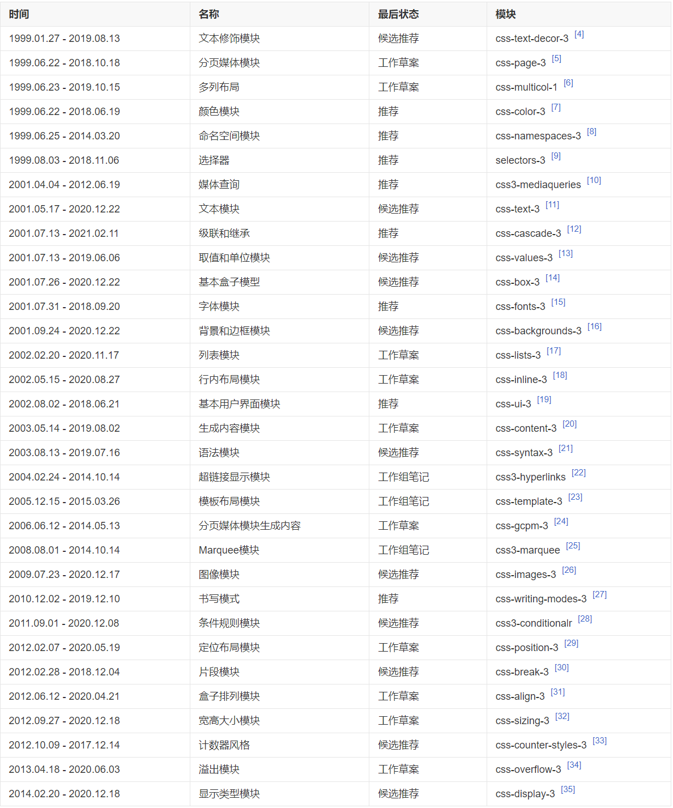
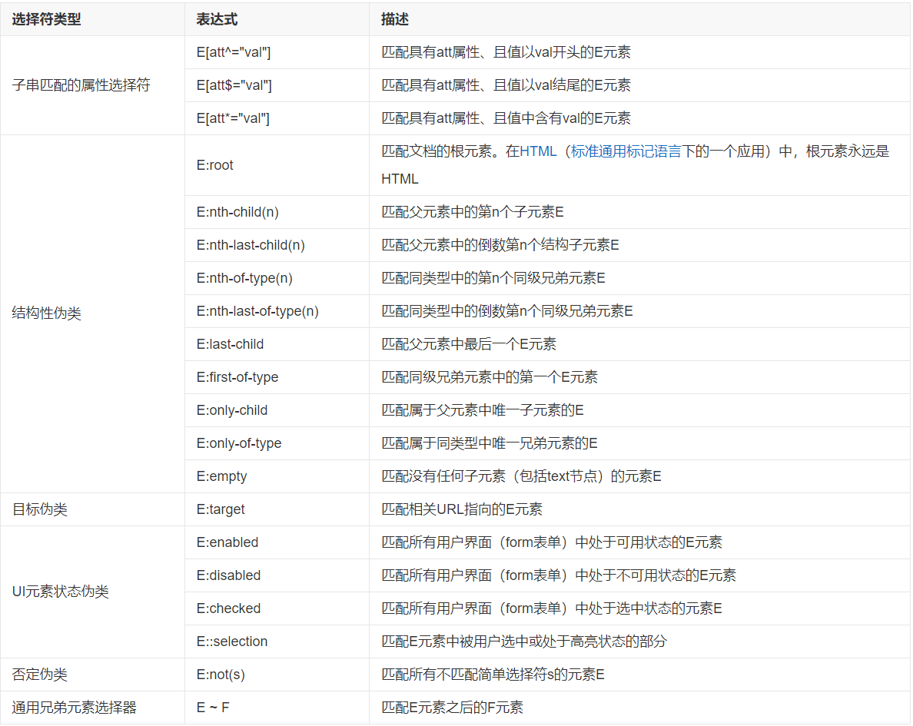
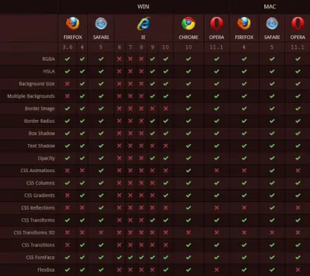

# 前言

CSS3 是 CSS（层叠样式表）技术的升级版本，于 1999 年开始制订，2001 年 5 月 23 日 W3C 完成了 CSS3 的工作草案，主要包括盒子模型、列表模块、超链接方式、语言模块、背景和边框、文字特效、多栏布局等模块。

CSS 演进的一个主要变化就是 W3C 决定将 CSS3 分成一系列模块。浏览器厂商按 CSS 节奏快速创新，因此通过采用模块方法，CSS3 规范里的元素能以不同速度向前发展，因为不同的浏览器厂商只支持给定特性。但不同浏览器在不同时间支持不同特性，这也让跨浏览器开发变得复杂。

截至 2021 年 1 月，CSS3 各模块的规范情况：



## 语言基础

CSS3 的语法是建立在 CSS 原先版本基础上的，它允许使用者在标签中指定特定的 HTML 元素而不必使用多余的 class、ID 或 JavaScript。CSS 选择器中的大部分并不是在 CSS3 中新添加的，只是在之前的版本中没有得到广泛的应用。如果想尝试实现一个干净的、轻量级的标签以及结构与表现更好的分离，高级选择器是非常有用的，它们可以减少在标签中的 class 和 ID 的数量并让设计师更方便地维护样式表。

新增的选择器：



## 新增特性

CSS3 的新特征有很多，例如圆角效果、图形化边界、块阴影与文字阴影、使用 RGBA 实现透明效果、渐变效果、使用@Font-Face 实现定制字体、多背景图、文字或图像的变形处理（旋转、缩放、倾斜、移动）、多栏布局、媒体查询等。

**1. 边框特性**

CSS3 对网页中的边框进行了一些改进，主要包括支持圆角边框、多层边框、边框色彩与图片等。在 CSS3 中最常用的一个改进就是圆角边框，通过 CSS3 的属性可以快速实现圆角定义，同时还可以根据实际情况针对特定角进行圆角定义。

```css
/*圆角边框*/
div {
  border: 2px solid;
  border-radius: 25px;
}

/*图片边框*/
div {
  border-image: url(border.png) 30 30 round;
  -webkit-border-image: url(border.png) 30 30 round; /* Safari 5 and older */
  -o-border-image: url(border.png) 30 30 round; /* Opera */
}
```

**2. 多背景图**

CSS3 允许使用多个属性（比如 background-image、background-repeat、background-size、background-position、background-origin 和 background-clip 等）在一个元素上添加多层背景图片。该属性的应用大大改善了以往面对多层次设计需要多层布局的问题，帮助 Web 前端开发者在不借助 Photoshop 的情况下实现对页面背景的设计，简化了背景图片的维护成本。

```css
/*多图背景*/
#example1 {
  background-image: url(img_flwr.gif), url(paper.gif);
  background-position: right bottom, left top;
  background-repeat: no-repeat, repeat;
}
/*或*/
#example1 {
  background: url(img_flwr.gif) right bottom no-repeat, url(paper.gif) left top repeat;
}
```

**3. 颜色与透明度**

CSS3 颜色模块的引入，实现了制作 Web 效果时不再局限于 RGB 和十六进制两种模式。CSS3 增加了 HSL、HSLA、RGBA 几种新的颜色模式。这几种颜色模式的提出，在做开发的时候不仅可以设置元素的色彩，还能根据需要轻松地设定元素透明度。

**4. 多列布局与弹性盒模型布局**

CSS3 多列布局属性可以不使用多个 div 标签就能实现多列布局。CSS3 中的多列布局模块描述了如何像报纸、杂志那样，把一个简单的区块拆成多列，并通过相应属性来实现列数、列宽、各列之间的空白间距。弹性盒模型布局方便了 Web 前端开发者根据复杂的前端分辨率进行弹性布局，轻松地实现页面中的某一区块在水平、垂直方向对齐，是进行响应式网站开发的一大利器。

**5. 盒子的变形**

在 CSS2.1 中，想让某个元素变形必须要借助 JavaScript 写大量的代码实现，在 CSS3 中加入了变形属性，该属性在 2D 或 3D 空间里操作盒子的位置和形状，来实现例如旋转、扭曲、缩放或者移位。变形属性的出现，使 Web 前端中的元素展示不仅仅局限在二维空间，Web 前端开发者可以通过旋转、扭曲、缩放或者移位等操作实现元素在三维控件上的展示。通过变形元素，web 前端中的内容展示更加形象、真实。

```css
/*2D转换*/
/*移动*/
div {
  transform: translate(50px, 100px);
}
/*旋转*/
div {
  transform: rotate(30deg);
}
/*改变宽高*/
div {
  transform: scale(2, 3);
}
/*倾斜*/
div {
  transform: skew(30deg, 20deg);
}
/*使用六个值的矩阵实现转换*/
div {
  transform: matrix(0.866, 0.5, -0.5, 0.866, 0, 0);
}

/*3D转换*/
/*围绕X轴旋转*/
div {
  transform: rotateX(120deg);
}
/*围绕Y轴旋转*/
div {
  transform: rotateY(130deg);
}
/*围绕Z轴旋转*/
div {
  transform: rotateZ(140deg);
}
/*围绕Z轴旋转*/
div {
  transform: rotateZ(140deg);
}
/*改变被转换元素的位置*/
#div2 {
  transform: rotate(45deg);
  transform-origin: 20% 40%;
}
/*让转换的子元素保留3D转换*/
<style > #div1 {
  padding: 50px;
  position: absolute;
  border: 1px solid black;
  background-color: red;
  transform: rotateY(60deg);
  transform-style: preserve-3d;
}
#div2 {
  padding: 40px;
  position: absolute;
  border: 1px solid black;
  background-color: yellow;
  transform: rotateY(-60deg);
}
</style>
<div id="div1">HELLO
  <div id="div2">YELLOW</div>
</div>
/*透视效果及规定其底部位置*/
div {
  perspective: 150;
  perspective-origin: 10% 10%;
}
/*定义元素在不面对屏幕时是否可见*/
div {
  backface-visibility: hidden; /*可见为visible*/
}
```

**6. 过渡与动画**

CSS3 的“过渡”（transition）属性通过设定某种元素在某段时间内的变化实现一些简单的动画效果，让某些效果变得更加具有流线性与平滑性。CSS3 的“动画”（animation）属性能够实现更复杂的样式变化以及一些交互效果，而不需要使用任何 Flash 或 JavaScript 脚本代码。过渡与动画的出现，使 CSS 在 Web 前端开发中不再仅仅局限于简单的静态内容展示，而是通过简单的方法使页面元素动了起来，实现了元素从静到动的变化 [40]。

```css
/*过渡*/
div {
  transition-property: width;
  transition-duration: 1s;
  transition-timing-function: linear;
  transition-delay: 2s;
}
/*或*/
div {
  transition: width 1s linear 2s;
}

/*动画*/
div {
  width: 100px;
  height: 100px;
  background: red;
  animation: myfirst 5s;
}
@keyframes myfirst {
  0% {
    background: red;
  }
  25% {
    background: yellow;
  }
  50% {
    background: blue;
  }
  100% {
    background: green;
  }
}
```

**7. Web 字体**

CSS3 中引入了@font-face，@font-face 是链接服务器字体的一种方式，这些嵌入的字体能变成浏览器的安全字体，开发人员不用再担心用户没有这些字体而导致网页在用户浏览器无法正常显示的问题 [40]。

```css
/*引入字体*/
@font-face {
  font-family: myFirstFont;
  src: url(sansation_light.woff);
}
div {
  font-family: myFirstFont;
}
```

**8. 媒体查询**

CSS3 中引入媒体查询（mediaqueries），可为不同分辨率的设备定义不同的样式。比如，在可视区域小于 480 像素时，可能想让原来在右侧的网站侧栏显示在主内容的下边，以往必须通过 JavaScript 判断用户浏览器的分辨率，然后再通过 JavaScript 修改 CSS。CSS3 中只需要通过媒体查询就可实现上述操作 [40]。

```css
/*媒体查询判定屏幕可视窗口尺寸*/
body {
  background-color: black;
}
@media screen and (min-width: 480px) {
  body {
    background-color: gray;
  }
}
```

**9. 阴影**

阴影主要分为两种：文本阴影（text-shadow）和盒子阴影（box-shadow）。文本阴影在 CSS2 中已经存在，但没有得到广泛的运用（CSS2.1 中删除了）。CSS3 延续了这个特性，并进行了新的定义，该属性提供了一种新的跨浏览器解决方案，使文本看起来更加醒目。CSS3 中的盒子阴影的引入，可轻易地为任何元素添加盒子阴影。

```css
/*文本阴影*/
h1 {
  text-shadow: 5px 5px 5px #ff0000;
}

/*盒子阴影*/
div {
  box-shadow: 10px 10px 5px #888888;
}
```

## 兼容问题



浏览器厂商以前就一直在实施 CSS3，虽然它还未成为真正的标准，但却提供了针对浏览器的前缀：

Chrome（谷歌浏览器）：-webkit-
Safari（苹果浏览器）：-webkit-
Firefox（火狐浏览器）：-moz-
lE（IE 浏览器）：-ms-
Opera（欧朋浏览器）：-O-

例如，CSS3 渐变样式在 Firefox 和 Safari 中是不同的。Firefox 使用-moz-linear-gradient，而 Safari 使用-webkit-gradient，这两种语法都使用了厂商类型的前缀。
需要注意的是，在使用有厂商前缀的样式时，也应该使用无前缀的。这样可以保证当浏览器移除了前缀，使用标准 CSS3 规范时，样式仍然有效。例如：

```css
#example{
  -webkit-box-shadow：0 3px 5px#FFF;
  -moz-box-shadow：0 3px 5px#FFF;
  -o-box-shadow：0 3px 5px#FFF;
  box-shadow：0 3px 5px#FFF;/*无前缀的样式*/
}
```

## 最佳实践

**1. 尽量使用 CSS3 的新特性**
CSS3 中有很多新的属性，这些属性可以让我们开发 Web 前端页面更加方便、高效。在开发过程中，我们应该尽可能地使用 CSS3 新特性，而不是使用老旧的技术来实现同样的效果。

**2. 使用浏览器前缀**
在使用 CSS3 新特性时，应该使用浏览器厂商的前缀，以确保兼容性。例如，使用-webkit-box-shadow 代替 box-shadow。

**3. 避免使用过多选择器**
在编写 CSS 时，应该尽量避免使用过多的选择器，因为这会增加 CSS 的解析时间。可以使用类名或 ID 来代替选择器。

**4. 避免使用过多的属性**
在编写 CSS 时，应该尽量避免使用过多的属性，因为这会增加 CSS 的文件大小和渲染时间。可以使用缩写来简化代码。

**5. 使用预处理器**
预处理器可以帮助我们编写更简洁的 CSS 代码，并且提供了一些有用的功能，如变量、函数和混合等。使用预处理器可以提高代码的可读性和可维护性。

**6. 使用压缩工具**
使用压缩工具可以帮助我们减少 CSS 的文件大小，提高页面加载速度。可以使用在线的 CSS 压缩工具来压缩 CSS 代码。

**7. 使用 CSS 框架**
CSS 框架可以帮助我们快速搭建 Web 前端页面，并且提供了一些常用的样式和布局。使用 CSS 框架可以减少开发时间，提高开发效率。

**8. 优化图片和字体文件**
在 Web 开发中，图片和字体文件是占用带宽的重要资源。使用压缩工具可以减少图片和字体的文件大小，提高页面加载速度。

**9. 避免使用过多的 CSS 文件**
在 Web 开发中，应该避免使用过多的 CSS 文件，因为这会增加页面的加载时间。可以使用 CSS 文件合并工具将多个 CSS 文件合并成一个，减少 HTTP 请求数量。

**10. 使用 CDN 加速**
使用 CDN（内容分发网络）可以加速 CSS 文件的加载速度，减少页面加载时间。

## 总结

CSS3 是 CSS（层叠样式表）技术的升级版本，于 1999 年开始制订，2001 年 5 月 23 日 W3C 完成了 CSS3 的工作草案。CSS3 的新特性有很多，例如圆角效果、图形化边界、块阴影与文字阴影、使用 RGBA 实现透明效果、渐变效果、使用@Font-Face 实现定制字体、多背景图、文字或图像的变形处理（旋转、缩放、倾斜、移动）、多栏布局、媒体查询等。

参考资料：

[1] 阮一峰. CSS3 教程 [M]. 北京：人民邮电出版社，2014.

[2] 张鑫旭. CSS3 实战手册 [M]. 北京：清华大学出版社，2016.

[3] 百度百科. CSS3 [EB/OL]. https://baike.baidu.com/item/css3/874854?fr=aladdin.
