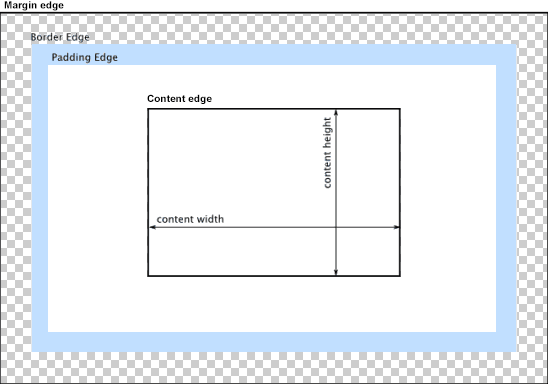

# 视觉格式化模型

CSS 视觉格式化模型（visual formatting model）是用来处理和在视觉媒体上显示文档时使用的计算规则。该模型是 CSS 的重要基础概念之一。

视觉格式化模型会根据 CSS 盒子模型将文档中的元素转换为一个个盒子，每个盒子的布局由以下因素决定：

- **盒子的尺寸**：精确指定、由约束条件指定或没有指定
- **盒子的类型**：行内盒子（inline）、行内级盒子（inline-level）、原子行内级盒子（atomic inline-level）、块盒子（block）
- **定位方案**（positioning scheme）：普通流定位、浮动定位或绝对定位
- **文档树中的其他元素**：即当前盒子的子元素或兄弟元素
- **视口尺寸与位置**
- **所包含的图片的尺寸**
- **其他的某些外部因素**

该模型会根据盒子的包含块（containing block）的边界来渲染盒子。通常，盒子会创建一个包含其后代元素的包含块，但是盒子并不由包含块所限制，当盒子的布局跑到包含块的外面时称为溢出（overflow）。

## 术语理解

**块（block）**
在 CSS 视觉格式化模型中，块是一种布局概念。它表示一个在文档流中垂直排列的矩形区域。块元素会在垂直方向上一个接一个地排列，占据父容器的整个可用宽度（除非指定了宽度），并且在垂直方向上可以设置高度、内边距、外边距等属性。

```html
<div style="background - color: lightblue;">这是一个块元素</div>
<div style="background - color: lightgreen;">这是另一个块元素</div>
```

在 HTML 中，`<div>`就是一个典型的块元素。这两个`<div>`元素会在垂直方向上依次排列，各自占据父容器（如果没有特殊设置，就是`<body>`）的整个宽度，并且可以根据设置的背景色看到它们是独立的块。

**包含块（containing block）**
包含块是一个相对概念，用于确定元素的定位和大小计算的参考框。一个元素的包含块是其布局上下文，不同的定位方式（如 relative、absolute、fixed）会根据不同的规则来确定包含块。

比如，一个绝对定位的元素会生成一个包含块，该元素的包含块就是其最近的 position 非 static 的父元素，如果没有这样的元素，则该元素的包含块就是初始包含块（initial containing block）。

```html
<div
  style="position: relative; width: 300px; height: 200px; top: 100px; left: 100px;background-color: yellow;">
  <div style="position: absolute; top: 10px; left: 10px; background-color: pink;">
    这个内部的绝对定位元素的包含块是外部的相对定位的div
  </div>
</div>
```

**盒子（box）**
一个抽象的概念，由 CSS 引擎根据文档中的内容所创建，主要用于文档元素的定位、布局和格式化等用途。盒子与元素并不是一一对应的，有时多个元素会合并生成一个盒子，有时一个元素会生成多个盒子（如匿名盒子）。

**块级元素（block-level element）**
块级元素是 HTML 中的一类元素，当元素的 display 为 block、list-item、table 时，该元素将成为块级元素。元素是否是块级元素仅是元素本身的属性，并不直接用于格式化上下文的创建或布局。在页面布局中，它们默认以块的形式呈现。块级元素会独占一行，并且可以设置宽度、高度、内边距、外边距等属性。常见的块级元素有`<div>`、`<p>`、`<h1>` - `<h6>`等。

**块级盒子（block-level box）**
由块级元素生成，一个块级元素至少会生成一个块级盒子，但也有可能生成多个（例如列表项元素）。

**块盒子（block box）**
如果一个块级盒子同时也是一个块容器盒子（见下），则称其为块盒子。除具名块盒子之外，还有一类块盒子是匿名的，称为匿名块盒子（Anonymous block box），匿名盒子无法被 CSS 选择符选中。

**块容器盒子（block container box 或 block containing box）**
块容器盒子是一种特殊的块级盒子，它不仅可以包含块级元素，还可以包含行内元素。块容器盒子侧重于当前盒子作为“容器”的这一角色，它不参与当前块的布局和定位。它所描述的仅仅是当前盒子与其后代之间的关系。换句话说，块容器盒子主要用于确定其子元素的定位、布局等。它会为内部元素提供了一个块级的布局上下文，内部元素会按照块级或行内的规则在这个容器内进行布局。

能够注意到块级盒子与块容器盒子是不同的这一点很重要。前者描述了元素与其父元素和兄弟元素之间的行为，而后者描述了元素跟其后代之间的行为。有些块级盒子并不是块容器盒子，比如表格；而有些块容器盒子也不是块级盒子，比如非替换行内块和非替换表格单元格。

> 注意：盒子分为“块盒子”和“块级盒子”两种，但元素只有“块级元素”，而没有“块元素”。下面的“行内级元素”也是一样。

**行内级元素（inline-level element）**
行内级元素在 HTML 中是与块级元素相对的另一类元素。display 为 inline、inline-block、inline-table 的元素称为行内级元素。它们在页面布局中不会独占一行，而是按照文本流的顺序水平排列，并且宽度和高度通常由其内容决定，不能直接设置宽度和高度（某些特殊情况除外）。与块级元素一样，元素是否是行内级元素仅是元素本身的属性，并不直接用于格式化上下文的创建或布局。常见的行内级元素有`<span>`、`<a>`、`<em>`、`<strong>`等。

**行内级盒子（inline-level box）**
由行内级元素生成，行内级盒子包括行内盒子和原子行内级盒子两种，区别在于该盒子是否参与行内格式化上下文的创建。

**行内盒子（inline box）**
参与行内格式化上下文创建的行内级盒子称为行内盒子。与块盒子类似，行内盒子也分为具名行内盒子和匿名行内盒子（anonymous inline box）两种。

**原子行内级盒子（atomic inline-level box）**
不参与行内格式化上下文创建的行内级盒子称为原子行内级盒子。原子行内级盒子是一种特殊的行内级盒子，它在布局中被视为一个不可分割的整体。例如，图像（``）和表单输入元素（`<input>`）在某些情况下被视为原子行内级盒子。它们不能被分割成多行，并且在布局中有自己独特的行为。

**非替换盒子（Non-Replaced Box）**
非替换盒子是指其内容由 CSS 直接控制，并且盒子的大小由内容的尺寸决定的元素。大多数 HTML 元素生成的都是非替换盒子，例如`<div>`、`<span>`、`<p>`等。

特点：

- CSS 可以直接控制内容的布局和尺寸。
- 盒子的大小通常由其内容和 CSS 属性（如 width、height、padding、border、margin 等）决定。
- 可以使用 width 和 height 属性来设置盒子的尺寸，即使内容不足以填满盒子。

**替换盒子（Replaced Box）**
替换盒子是指其内容由外部资源或浏览器的默认行为决定，盒子的大小由外部资源的固有尺寸决定的元素。常见的替换盒子包括``、`<input>`、`<textarea>`、`<video>`等。

特点：

- CSS 不能直接控制内容的布局和尺寸，但可以控制盒子本身的尺寸和位置。
- 盒子的大小通常由外部资源的固有尺寸决定，例如图像的尺寸或视频播放器的大小。
- 使用 width 和 height 属性设置替换盒子的尺寸时，内容可能会被缩放以适应指定的尺寸。

## CSS 盒子模型

当对一个文档进行布局（lay out）的时候，浏览器的渲染引擎会根据标准之一的 CSS 基础框盒模型（CSS basic box model），将所有元素表示为一个个矩形的盒子（box）。CSS 决定这些盒子的大小、位置以及属性（例如颜色、背景、边框尺寸等）。

每个盒子由四个部分（或称区域）组成，其效用由它们各自的边界（Edge）所定义。如图，与盒子的四个组成区域相对应，每个盒子有四个边界：内容边界 Content edge、内边距边界 Padding Edge、边框边界 Border Edge、外边框边界 Margin Edge。



**内容区域**
内容区域（content area）由内容边界限制，容纳着元素的“真实”内容，例如文本、图像，或是一个视频播放器。它的尺寸为内容宽度（或称 content-box 宽度）和内容高度（或称 content-box 高度）。它通常含有一个背景颜色（默认颜色为透明）或背景图像。

**内边距区域**
内边距区域（padding area）由内边距边界限制，扩展自内容区域，负责延伸内容区域的背景，填充元素中内容与边框的间距。它的尺寸是 padding-box 宽度 和 padding-box 高度。

**边框区域**
边框区域（border area）由边框边界限制，扩展自内边距区域，是容纳边框的区域。其尺寸为 border-box 宽度和 border-box 高度。

**外边距区域**
外边距区域（margin area）由外边距边界限制，用空白区域扩展边框区域，以分开相邻的元素。它的尺寸为 margin-box 宽度和 margin-box 高度。

> **注意：** 除可替换元素外，对于行内元素来说，尽管内容周围存在内边距与边框，但其占用空间（每一行文字的高度）则由 line-height 属性决定，即使边框和内边距仍会显示在内容周围。

## 格式化上下文

格式化上下文（Formatting Context）是 W3C CSS2.1 规范中的一个概念。它是页面中的一块渲染区域，并且有一套渲染规则，它决定了其子元素将如何定位，以及和其他元素的关系和相互作用。每个格式上下文在其上下文中都有特定的布局规则。

### 块格式化上下文（Block Formatting Context，BFC）

BFC 是 Web 页面的可视 CSS 渲染的一部分，是块级盒子的布局过程发生的区域，也是浮动元素与其他元素交互的区域。

在 BFC 中，盒子从顶端开始垂直地一个接一个地排列，两个盒子之间的垂直间隙是由他们的 margin 边距所决定的。在一个 BFC 中，两个相邻的盒子的 vertical-align 值不会影响两者之间是否产生交集。在 BFC 中，每一个元素都位于包含框之中，这个包含框与元素生成的元素类型无关，也不管这个元素生成了哪种类型的框。

下列方式会创建块格式化上下文：

- 文档的根元素（`<html>`）—— 初始块格式上下文。
- 浮动元素（即 float 值不为 none 的元素）。
- 绝对定位元素（position 值为 absolute 或 fixed 的元素）。
- 行内块元素（display 值为 inline-block 的元素）。
- 表格单元格（display 值为 table-cell，HTML 表格单元格默认值）。
- 表格标题（display 值为 table-caption，HTML 表格标题默认值）。
- 匿名表格单元格元素（display 值为 table（HTML 表格默认值）、table-row（表格行默认值）、table-row-group（表格体默认值）、table-header-group（表格头部默认值）、table-footer-group（表格尾部默认值）或 inline-table）。
- overflow 值不为 visible 或 clip 的块级元素。
- display 值为 flow-root 的元素。
- contain 值为 layout、content 或 paint 的元素。
- 弹性元素（display 值为 flex 或 inline-flex 元素的直接子元素），如果它们本身既不是弹性、网格也不是表格容器。
- 网格元素（display 值为 grid 或 inline-grid 元素的直接子元素），如果它们本身既不是弹性、网格也不是表格容器。
- 多列容器（column-count 或 column-width 值不为 auto，且含有 column-count: 1 的元素）。
- column-span 值为 all 的元素始终会创建一个新的格式化上下文，即使该元素没有包裹在一个多列容器中（规范变更、Chrome bug）

创建一个新的 BFC 很有用，因为新的 BFC 的行为与最外层的文档非常相似，它在主布局中创造了一个小布局。BFC 包含其内部的所有内容，float 和 clear 仅适用于同一格式上下文中的项目，而页边距仅在同一格式上下文中的元素之间折叠。

### 行内格式化上下文（Inline Formatting Context，IFC）

内联格式上下文存在于其他格式上下文中，可以将其视为段落的上下文。段落创建了一个内联格式上下文，其中在文本中使用诸如 `<strong>`、`<a>`或 `<span>` 元素等内容。

在 IFC 中，盒子会水平排列，不过 box model 不完全适用于参与内联格式上下文。在 IFC 中，水平填充、边框和边距将应用于元素，并左右移动文本。但是，元素上方和下方边距将不适用。应用垂直填充和边框可能会在内容的上方和下方重叠，因为在内联格式上下文中，填充和边框不会将行框撑开。

### 弹性盒格式化上下文（Flexible Formatting Context，FFC）

FFC 是由 display: flex;或 display: inline-flex;创建的布局上下文，用于弹性盒模型的布局。

FFC 的子元素可以在任何方向上排布，也可以“弹性伸缩”其尺寸，既可以增加尺寸以填满未使用的空间，也可以收缩尺寸以避免父元素溢出。子元素的水平对齐和垂直对齐都能很方便的进行操控。通过嵌套这些框（水平框在垂直框内，或垂直框在水平框内）可以在两个维度上构建布局。

```css
.flex-container {
  display: flex;
}
```

这段代码创建了一个弹性盒格式化上下文，其中的子元素将作为弹性项进行布局。

### 网格格式化上下文（Grid Formatting Context，GFC）

GFC 是由 display: grid;或 display: inline-grid;创建的布局上下文，用于网格模型的布局。

```css
.grid-container {
  display: grid;
}
```

这段代码创建了一个网格格式化上下文，其中的子元素将作为网格项进行布局。

### 表格格式化上下文（Table Formatting Context）

表格格式化上下文是由 display: table;、display: table-row;、display: table-cell; 或 display: table-caption; 属性创建的。在这种上下文中，元素的行为类似于 HTML 表格模型中的对应部分。

```css
.table-like {
  display: table;
  width: 100%;
}

.table-row-like {
  display: table-row;
}

.table-cell-like {
  display: table-cell;
}
```

这段代码创建了一个类似表格的布局，其中 .table-like 元素作为表格，.table-row-like 作为行，.table-cell-like 作为单元格。

### 多列格式化上下文（Multi-column Formatting Context）

CSS 多列布局扩展块布局模式，以便更容易地定义多列文本。如果一行太长，人们阅读文本很麻烦; 如果眼睛从一行的终点移动到下一个行的开始需要太长时间，它们就会丢失它们所在的行。因此，为了最大限度地利用大屏幕，作者应该将宽度不等的文本列并排放置，就像报纸一样。

多列格式化上下文是由 column-count 或 column-width 属性（当它们的值不是 auto 时）创建的。这种上下文允许内容在多列中流动，类似于报纸的布局。

```css
.multi-column {
  column-count: 3; /* 创建三列布局 */
}
```

这段代码创建了一个多列格式化上下文，其中内容将在三列中流动。

## 布局模型

CSS 布局模型是 CSS 负责将网页内容格式化成不同尺寸和形状的算法。CSS 包含多种不同的布局模型，用于定义不同类型的盒子（box）如何显示在屏幕上以及如何定位这些盒子。元素的显示类型（display type）决定了该元素生成的布局模型，一个元素的显示类型定义了外部显示类型，这规定了该框如何与同一格式上下文中的其他元素一起显示。它还定义了内部显示类型，该类型指示此元素内的框的行为方式。

### 常规流布局模型

在 CSS 2.1 规范中我们定义了常规流（Normal Flow）。常规流中的任何一个盒子总是某个格式区域（formatting context）中的一部分。块级盒子是在块格式区域（block formatting context）中工作的盒子，而内联盒子是在内联格式区域（inline formatting context）中工作的盒子。任何一个盒子总是块级盒子或内联盒子中的一种。

规范中还规定了块格式区域与内联格式区域中的元素行为。对于块级格式环境，规范内规定：

- 在一个块格式区域中，盒子会从包含块的顶部开始，按序垂直排列。同级盒子间的垂直距离会由“margin”属性决定。
- 相邻两个块级盒子之间的垂直间距会遵循外边距折叠原则被折叠。
- 在一个块格式区域中，每个盒子的左外边缘会与包含块左边缘重合（如果是从右到左的排版顺序，则盒子的右外边缘与包含块右边缘重合）。

对于内联格式环境，规范内规定：

- 在内联格式区域中，盒子会从包含块的顶部开始，按序水平排列。
- 只有水平外边距、边框和内边距会被保留。
- 这些盒子可以以不同的方式在垂直方向上对齐：可以底部对齐或顶部对其，或者按文字底部进行对齐。
- 我们把包含一串盒子的矩形区域称为一个线条框。

### 脱离流布局模型

脱离流布局模型中的元素位置由 CSS 属性决定，这些属性包括 position、float 和 display。脱离流布局模型中，元素的位置不会受到常规流布局的影响，而是根据属性值决定其最终位置。

脱离常规流的元素会创建一个新的块级格式化上下文（Block Formatting Context: BFC）环境，其中包含的所有元素构成了一个小的布局环境，与页面中的其他内容分隔开来。而根元素，作为页面中所有内容的容器，自身脱离常规流，为整个文档创建了一个块级格式化上下文环境。

### 弹性盒布局模型

CSS 弹性盒子布局是 CSS 的模块之一，定义了一种针对用户界面设计而优化的 CSS 盒子模型。在弹性布局模型中，弹性容器的子元素可以在任何方向上排布，也可以“弹性伸缩”其尺寸，既可以增加尺寸以填满未使用的空间，也可以收缩尺寸以避免父元素溢出。子元素的水平对齐和垂直对齐都能很方便的进行操控。通过嵌套这些框（水平框在垂直框内，或垂直框在水平框内）可以在两个维度上构建布局。

Flexible Box 模型，通常被称为 flexbox，是一种一维的布局模型。它给 flexbox 的子元素之间提供了强大的空间分布和对齐能力。

当使用 flex 布局时，首先想到的是两根轴线 — 主轴和交叉轴。主轴由 flex-direction 定义，另一根轴垂直于它。我们使用 flexbox 的所有属性都跟这两根轴线有关。

文档中采用了 flexbox 的区域就叫做 flex 容器。为了创建 flex 容器，我们把一个容器的 display 属性值改为 flex 或者 inline-flex。完成这一步之后，容器中的直系子元素就会变为 flex 元素。由于所有 CSS 属性都会有一个初始值，所以 flex 容器中的所有 flex 元素都会有下列行为：

- 元素排列为一行（flex-direction 属性的初始值是 row）。
- 元素从主轴的起始线开始。
- 元素不会在主维度方向拉伸，但是可以缩小。
- 元素被拉伸来填充交叉轴大小。
- flex-basis 属性为 auto。
- flex-wrap 属性为 nowrap。

这会让你的元素呈线形排列，并且把自己的大小作为主轴上的大小。如果有太多元素超出容器，它们会溢出而不会换行。如果一些元素比其他元素高，那么元素会沿交叉轴被拉伸来填满它的大小。

### 网格布局模型

CSS 网格布局引入了二维网格布局系统，可用于布局页面主要的区域或小型用户界面元素。

网格是一组相交的水平线和垂直线，它定义了网格的列和行。我们可以将网格元素放置在与这些列和行相关的位置上。CSS 网格布局具有以下特点：

**固定的位置和弹性的轨道的大小**
你可以使用固定的轨道尺寸创建网格，比如使用像素单位。你也可以使用比如百分比或者专门为此目的创建的新单位 fr 来创建有弹性尺寸的网格。

**网格项摆放**
你可以使用行号、行名或者标定一个网格区域来精确定位元素。网格同时还使用一种算法来控制未给出明确网格位置的元素。

**创建额外的轨道来包含内容**
可以通过网格布局定义显式网格。网格布局规范非常灵活，可以在需要时添加额外的行和列。包括添加“一个容器能容纳的尽可能多的列”等特性。

**对齐控制**
网格包含对齐特性，因此我们可以控制项目放入网格区域后的对齐方式，以及整个网格的对齐方式。

**控制重叠内容**
多个项目可以放置在网格单元格中，或者区域可以部分地彼此重叠。然后可以使用 z-index 属性来控制重叠区域显示的优先级。

网格布局是一个强大的规范，当与 CSS 的其他部分（如弹性盒）结合使用时，可以帮助你创建以前不可能在 CSS 中构建的布局。这一切都是通过在网格容器上创建一个网格来开始的。

### 多列布局模型

多列布局（通常称为 multicol）是一种规范，用于将内容布置到一组列框中，就像报纸中的列一样。多列布局模型允许内容在任何方向上排布，也可以“弹性伸缩”其尺寸，既可以增加尺寸以填满未使用的空间，也可以收缩尺寸以避免父元素溢出

Multicol 与 CSS 中的任何其他布局方法不同，它将内容（包括所有后代元素）分段为列。这与在使用 CSS Paged Media 时将内容分段为页面的方式相同，例如通过创建打印样式表。

CSS 多列布局扩展块布局模式，以便更容易地定义多列文本。如果一行太长，人们阅读文本很麻烦; 如果眼睛从一行的终点移动到下一个行的开始需要太长时间，它们就会丢失它们所在的行。因此，为了最大限度地利用大屏幕，作者应该将宽度不等的文本列并排放置，就像报纸一样。

## 参考链接

- [CSS 视觉格式化模型](https://developer.mozilla.org/zh-CN/docs/Web/CSS/Visual_formatting_model)
