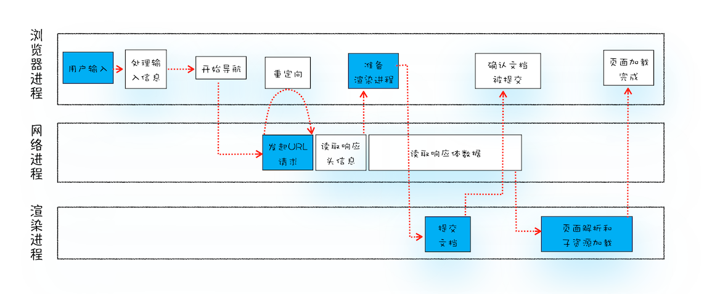
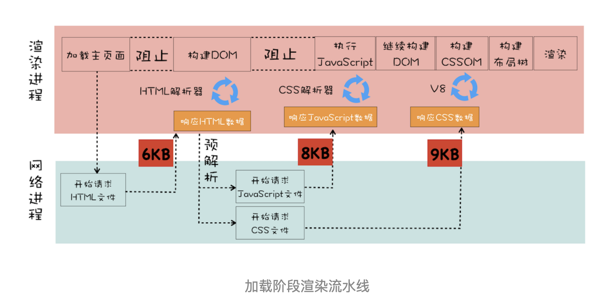
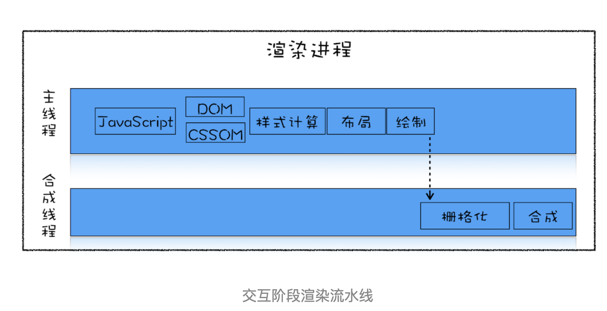

# 前言

在前端性能优化中，页面优化是其中一项重要的内容。

这里我们所谈论的页面优化，其实就是要让页面更快地显示和响应。由于一个页面在它不同的阶段，所侧重的关注点是不一样的，所以如果我们要讨论页面优化，就要分析一个页面生存周期的不同阶段。

通常一个页面有三个阶段：**加载阶段、交互阶段和关闭阶段**

- 加载阶段：从开始加载到页面完全渲染完成这段时间，影响到这个阶段的主要因素有网络和 JavaScript 脚本。
- 交互阶段：从页面完全渲染完成到用户开始交互这段时间，影响到这个阶段的主要因素是 JavaScript 脚本。
- 关闭阶段：主要是用户发出关闭指令后页面所做的一些清理操作。

我们需要重点关注加载阶段和交互阶段，因为影响到我们体验的因素主要都在这两个阶段，下面我们就来逐个详细分析下。

## 加载阶段

### 页面加载流程

我们先来看看页面加载过程中都做了哪些事情：



从上图可以看到，网页加载的过程需要各个进程之间的配合，所以在开始正式流程之前，我们还是先来快速回顾下浏览器进程、渲染进程和网络进程的主要职责。

- 浏览器进程主要负责用户交互、子进程管理和文件储存等功能。
- 网络进程是面向渲染进程和浏览器进程等提供网络下载功能。
- 渲染进程的主要职责是把从网络下载的 HTML、JavaScript、CSS、图片等资源解析为可以显示和交互的页面。因为渲染进程所有的内容都是通过网络获取的，会存在一些恶意代码利用浏览器漏洞对系统进行攻击，所以运行在渲染进程里面的代码是不被信任的。这也是为什么 Chrome 会让渲染进程运行在安全沙箱里，就是为了保证系统的安全。

整个流程包含了许多步骤，比较核心的节点是蓝色背景标记出来的。这个过程可以大致描述为如下：

- 首先，用户从浏览器进程里输入请求信息；
- 然后，网络进程发起 URL 请求；
- 服务器响应 URL 请求之后，浏览器进程就又要开始准备渲染进程了；
- 渲染进程准备好之后，需要先向渲染进程提交页面数据，我们称之为提交文档阶段；
- 渲染进程接收完文档信息之后，便开始解析页面和加载子资源，完成页面的渲染。

### 优化

我们先来分析如何系统优化加载阶段中的页面，一个典型的渲染流水线，如下图所示



观察上面这个渲染流水线，你能分析出来有哪些因素影响了页面加载速度吗？下面我们就先来分析下这个问题。

通过前面文章的讲解，你应该已经知道了并非所有的资源都会阻塞页面的首次绘制，比如图片、音频、视频等文件就不会阻塞页面的首次渲染；而 JavaScript、首次请求的 HTML 资源文件、CSS 文件是会阻塞首次渲染的，因为在构建 DOM 的过程中需要 HTML 和 JavaScript 文件，在构造渲染树的过程中需要用到 CSS 文件。

我们把这些能阻塞网页首次渲染的资源称为关键资源。基于关键资源，我们可以继续细化出来三个影响页面首次渲染的核心因素。

- **关键资源的数量**：如果关键资源过多，浏览器需要下载的资源就越多，自然就会越慢。
- **关键资源的体积**：如果关键资源体积过大，浏览器需要花费更长的时间来下载、解析和执行。
- **关键资源的解析顺序**：如果关键资源之间存在依赖关系，那么就会阻塞后续资源的下载。
- **请求关键资源需要多少个 RTT（Round Trip Time）**：RTT 表示的是网络请求从客户端到服务端，再到客户端的时间。由于 TCP 的特性，这个数据并不是一次传输到服务端的，而是需要拆分成一个个数据包来回多次进行传输的。RTT 就是这里的往返时延。通常 1 个 HTTP 的数据包在 14KB 左右，那么假设请求 1 个 0.1M 的页面就需要拆分成 8 个包来传输了，也就是说需要 8 个 RTT。并且资源在物理网络中的位置越远，RTT 就会越大。

了解了影响加载过程中的几个核心因素之后，接下来我们就可以系统性地考虑优化方案了。**总的优化原则就是减少关键资源个数，降低关键资源大小，降低关键资源的 RTT 次数**。

- 如何减少关键资源的个数？一种方式是可以将 JavaScript 和 CSS 改成内联的形式，比如上图的 JavaScript 和 CSS，若都改成内联模式，那么关键资源的个数就由 3 个减少到了 1 个。另一种方式，如果 JavaScript 代码没有 DOM 或者 CSSOM 的操作，则可以改成 sync 或者 defer 属性；同样对于 CSS，如果不是在构建页面之前加载的，则可以添加媒体取消阻止显现的标志。当 JavaScript 标签加上了 sync 或者 defer、CSSlink 属性之前加上了取消阻止显现的标志后，它们就变成了非关键资源了。
- 如何减少关键资源的大小？可以压缩 CSS 和 JavaScript 资源，移除 HTML、CSS、JavaScript 文件中一些注释内容，也可以通过前面讲的取消 CSS 或者 JavaScript 中关键资源的方式。
- 如何减少关键资源 RTT 的次数？可以通过减少关键资源的个数和减少关键资源的大小搭配来实现。除此之外，还可以使用 CDN 来减少每次 RTT 时长。

在优化实际的页面加载速度时，我们可以先画出优化之前关键资源的图表，然后按照上面优化关键资源的原则去优化，优化完成之后再画出优化之后的关键资源图表。

## 交互阶段

接下来我们再来聊聊页面加载完成之后的交互阶段以及应该如何去优化。谈交互阶段的优化，其实就是在谈渲染进程渲染帧的速度，因为在交互阶段，帧的渲染速度决定了交互的流畅度。因此讨论页面优化实际上就是讨论渲染引擎是如何渲染帧的，否则就无法优化帧率。

我们先来看看交互阶段的渲染流水线（如下图）。和加载阶段的渲染流水线有一些不同的地方是，在交互阶段没有了加载关键资源和构建 DOM、CSSOM 流程，通常是由 JavaScript 触发交互动画的。



结合上图，我们来一起回顾下交互阶段是如何生成一个帧的。大部分情况下，生成一个新的帧都是由 JavaScript 通过修改 DOM 或者 CSSOM 来触发的。还有另外一部分帧是由 CSS 来触发的。

如果在计算样式阶段发现有布局信息的修改，那么就会触发重排操作，然后触发后续渲染流水线的一系列操作，这个代价是非常大的。

同样如果在计算样式阶段没有发现有布局信息的修改，只是修改了颜色一类的信息，那么就不会涉及到布局相关的调整，所以可以跳过布局阶段，直接进入绘制阶段，这个过程叫重绘。不过重绘阶段的代价也是不小的。

还有另外一种情况，通过 CSS 实现一些变形、渐变、动画等特效，这是由 CSS 触发的，并且是在合成线程上执行的，这个过程称为合成。因为它不会触发重排或者重绘，而且合成操作本身的速度就非常快，所以执行合成是效率最高的方式。

回顾了在交互过程中的帧是如何生成的，那接下来我们就可以讨论优化方案了。**核心的优化原则是：尽量减少一帧的生成时间**。所以，下面我们就来分析下在交互阶段渲染流水线中有哪些因素影响了帧的生成速度以及如何去优化。

- **减少 JavaScript 脚本执行时间**：JavaScript 脚本执行时间过长，就会阻塞后续的渲染流水线。针对这种情况我们可以采用以下两种策略：
  - 将一次执行的函数分解为多个任务，使得每个任务执行时间足够短。例如，可以使用 setTimeout 或者 requestAnimationFrame 来执行函数。
  - 使用 Web Worker 来执行耗时的任务。
- **避免强制同步布局**：通过 DOM 接口执行添加元素或者删除元素等操作后，是需要重新计算样式和布局的，不过正常情况下这些操作都是在另外的任务中异步完成的，这样做是为了避免当前的任务占用太长的主线程时间。而强制同步布局，是指 JavaScript 强制将计算样式和布局操作提前到当前的任务中。为了避免强制同步布局，我们尽量避免在修改 DOM 之后查询布局信息。
- **避免布局抖动**：还有一种比强制同步布局更坏的情况，那就是布局抖动。所谓布局抖动，是指在一次 JavaScript 执行过程中，多次执行强制布局和抖动操作。这种情况的避免方式和强制同步布局一样，都是尽量不要在修改 DOM 结构时再去查询一些相关值。
- **合理利用 CSS 合成动画**：合成动画是直接在合成线程上执行的，这和在主线程上执行的布局、绘制等操作不同，如果主线程被 JavaScript 或者一些布局任务占用，CSS 动画依然能继续执行。所以要尽量利用好 CSS 合成动画，如果能让 CSS 处理动画，就尽量交给 CSS 来操作。另外，如果能提前知道对某个元素执行动画操作，那就最好将其标记为 will-change，这是告诉渲染引擎需要将该元素单独生成一个图层。
- **避免频繁的垃圾回收**：我们知道 JavaScript 使用了自动垃圾回收机制，如果在一些函数中频繁创建临时对象，那么垃圾回收器也会频繁地去执行垃圾回收策略。这样当垃圾回收操作发生时，就会占用主线程，从而影响到其他任务的执行，严重的话还会让用户产生掉帧、不流畅的感觉。所以要尽量避免产生那些临时垃圾数据。那该怎么做呢？可以尽可能优化储存结构，尽可能避免小颗粒对象的产生。

## 实战优化方案

### JS 拆分与合并

1. **路由懒加载**：使用 import()函数语句，将路由组件打包成独立的模块。只有访问到对应路由时，才去加载对应的组件内容。这种方式可以有效地减少首次加载页面时需要加载的代码量，提高页面的加载速度。
2. **按需导入**：在项目中只引入所需的特定模块或功能，而不是引入整个包。这样可以减小项目的体积，提高加载速度，使用 babel-plugin-import 插件，可以做到按需加载组件。
3. **提取公共包**：当一个 npm 包在多个路由页面中被引用，vite 和 webpack 都会把公共包提取到一个公共的 chunk（块）中。而随着项目越来越大，更多公共包的引入，体积只会越来越大。而且其中任何一个 npm 包进行了更新，文件的 hash 值就会改变，缓存失效，浏览器得重新从服务器下载资源。我们可以通过 webpack 使用 splitChunks，vite 基于 rollup 使用 manualChunks 提取指定的公共包。

### 图片优化

1. **图片格式选择**：在选择图片格式时，要根据实际需求来选择。如果需要显示透明度，则使用 png 格式；如果不需要透明度，则可以使用 jpg 格式。当只需要显示颜色丰富的图片，则使用 webp 格式，webp 格式可以同时提供有损压缩和无损压缩两种格式，并且提供了两种质量设置，在保证视觉效果的前提下，可以更进一步减小图片体积，可以使用在线工具在线转换，或者使用插件自动化生成，例如 image-min-webp。
2. **压缩图片**：使用 tinypng、pngquant 等工具对图片进行压缩，可以减小图片的体积，提高加载速度，或者在构建流程中加入压缩图片插件，例如 image-webpack-loader。
3. **懒加载**：对于一些非首屏的图片，我们可以使用懒加载的方式，只有用户滚动到相应的位置时才去加载该图片，可以使用 IntersectionObserver API，或者使用 lazyload 插件实现。
4. **CDN 加速**：将静态资源部署到 cdn 上，可以提高资源的访问速度和稳定性。
5. **图片降级**：当网络条件较差时，可以优先展示低分辨率的图片，然后通过监听 window 对象的 load 事件，再替换为高清图。
6. **预加载**：在进入某个页面后，提前加载当前页面的所需图片，这样就可以避免用户点击操作时出现图片加载等待的情况。
7. **使用图标字体代替图片**：使用 iconfont 或者 svg 图标，可以减少图片请求数量，也可以减小图片体积。
8. **使用 base64 编码**：可以将图片转换为 base64 格式的字符串，这样可以减少 http 请求。

### 传输优化

- **脚本异步加载**：defer 属性可以异步加载脚本，能保证执行顺序。在 DOM 解析之后，DOMContentLoaded 触发之前执行。async 属性也可以异步加载脚本，不能保证执行顺序。浏览器会尽快解析和执行。
- **资源预加载**：preload 属性可以告诉浏览器在页面加载完成后，提前获取需要的资源，并放入浏览器的缓存中。prefetch 属性在浏览器空闲时预先下载其他页面可能要用到的资源。
- **减少 DNS 查询**：浏览器在请求资源时，会进行 dns 解析。当浏览器要请求一个资源时，会先检查本地缓存中有没有该域名对应的 ip 地址。可以使用 dns-prefetch 预解析，告诉浏览器当前页面要用到哪些域名对应的 ip 地址，或者 preconnct 提前建立连接。
- **使用 http2**：http2 支持多路复用，可以减少请求数。需要服务器端支持，如 Apache 需要 mod_spdy 模块，Nginx 需要 http_v2_module 模块。
- **开启 Gzip 压缩**：使用 gzip 对传输的数据进行压缩，可以减小文件体积，加快传输速度。下面是 nginx 开启 gzip 压缩示例：

```conf
http{
  gzip on; # 是否开启gzip
  gzip_min_length  1k;# 开始压缩的最小长度(再小就不要压缩了,意义不在)
  gzip_buffers     4 16k; # 缓冲(压缩在内存中缓冲几块? 每块多大?)
  gzip_http_version 1.1;# 开始压缩的http协议版本(可以不设置,目前几乎全是1.1协议)
  gzip_comp_level 2;# 推荐6 压缩级别(级别越高,压的越小,越浪费CPU计算资源)
  gzip_types     text/plain application/javascript application/x-javascript text/javascript text/css application/xml;# 对哪些类型的文件用压缩 如txt,xml,html ,css
  gzip_vary on; # 是否传输gzip压缩标志
  gzip_proxied   expired no-cache no-store private auth; #Nginx做为反向代理的时候启用 例如如果header中包含”Expires”头信息，启用压缩
  gzip_disable   "MSIE [1-6]\."; #正则匹配UA，配置禁用gzip条件。此处表示ie6及以下不启用gzip（因为ie低版本不支持）
  gzip_static on; #开启后会寻找以.gz结尾的文件，直接返回
}
```

> 尽管 Nginx 已配置为在响应时压缩并返回 Gzip 格式的数据，但压缩操作会消耗服务器 CPU 资源和时间。压缩级别越高，资源消耗越大。因此，我们通常会上传已压缩的 gzip 文件，以便服务器直接返回，从而节省资源。在 Nginx 上我们需要配置 gzip_static on 来启用该功能。

- **使用 CDN 加速**：将静态资源部署到 cdn 上，可以提高资源的访问速度和稳定性。CDN 加速原理：通过在网络不同节点部署缓存服务器，就近返回资源给用户，以提高网站的访问速度，使用 CDN 之后，还需配置 externals(webpack)、external(vite)，告诉打包工具忽略对某些库的打包，因为这些库已经通过 CDN 链接在浏览器中直接引用了：

```js
/* 假设已经配置了 echarts 通过 CDN 引入 */

//webpack.config.js
module.exports = {
  //...
  //externals中的key是用于import，value表示在全局中访问到该对象
  externals: {
    echarts: 'echarts',
  },
};

//vite.config.ts
export default () => {
  return defineConfig({
    //...
    build: {
      rollupOptions: {
        //...
        external: ['echarts'],
      },
    },
  });
};
```

- **SSR**：服务端渲染，将页面在服务器端生成 HTML 字符串，然后直接返回给客户端。

### 缓存优化

- **缓存静态资源**：使用 webpack 打包工具，可以将静态资源文件进行 hash 值处理，生成一个 hash 值作为文件名，这样每次修改文件内容后，文件名就会变化，浏览器就会重新请求资源。
- **缓存接口数据**：使用 localStorage、sessionStorage 等浏览器缓存技术，将一些不需要频繁请求的数据存储到本地。

### 交互优化

- **使用虚拟列表**：当数据量过大时，可以使用虚拟列表的方式只渲染可视区域内的数据。
- **使用骨架屏**：在页面资源未加载完成之前，先展示出页面的大致结构，等页面资源加载完成后，再替换成真实的页面内容。
- **防抖和节流**：防抖是指在事件被触发 n 秒后再执行回调，如果在这 n 秒内事件又被触发，则重新计时；节流是指规定一个单位时间，在这个单位时间内，只能有一次函数执行事件。
- **loading**：在数据未加载完成之前，页面展示一个 loading 动画，减轻等待焦虑。如 nprogress 插件。

## 性能指标 - Timings

在了解完页面加载和交互的优化方案之后，我们再来看看如何衡量页面的性能。

- **首次内容绘制（First Contentful Paint，FCP）**：指浏览器将第一个文本、图片、非空白 canvas 的内容绘制到屏幕上的时间。
- **首次有效绘制（First Meaningful Paint，FMP）**：指浏览器将页面主要内容（如文本、图片等）绘制到屏幕上的时间。
- **首次 CPU 空闲（First CPU Idle，FCI）**：指浏览器在一定时间内没有执行任何高耗能任务时的时间。
- **首次可交互（First Interactive，FID）**：指用户可以与页面进行交互的时间。
- **总下载时间（Total Download Time，TDT）**：指从浏览器开始请求资源到所有资源下载完成的时间。
- **首次绘制时间（First Paint，FP）**：指浏览器将页面上第一个像素点绘制到屏幕上所花费的时间。
- **文档内容加载完成时间（DOMContentLoaded，DCL）**: 指浏览器解析完所有 HTML 文档的时间。
- **页面完全加载时间（Page Load Time，PLT）**：指浏览器从开始请求资源到页面完全加载完成的时间。
- **最大下载时间（Max Download Time，MDT）**: 指浏览器从开始请求资源到最大资源下载完成的时间。
- **最大内容绘制时间（Largest Contentful Paint，LCP）**: 指浏览器从开始请求资源到最大内容绘制完成的时间。

> 加载顺序由页面决定，例如 L 可能在 LCP 之前，也可能在 LCP 之后

## 总结

以上就是关于前端性能优化的相关内容了，希望对大家有所帮助。

1. 减少关键资源的个数、体积和 RTT 的次数，这是优化页面加载速度的核心原则。
2. 在交互阶段，要尽量减少一帧的生成时间，避免 JavaScript 脚本执行时间过长，避免强制同步布局，合理利用 CSS 合成动画。
