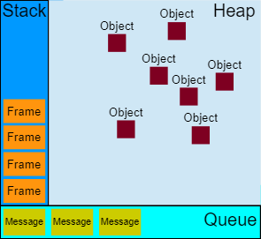
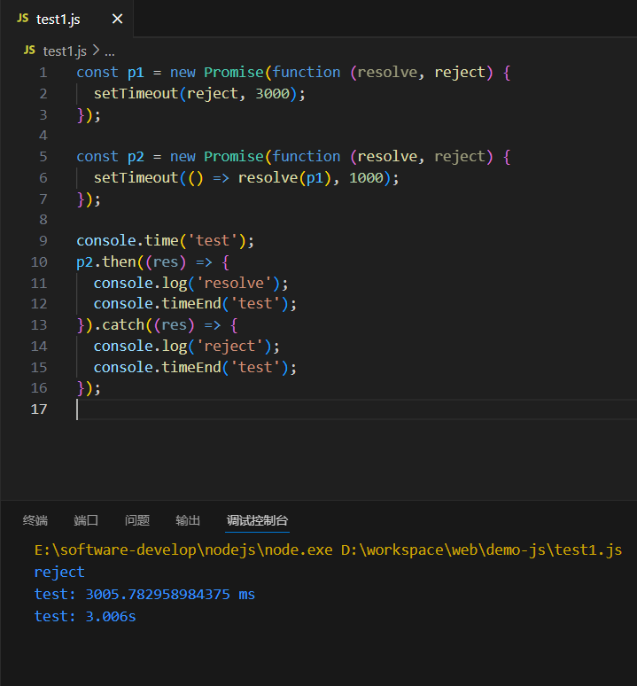

# 并发模型

JavaScript 有一个基于事件循环的并发模型，事件循环负责执行代码、收集和处理事件以及执行队列中的子任务。

## 运行时概念

接下来的内容解释了这个理论模型。现代 JavaScript 引擎实现并着重优化了以下描述的这些语义。



**栈**

栈是用来存储函数调用框架的内存区域。每一个函数调用都会创建一个对应的栈帧，它存储了该函数执行期间可能用到的数据：函数的局部变量、参数和 this。

```js
function foo(b) {
  let a = 10;
  return a + b + 11;
}

function bar(x) {
  let y = 3;
  return foo(x * y);
}
console.log(bar(7)); // 返回 42
```

当调用 bar 时，第一个帧被创建并压入栈中，帧中包含了 bar 的参数和局部变量。当 bar 调用 foo 时，第二个帧被创建并被压入栈中，放在第一个帧之上，帧中包含 foo 的参数和局部变量。当 foo 执行完毕然后返回时，第二个帧就被弹出栈（剩下 bar 函数的调用帧）。当 bar 也执行完毕然后返回时，第一个帧也被弹出，栈就被清空了。

**堆**

对象被分配在堆中，堆是一个用来表示一大块（通常是非结构化的）内存区域的计算机术语。

**队列**

一个 JavaScript 运行时包含了一个待处理消息的消息队列。每一个消息都关联着一个用以处理这个消息的回调函数。

在 `事件循环` 期间的某个时刻，运行时会从最先进入队列的消息开始处理队列中的消息。被处理的消息会被移出队列，并作为输入参数来调用与之关联的函数。正如前面所提到的，调用一个函数总是会为其创造一个新的栈帧。

函数的处理会一直进行到执行栈再次为空为止；然后事件循环将会处理队列中的下一个消息（如果还有的话）。

**事件循环**

之所以称之为 事件循环，是因为它经常按照类似如下的方式来被实现：

```js
while (queue.waitForMessage()) {
  queue.processNextMessage();
}
```

queue.waitForMessage() 会同步地等待消息到达 (如果当前没有任何消息等待被处理)。

**"执行至完成"**

每一个消息完整地执行后，其他消息才会被执行。这为程序的分析提供了一些优秀的特性，包括：当一个函数执行时，它不会被抢占，只有在它运行完毕之后才会去运行任何其他的代码，才能修改这个函数操作的数据。这与 C 语言不同，例如，如果函数在线程中运行，它可能在任何位置被终止，然后在另一个线程中运行其他代码。

这个模型的一个缺点在于当一个消息需要太长时间才能处理完毕时，Web 应用程序就无法处理与用户的交互，例如点击或滚动。为了缓解这个问题，浏览器一般会弹出一个“这个脚本运行时间过长”的对话框。一个良好的习惯是缩短单个消息处理时间，并在可能的情况下将一个消息裁剪成多个消息。

**添加消息**

在浏览器里，每当一个事件发生并且有一个事件监听器绑定在该事件上时，一个消息就会被添加进消息队列。如果没有事件监听器，这个事件将会丢失。所以当一个带有点击事件处理器的元素被点击时，就会像其他事件一样产生一个类似的消息。

函数 setTimeout 接受两个参数：待加入队列的消息和一个时间值（可选，默认为 0）。这个时间值代表了消息被实际加入到队列的最小延迟时间。如果队列中没有其他消息并且栈为空，在这段延迟时间过去之后，消息会被马上处理。但是，如果有其他消息，setTimeout 消息必须等待其他消息处理完。因此第二个参数仅仅表示最少延迟时间，而非确切的等待时间。

**零延迟**

零延迟并不意味着回调会立即执行。以 0 为第二参数调用 setTimeout 并不表示在 0 毫秒后就立即调用回调函数。

其等待的时间取决于队列里待处理的消息数量。在下面的例子中，"这是一条消息" 将会在回调获得处理之前输出到控制台，这是因为延迟参数是运行时处理请求所需的最小等待时间，但并不保证是准确的等待时间。

基本上，setTimeout 需要等待当前队列中所有的消息都处理完毕之后才能执行，即使已经超出了由第二参数所指定的时间。

```js
(function () {
  console.log('这是开始');

  setTimeout(function cb() {
    console.log('这是来自第一个回调的消息');
  });

  console.log('这是一条消息');

  setTimeout(function cb1() {
    console.log('这是来自第二个回调的消息');
  }, 0);

  console.log('这是结束');
})();

// "这是开始"
// "这是一条消息"
// "这是结束"
// "这是来自第一个回调的消息"
// "这是来自第二个回调的消息"
```

**多个运行时互相通信**

一个 web worker 或者一个跨域的 iframe 都有自己的栈、堆和消息队列。两个不同的运行时只能通过 postMessage 方法进行通信。如果另一个运行时侦听 message 事件，则此方法会向该运行时添加消息。

**永不阻塞**

JavaScript 的事件循环模型与许多其他语言不同的一个非常有趣的特性是，它永不阻塞。处理 I/O 通常通过事件和回调来执行，所以当一个应用正等待一个 IndexedDB 查询返回或者一个 XHR 请求返回时，它仍然可以处理其他事情，比如用户输入。

## 异步编程

异步编程是一种处理并发操作的编程方式，它允许程序在等待异步操作完成时继续执行其他任务。这对于提高应用程序的响应性和性能至关重要，特别是在处理 I/O 操作（如网络请求、文件读写等）时。以下是 JavaScript 在浏览器上常见的异步编程方法：

1. **回调函数（Callback Functions）**
   回调函数是最基础的异步编程方法。它将一个函数作为参数传递给另一个函数，在某个时刻，后者会执行这个回调函数。
   **优点**：简单易实现，适用于简单的异步操作。
   **缺点**：可能导致“回调地狱”，代码难以维护，错误处理复杂。
   **示例**：

   ```javascript
   function asyncOperation(callback) {
     // 异步操作
     setTimeout(() => {
       callback('Operation completed');
     }, 1000);
   }

   asyncOperation((result) => {
     console.log(result);
   });
   ```

2. **事件监听（Event Listeners）**
   事件监听是一种基于事件的异步编程方式。当特定的事件发生时，事件处理函数会被调用。
   **优点**：适用于基于用户交互的异步操作，如点击、滚动等。
   **缺点**：不适合复杂的异步流程控制。
   **示例**：

   ```javascript
   document.addEventListener('click', () => {
     console.log('Button clicked');
   });
   ```

3. **Promises**
   Promises 是 ES6 引入的，用于表示异步操作的最终完成（或失败）及其结果值。
   **优点**：解决了回调函数的“回调地狱”问题，提供了链式调用的方式。
   **缺点**：无法中途取消、异常捕获复杂、无法获取任务进展。
   **示例**：

   ```javascript
   const promise = new Promise((resolve, reject) => {
     setTimeout(() => {
       resolve('Promise completed');
     }, 1000);
   });

   promise
     .then((result) => {
       console.log(result);
     })
     .catch((error) => {
       console.error(error);
     });
   ```

4. **Async/Await**
   `async`和`await`是 ES2017 引入的，它们建立在 Promises 之上，提供了一种更直观的异步编程方式。
   **优点**：使得异步代码看起来和同步代码类似，易于理解和维护。
   **缺点**：只能在`async`函数内部使用`await`。
   **示例**：

   ```javascript
   async function asyncFunction() {
     try {
       const result = await Promise.resolve('Async operation completed');
       console.log(result);
     } catch (error) {
       console.error(error);
     }
   }

   asyncFunction();
   ```

5. **Web Workers**
   Web Workers 允许在后台线程中运行 JavaScript 代码，不阻塞主线程。
   **优点**：适用于复杂的计算任务，避免阻塞 UI 线程。
   **缺点**：与主线程的通信需要通过消息传递。
   **示例**：

   ```javascript
   const worker = new Worker('worker.js');
   worker.onmessage = (event) => {
     console.log('Message from worker:', event.data);
   };
   worker.postMessage('Start task');
   ```

6. **Service Workers**
   Service Workers 运行在浏览器的后台，可以控制页面的加载、缓存和网络请求。
   **优点**：可以缓存资源，实现离线体验。
   **缺点**：配置和调试相对复杂。
   **示例**：

   ```javascript
   if ('serviceWorker' in navigator) {
     navigator.serviceWorker
       .register('/service-worker.js')
       .then((registration) => {
         console.log('Service Worker registered');
       })
       .catch((error) => {
         console.error('Service Worker registration failed', error);
       });
   }
   ```

7. **Request Animation Frame**
   `requestAnimationFrame`用于在浏览器的下一次重绘之前执行动画帧的更新。
   **优点**：提供平滑的动画效果。
   **缺点**：仅限于动画相关的任务。
   **示例**：

   ```javascript
   function animate() {
     // 更新动画帧
     requestAnimationFrame(animate);
   }

   animate();
   ```

这些异步编程方式各有适用场景，开发者可以根据具体需求选择合适的方法来处理异步操作。随着 JavaScript 语言的发展，异步编程模型也在不断进化，以适应更复杂的应用场景。

## 理解 Promise

所谓 Promise，简单说就是一个容器，里面保存着某个未来才会结束的事件（通常是一个异步操作）的结果。从语法上说，Promise 是一个对象，从它可以获取异步操作的消息。Promise 提供统一的 API，各种异步操作都可以用同样的方法进行处理。

Promise 对象有以下两个特点：

1. **对象的状态不受外界影响。** Promise 对象代表一个异步操作，有三种状态：pending（进行中）、fulfilled（已成功）和 rejected（已失败）。只有异步操作的结果，可以决定当前是哪一种状态，任何其他操作都无法改变这个状态。这也是 Promise 这个名字的由来，它的英语意思就是“承诺”，表示其他手段无法改变。
2. **一旦状态改变，就不会再变。** 任何时候都可以得到这个结果。Promise 对象的状态改变，只有两种可能：从 pending 变为 fulfilled 和从 pending 变为 rejected。只要这两种情况发生，状态就凝固了，不会再变了，会一直保持这个结果，这时就称为 resolved（已定型）。如果改变已经发生了，你再对 Promise 对象添加回调函数，也会立即得到这个结果。这与事件（Event）完全不同，事件的特点是，如果你错过了它，再去监听，是得不到结果的。

**状态会传递**

当一个 promise（p2） 的 resove 方法返回一个 promise（p1） 对象时，即一个异步操作的结果是返回另一个异步操作。如果 p1 的状态是 pending，那么 p2 的回调函数就会等待 p1 的状态改变。



如上图所示，3s 后执行 catch 回调。由于 p2 返回的是另一个 Promise，导致 p2 自己的状态无效，由 p1 的状态决定 p2 的状态。所以，后面的 then、catch 语句都变成针对后者（p1）。

**错误“冒泡”**

Promise 对象的错误具有“冒泡”性质，会一直向后传递，直到被捕获为止。也就是说，错误总是会被下一个 catch 语句捕获。

```js
const p = new Promise((resolve, reject) => {
  setTimeout(reject, 0, 'error');
});

p.then(() => console.log('success'))
  .then(() => console.log('success2'))
  .catch((err) => console.log(err));
```

上面代码中，一共有三个 Promise 对象：一个是 new 出来的 p，两个由 then()产生。它们之中任何一个抛出的错误，都会被最后一个 catch()捕获。

所以一般来说，不要在 then()方法里面定义 Reject 状态的回调函数（即 then 的第二个参数），而应该总是使用 catch 回调来捕获。

```js
// bad
promise.then(
  function (data) {
    // success
  },
  function (err) {
    // error
  }
);

// good
promise
  .then(function (data) {
    // success
  })
  .catch(function (err) {
    // error
  });
```

**手写 Promise**

我们可以通过 settimeOut 模拟异步，创建一个类似 Promise 的类，实现 `Promise` 的基本功能，包括异步的 `resolve` 和 `reject`，以及链式调用的 `then` 方法。

```javascript
class MyPromise {
  constructor(executor) {
    // 定义三个状态常量
    this._PENDING = 'pending';
    this._FULFILLED = 'fulfilled';
    this._REJECTED = 'rejected';

    // 初始状态为 pending
    this.state = this._PENDING;

    // 存储成功或失败的值
    this.value = undefined;

    // 存储成功和失败的回调函数队列
    this.onFulfilledCallbacks = [];
    this.onRejectedCallbacks = [];

    try {
      executor(this._resolve, this._reject);
    } catch (err) {
      this._reject(err);
    }
  }

  _resolve = (value) => {
    // 如果不是 pending 状态，忽略
    if (this.state !== this._PENDING) return;

    // 模拟真实的 Promise 行为，异步执行成功回调
    setTimeout(() => {
      this.state = this._FULFILLED;
      this.value = value;

      // 执行所有成功回调
      this.onFulfilledCallbacks.forEach((callback) => callback(value));
    });
  };

  _reject = (reason) => {
    // 如果不是 pending 状态，忽略
    if (this.state !== this._PENDING) return;

    // 模拟真实的 Promise 行为，异步执行失败回调
    setTimeout(() => {
      this.state = this._REJECTED;
      this.value = reason;

      // 执行所有失败回调
      this.onRejectedCallbacks.forEach((callback) => callback(reason));
    });
  };

  then(onFulfilled, onRejected) {
    // 如果 onFulfilled 或 onRejected 不是函数，则使用默认处理
    onFulfilled = typeof onFulfilled === 'function' ? onFulfilled : (value) => value;
    onRejected =
      typeof onRejected === 'function'
        ? onRejected
        : (reason) => {
            throw reason;
          };

    // 创建一个新的 MyPromise 实例
    let promise2 = new MyPromise((resolve, reject) => {
      // 如果当前 Promise 是成功的，执行成功回调
      if (this.state === this._FULFILLED) {
        setTimeout(() => {
          try {
            const x = onFulfilled(this.value);
            resolvePromise(promise2, x, resolve, reject);
          } catch (err) {
            reject(err);
          }
        });
      }

      // 如果当前 Promise 是失败的，执行失败回调
      if (this.state === this._REJECTED) {
        setTimeout(() => {
          try {
            const x = onRejected(this.value);
            resolvePromise(promise2, x, resolve, reject);
          } catch (err) {
            reject(err);
          }
        });
      }

      // 如果当前 Promise 还是 pending 状态，先保存回调函数
      if (this.state === this._PENDING) {
        this.onFulfilledCallbacks.push(() => {
          setTimeout(() => {
            try {
              const x = onFulfilled(this.value);
              resolvePromise(promise2, x, resolve, reject);
            } catch (err) {
              reject(err);
            }
          });
        });
        this.onRejectedCallbacks.push(() => {
          setTimeout(() => {
            try {
              const x = onRejected(this.value);
              resolvePromise(promise2, x, resolve, reject);
            } catch (err) {
              reject(err);
            }
          });
        });
      }
    });

    return promise2;
  }

  // 静态方法，用于解决 then 方法中的返回值
  static resolvePromise(promise2, x, resolve, reject) {
    // 如果 x 就是一个 MyPromise 实例，直接状态转移
    if (x instanceof MyPromise) {
      x.then(resolve, reject);
    } else if (x !== null && typeof x === 'object') {
      let called;
      try {
        let then = x.then;
        if (typeof then === 'function') {
          then.call(
            x,
            (y) => {
              if (called) return;
              called = true;
              resolvePromise(promise2, y, resolve, reject);
            },
            (err) => {
              if (called) return;
              called = true;
              reject(err);
            }
          );
        } else {
          if (called) return;
          called = true;
          resolve(x);
        }
      } catch (err) {
        if (called) return;
        called = true;
        reject(err);
      }
    } else {
      resolve(x);
    }
  }
}

// 使用示例
const myPromise = new MyPromise((resolve, reject) => {
  setTimeout(() => {
    resolve('Success!');
  }, 1000);
});

myPromise.then(
  (value) => {
    console.log(value); // 输出：Success!
  },
  (reason) => {
    console.error(reason);
  }
);
```

## generator 函数

Generator 函数是 ES6 提供的一种异步编程解决方案，语法行为与传统函数完全不同。

Generator 函数有多种理解角度。语法上，首先可以把它理解成，Generator 函数是一个状态机，封装了多个内部状态。

执行 Generator 函数会返回一个遍历器对象，也就是说，Generator 函数除了状态机，还是一个遍历器对象生成函数。返回的遍历器对象，可以依次遍历 Generator 函数内部的每一个状态。

形式上，Generator 函数是一个普通函数，但是有两个特征。一是，function 关键字与函数名之间有一个星号；二是，函数体内部使用 yield 表达式，定义不同的内部状态（yield 在英语里的意思就是“产出”）。

```javascript
function* helloWorldGenerator() {
  yield 'hello';
  yield 'world';
  return 'ending';
}

var hw = helloWorldGenerator();
```

上面代码定义了一个 Generator 函数 helloWorldGenerator，它内部有两个 yield 表达式（hello 和 world），即该函数有三个状态：hello，world 和 return 语句（结束执行）。

然后，Generator 函数的调用方法与普通函数一样，也是在函数名后面加上一对圆括号。不同的是，调用 Generator 函数后，**该函数并不执行**，返回的也不是函数运行结果，而是一个指向内部状态的**遍历器对象**（Iterator Object）。

下一步，必须调用遍历器对象的 **next** 方法，使得指针移向下一个状态。也就是说，每次调用 next 方法，内部指针就从函数头部或上一次停下来的地方开始执行，**直到遇到下一个 yield** 表达式（或 return 语句）为止。换言之，Generator 函数是分段执行的，yield 表达式是暂停执行的标记，而 next 方法可以恢复执行。

```javascript
hw.next();
// { value: 'hello', done: false }

hw.next();
// { value: 'world', done: false }

hw.next();
// { value: 'ending', done: true }

hw.next();
// { value: undefined, done: true }
```

上面代码一共调用了四次 next 方法，第一次调用，Generator 函数开始执行，直到遇到第一个 yield 表达式为止。第二次调用，Generator 函数从上次 yield 表达式停下的地方，一直执行到下一个 yield 表达式。第三次调用，Generator 函数已经执行完毕，此时 done 属性为 true，value 属性返回的是 Generator 函数的返回值。第四次调用，此时 Generator 函数已经运行完毕，next 方法返回对象的 value 属性为 undefined，done 属性为 true。以后再调用 next 方法，返回的都是这个值。

### yield 表达式

由于 Generator 函数返回的遍历器对象，只有调用 next 方法才会遍历下一个内部状态，所以其实提供了一种可以暂停执行的函数。yield 表达式就是暂停标志。

遍历器对象的 next 方法的运行逻辑如下：

（1）遇到 yield 表达式，就暂停执行后面的操作，并将紧跟在 yield 后面的那个表达式的值，作为返回的对象的 value 属性值。

（2）下一次调用 next 方法时，再继续往下执行，直到遇到下一个 yield 表达式。

（3）如果没有再遇到新的 yield 表达式，就一直运行到函数结束，直到 return 语句为止，并将 return 语句后面的表达式的值，作为返回的对象的 value 属性值。

（4）如果该函数没有 return 语句，则返回的对象的 value 属性值为 undefined。

yield 表达式只能用在 Generator 函数里面。另外需要注意的是，yield 表达式后面的表达式，只有当调用 next 方法、内部指针指向该语句时才会执行，因此等于为 JavaScript 提供了手动的“惰性求值”（Lazy Evaluation）的语法功能。

**yield\* 表达式**
如果在 Generator 函数内部，调用另一个 Generator 函数。需要在前者的函数体内部，自己手动完成遍历。

ES6 提供了 yield\*表达式，作为解决办法，用来在一个 Generator 函数里面执行另一个 Generator 函数。

```javascript
function* foo() {
  yield 'a';
  yield 'b';
}

function* bar() {
  yield 'x';
  yield* foo();
  yield 'y';
}

// 等同于
function* bar() {
  yield 'x';
  yield 'a';
  yield 'b';
  yield 'y';
}

// 等同于
function* bar() {
  yield 'x';
  for (let v of foo()) {
    yield v;
  }
  yield 'y';
}

for (let v of bar()) {
  console.log(v);
}
// "x"
// "a"
// "b"
// "y"
```

### next 方法的参数

yield 表达式本身没有返回值，或者说总是返回 undefined。next 方法可以带一个参数，该参数就会被当作上一个 yield 表达式的返回值。

这个功能有很重要的语法意义。Generator 函数从暂停状态到恢复运行，它的上下文状态（context）是不变的。通过 next 方法的参数，就有办法在 Generator 函数开始运行之后，继续向函数体内部注入值。也就是说，可以在 Generator 函数运行的不同阶段，从外部向内部注入不同的值，从而调整函数行为。

```javascript
function* foo(x) {
  var y = 2 * (yield x + 1);
  var z = yield y / 3;
  return x + y + z;
}

var a = foo(5);
a.next(); // Object{value:6, done:false}
a.next(); // Object{value:NaN, done:false}
a.next(); // Object{value:NaN, done:true}

var b = foo(5);
b.next(); // { value:6, done:false }
b.next(12); // { value:8, done:false }
b.next(13); // { value:42, done:true }
```

注意，由于 next 方法的参数表示上一个 yield 表达式的返回值，所以在第一次使用 next 方法时，传递参数是无效的。V8 引擎直接忽略第一次使用 next 方法时的参数，只有从第二次使用 next 方法开始，参数才是有效的。从语义上讲，第一个 next 方法用来启动遍历器对象，所以不用带有参数。

### Generator 与协程

协程（coroutine）是一种程序运行的方式，可以理解成“协作的线程”或“协作的函数”。协程既可以用单线程实现，也可以用多线程实现。前者是一种特殊的子例程，后者是一种特殊的线程。

**（1）协程与子例程的差异**

传统的“子例程”（subroutine）采用堆栈式“后进先出”的执行方式，只有当调用的子函数完全执行完毕，才会结束执行父函数。协程与其不同，多个线程（单线程情况下，即多个函数）可以并行执行，但是只有一个线程（或函数）处于正在运行的状态，其他线程（或函数）都处于暂停态（suspended），线程（或函数）之间可以交换执行权。也就是说，一个线程（或函数）执行到一半，可以暂停执行，将执行权交给另一个线程（或函数），等到稍后收回执行权的时候，再恢复执行。这种可以并行执行、交换执行权的线程（或函数），就称为协程。

从实现上看，在内存中，子例程只使用一个栈（stack），而协程是同时存在多个栈，但只有一个栈是在运行状态，也就是说，协程是以多占用内存为代价，实现多任务的并行。

**（2）协程与普通线程的差异**

不难看出，协程适合用于多任务运行的环境。在这个意义上，它与普通的线程很相似，都有自己的执行上下文、可以分享全局变量。它们的不同之处在于，同一时间可以有多个线程处于运行状态，但是运行的协程只能有一个，其他协程都处于暂停状态。此外，普通的线程是抢先式的，到底哪个线程优先得到资源，必须由运行环境决定，但是协程是合作式的，执行权由协程自己分配。

由于 JavaScript 是单线程语言，只能保持一个调用栈。引入协程以后，每个任务可以保持自己的调用栈。这样做的最大好处，就是抛出错误的时候，可以找到原始的调用栈。不至于像异步操作的回调函数那样，一旦出错，原始的调用栈早就结束。

Generator 函数是 ES6 对协程的实现，但属于不完全实现。Generator 函数被称为“半协程”（semi-coroutine），意思是只有 Generator 函数的调用者，才能将程序的执行权还给 Generator 函数。如果是完全执行的协程，任何函数都可以让暂停的协程继续执行。

如果将 Generator 函数当作协程，完全可以将多个需要互相协作的任务写成 Generator 函数，它们之间使用 yield 表达式交换控制权。

### Generator 与上下文

JavaScript 代码运行时，会产生一个全局的上下文环境（context，又称运行环境），包含了当前所有的变量和对象。然后，执行函数（或块级代码）的时候，又会在当前上下文环境的上层，产生一个函数运行的上下文，变成当前（active）的上下文，由此形成一个上下文环境的堆栈（context stack）。

这个堆栈是“后进先出”的数据结构，最后产生的上下文环境首先执行完成，退出堆栈，然后再执行完成它下层的上下文，直至所有代码执行完成，堆栈清空。

Generator 函数不是这样，它执行产生的上下文环境，一旦遇到 yield 命令，就会暂时退出堆栈，但是并不消失，里面的所有变量和对象会冻结在当前状态。等到对它执行 next 命令时，这个上下文环境又会重新加入调用栈，冻结的变量和对象恢复执行。

```javascript
function* gen() {
  yield 1;
  return 2;
}

let g = gen();

console.log(g.next().value, g.next().value);
```

上面代码中，第一次执行 g.next()时，Generator 函数 gen 的上下文会加入堆栈，即开始运行 gen 内部的代码。等遇到 yield 1 时，gen 上下文退出堆栈，内部状态冻结。第二次执行 g.next()时，gen 上下文重新加入堆栈，变成当前的上下文，重新恢复执行。

### Generator 与异步编程

ES6 诞生以前，JS 异步编程的方法，大概有下面四种。

- 回调函数
- 事件监听
- 发布/订阅
- Promise 对象

Generator 函数将 JavaScript 异步编程带入了一个全新的阶段。

通过 Generator 函数，实现异步操作：

```javascript
var fetch = require('node-fetch');

function* gen() {
  var url = 'https://api.github.com/users/github';
  var result = yield fetch(url);
  console.log(result.bio);
}

var g = gen();
var result = g.next();

result.value
  .then(function (data) {
    return data.json();
  })
  .then(function (data) {
    g.next(data);
  });
```

上面代码中，首先执行 Generator 函数，获取遍历器对象，然后使用 next 方法（第二行），执行异步任务的第一阶段。由于 Fetch 模块返回的是一个 Promise 对象，因此要用 then 方法调用下一个 next 方法。

可以看到，虽然 Generator 函数将异步操作表示得很简洁，但是流程管理却不方便（即何时执行第一阶段、何时执行第二阶段）。

**Thunk 函数**

编译器的“传名调用”实现，往往是将参数放到一个临时函数之中，再将这个临时函数传入函数体。这个临时函数就叫做 Thunk 函数。

```javascript
function f(m) {
  return m * 2;
}

f(x + 5);

// 等同于

var thunk = function () {
  return x + 5;
};

function f(thunk) {
  return thunk() * 2;
}
```

上面代码中，函数 f 的参数 x + 5 被一个函数替换了。凡是用到原参数的地方，对 Thunk 函数求值即可。

这就是 Thunk 函数的定义，它是“传名调用”的一种实现策略，用来替换某个表达式。

JavaScript 语言是**传值调用**，它的 Thunk 函数含义有所不同。在 JavaScript 语言中，Thunk 函数替换的不是表达式，而是多参数函数，将其替换成一个只接受回调函数作为参数的单参数函数。

任何函数，只要参数有回调函数，就能写成 Thunk 函数的形式。下面是一个简单的 Thunk 函数转换器。

```javascript
// ES5版本
var Thunk = function (fn) {
  return function () {
    var args = Array.prototype.slice.call(arguments);
    return function (callback) {
      args.push(callback);
      return fn.apply(this, args);
    };
  };
};

// ES6版本
const Thunk = function (fn) {
  return function (...args) {
    return function (callback) {
      return fn.call(this, ...args, callback);
    };
  };
};

// 使用
function f(a, cb) {
  cb(a);
}
const ft = Thunk(f);

ft(1)(console.log); // 1
```

**基于 Thunk 函数的自动执行器**

Thunk 函数并不是 Generator 函数的特定语法，而是对普通函数式编程的一种推广。Generator 函数是协程在 ES6 的实现，Thunk 函数可以用于 Generator 函数的自动流程管理。

```javascript
function run(fn) {
  var gen = fn();

  function next(err, data) {
    var result = gen.next(data);
    if (result.done) return;
    result.value(next);
  }

  next();
}

function* g() {
  // ...
}

run(g);
```

上面代码的 run 函数，就是一个 Generator 函数的自动执行器。内部的 next 函数就是 Thunk 的回调函数。next 函数先将指针移到 Generator 函数的下一步（gen.next 方法），然后判断 Generator 函数是否结束（result.done 属性），如果没结束，就将 next 函数再传入 Thunk 函数（result.value 属性），否则就直接退出。

有了这个执行器，执行 Generator 函数方便多了。不管内部有多少个异步操作，直接把 Generator 函数传入 run 函数即可。当然，前提是每一个异步操作，都要是 Thunk 函数，也就是说，跟在 yield 命令后面的必须是 Thunk 函数。

Thunk 函数并不是 Generator 函数自动执行的唯一方案。因为自动执行的关键是，必须有一种机制，自动控制 Generator 函数的流程，接收和交还程序的执行权。回调函数可以做到这一点，Promise 对象也可以做到这一点。

**基于 Promise 对象的自动执行器**

```javascript
var fs = require('fs');

var readFile = function (fileName) {
  return new Promise(function (resolve, reject) {
    fs.readFile(fileName, function (error, data) {
      if (error) return reject(error);
      resolve(data);
    });
  });
};

var gen = function* () {
  var f1 = yield readFile('/etc/fstab');
  var f2 = yield readFile('/etc/shells');
  console.log(f1.toString());
  console.log(f2.toString());
};

function run(gen) {
  var g = gen();

  function next(data) {
    var result = g.next(data);
    if (result.done) return result.value;
    result.value.then(function (data) {
      next(data);
    });
  }

  next();
}

run(gen);
```

**co 模块**

co 模块是著名程序员 TJ Holowaychuk 于 2013 年 6 月发布的一个小工具，用于 Generator 函数的自动执行。

```javascript
var co = require('co');

var gen = function* () {
  var f1 = yield readFile('/etc/fstab');
  var f2 = yield readFile('/etc/shells');
  console.log(f1.toString());
  console.log(f2.toString());
};

// co函数返回一个Promise对象
co(gen).then(function () {
  console.log('Generator 函数执行完成');
});
```

co 模块其实就是将两种自动执行器（Thunk 函数和 Promise 对象），包装成一个模块。使用 co 的前提条件是，Generator 函数的 yield 命令后面，只能是 Thunk 函数或 Promise 对象。如果数组或对象的成员，全部都是 Promise 对象，也可以使用 co，co 内部会自动调用 Promise.all。

## 理解 aynsc/await

ES2017 标准引入了 async 函数，使得异步操作变得更加方便。

async 函数是什么？一句话，**它就是 Generator 函数的语法糖**。

**async 函数对 Generator 函数的改进，体现在以下四点：**

1. **内置执行器**
   Generator 函数的执行必须靠执行器，所以才有了 co 模块，而 async 函数自带执行器。也就是说，async 函数的执行，与普通函数一模一样，只要一行。
2. **更好的语义**
   async 和 await，比起星号和 yield，语义更清楚了。async 表示函数里有异步操作，await 表示紧跟在后面的表达式需要等待结果。
3. **更广的适用性**
   co 模块约定，yield 命令后面只能是 Thunk 函数或 Promise 对象，而 async 函数的 await 命令后面，可以是 Promise 对象和原始类型的值（数值、字符串和布尔值，但这时会自动转成立即 resolved 的 Promise 对象）。
4. **返回值是 Promise**
   async 函数的返回值是 Promise 对象，这比 Generator 函数的返回值是 Iterator 对象方便多了。你可以用 then 方法指定下一步的操作。

进一步说，async 函数完全可以看作多个异步操作，包装成的一个 Promise 对象，而 await 命令就是内部 then 命令的语法糖。

`async` 和 `await` 是 JavaScript 中处理异步操作的关键字，它们在 ES2017（也称为 ES8）中引入。这两个关键字使得异步代码的编写和阅读更加直观和简洁，类似于同步代码的风格。

### 基本用法

async 函数返回一个 Promise 对象，可以使用 then 方法添加回调函数。当函数执行的时候，一旦遇到 await 就会先返回，等到异步操作完成，再接着执行函数体内后面的语句。

```javascript
function timeout(ms) {
  return new Promise((resolve) => {
    setTimeout(resolve, ms);
  });
}

async function asyncPrint(value, ms) {
  await timeout(ms);
  console.log(value);
}

//  50 毫秒以后，输出hello world。
asyncPrint('hello world', 50);
```

### async

`async` 是一个用于声明异步函数的关键字。当一个函数被声明为 `async`，这意味着该函数会返回一个 `Promise` 对象。async 函数返回的 Promise 对象，必须等到内部所有 await 命令后面的 Promise 对象执行完，才会发生状态改变，除非遇到 return 语句或者抛出错误。也就是说，只有 async 函数内部的异步操作执行完，才会执行 then 方法指定的回调函数。如果函数正常执行结束，返回的 `Promise` 将被 `resolve`，并返回函数的返回值。如果函数中抛出错误，返回的 `Promise` 将被 `reject`。

**示例**：

```javascript
async function asyncFunction() {
  return 'Hello, World!';
}

asyncFunction().then((value) => {
  console.log(value); // 输出：Hello, World!
});
```

### await

`await` 是一个只能在 `async` 函数内部使用的关键字，用于等待一个 `Promise` 解决。当 `await` 表达式执行时，它会暂停函数的执行，直到等待的 `Promise` 被解决（无论是被 `resolve` 还是 `reject`）。如果 `Promise` 被 `resolve`，`await` 表达式返回 `Promise` 的结果值；如果 `Promise` 被 `reject`，会抛出拒绝的原因。

**示例**：

```javascript
async function fetchData() {
  const data = await fetch('https://api.example.com/data');
  const json = await data.json();
  return json;
}

fetchData()
  .then((data) => {
    console.log(data); // 处理获取的数据
  })
  .catch((error) => {
    console.error(error); // 处理错误
  });
```

### 错误处理

如果 await 后面的异步操作出错，那么等同于 async 函数返回的 Promise 对象被 reject。而任何一个 await 语句后面的 Promise 对象变为 reject 状态，那么整个 async 函数都会中断执行。

```javascript
async function f() {
  await Promise.reject('出错了');
  await Promise.resolve('hello world'); // 不会执行
}
```

如果我们希望即使前一个异步操作失败，也不要中断后面的异步操作。这时可以将第一个 await 放在 try...catch 结构里面，这样不管这个异步操作是否成功，第二个 await 都会执行。

```javascript
async function f() {
  try {
    await Promise.reject('出错了');
  } catch (e) {}
  return await Promise.resolve('hello world');
}

f().then((v) => console.log(v));
// hello world
```

另一种方法是 await 后面的 Promise 对象再跟一个 catch 方法，处理前面可能出现的错误。

### async 函数的实现原理

async 函数的实现原理，就是将 Generator 函数和自动执行器，包装在一个函数里。

```javascript
async function fn(args) {
  // ...
}

// 等同于

function fn(args) {
  return spawn(function* () {
    // ...
  });
}
```

所有的 async 函数都可以写成上面的第二种形式，其中的 spawn 函数就是自动执行器。

下面给出 spawn 函数的实现，基本就是 `co` 自动执行器的翻版。

```javascript
function spawn(genF) {
  return new Promise(function (resolve, reject) {
    const gen = genF();
    function step(nextF) {
      let next;
      try {
        next = nextF();
      } catch (e) {
        return reject(e);
      }
      if (next.done) {
        return resolve(next.value);
      }
      Promise.resolve(next.value).then(
        function (v) {
          step(function () {
            return gen.next(v);
          });
        },
        function (e) {
          step(function () {
            return gen.throw(e);
          });
        }
      );
    }
    step(function () {
      return gen.next(undefined);
    });
  });
}
```

### 特点和优势

1. **简化异步代码**：`async` 和 `await` 使得异步代码的编写更加直观，类似于同步代码，易于理解和维护。

2. **错误处理**：可以在 `async` 函数中使用 `try...catch` 语句来处理 `await` 表达式中抛出的错误。

3. **避免回调地狱**：与传统的回调函数相比，`async` 和 `await` 避免了深层嵌套的回调函数，即所谓的“回调地狱”。

4. **控制流**：`await` 允许更精确地控制异步操作的执行顺序，使得代码的执行流程更加清晰。

5. **性能**：虽然 `async` 和 `await` 提供了更易读的语法，但它们不会改变底层的异步操作性能。`await` 仅在语法层面上暂停函数执行，不会阻塞主线程。

### 注意事项

1. **只能在 `async` 函数中使用 `await`**：`await` 关键字只能在被 `async` 标记的函数内部使用。

2. **`await` 会暂停执行**：`await` 表达式会暂停函数的执行，直到等待的 `Promise` 解决。这意味着在等待期间，JavaScript 运行时可以执行其他任务。

3. **`await` 与 `return` 的关系**：在 `async` 函数中，`await` 表达式后面的 `Promise` 的解决值会成为 `return` 语句的返回值。

4. **`async` 函数的返回值**：即使没有使用 `await`，`async` 函数也会返回一个 `Promise` 对象。

5. **独立的异步操作最好同时触发**：多个 `await` 命令后面的异步操作，如果不存在继发关系，最好让它们同时触发，这样就会缩短程序的执行时间。

6. **async 函数可以保留运行堆栈。**

`async` 和 `await` 是现代 JavaScript 异步编程的重要工具，它们提供了一种更加简洁和直观的方式来处理异步任务。

## 总结

并发模型是 JavaScript 语言中一个重要的概念，它决定了代码的执行方式和性能。JS 引擎的并发模型是基于事件循环和任务队列来实现的。

## 参考

- [MDN - async function](https://developer.mozilla.org/en-US/docs/Web/JavaScript/Reference/Statements/async_function)
- [MDN - await](https://developer.mozilla.org/en-US/docs/Web/JavaScript/Reference/Operators/await)
- 阮一峰 - [ECMAScript 6 入门](http://es6.ruanyifeng.com)
