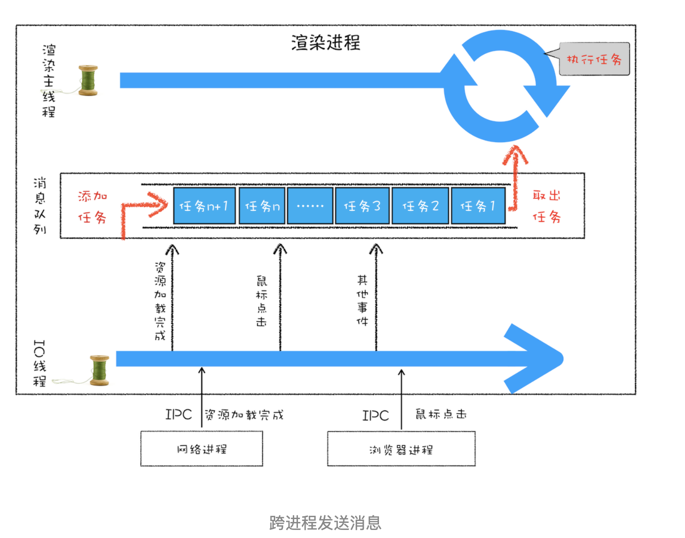

# 浏览器的事件循环

## 现代浏览器

现代浏览器采用多进程和多线程的架构。相比于早期的浏览器，现代浏览器在架构上进行了优化。解决单进程浏览器的不稳定性、安全性、不流畅性、性能瓶颈等问题。

## 浏览器有哪些进程和线程？

- 浏览器进程。主要负责界面显示、用户交互、子进程管理，同时提供存储等功能。
- 渲染进程。核心任务是将 HTML、CSS 和 JavaScript 转换为用户可以与之交互的网页，排版引擎 Blink 和 JavaScript 引擎 V8 都是运行在该进程中，默认情况下，Chrome 会为每个 Tab 标签创建一个渲染进程。出于安全考虑，渲染进程都是运行在沙箱模式下。
- GPU 进程。其实，Chrome 刚开始发布的时候是没有 GPU 进程的。而 GPU 的使用初衷是为了实现 3D CSS 的效果，只是随后网页、Chrome 的 UI 界面都选择采用 GPU 来绘制，- 这使得 GPU 成为浏览器普遍的需求。最后，Chrome 在其多进程架构上也引入了 GPU 进程。
- 网络进程。主要负责页面的网络资源加载，之前是作为一个模块运行在浏览器进程里面的，直至最近才独立出来，成为一个单独的进程。
- 插件进程。主要是负责插件的运行，因插件易崩溃，所以需要通过插件进程来隔离，以保证插件进程崩溃不会对浏览器和页面造成影响

事件循环发生在渲染进程的主线程上，负责协调和管理宏任务和微任务的执行顺序。

## 渲染主线程和事件循环

渲染主线程是浏览器中最繁忙与核心的线程，需要它处理很多任务，比如解析 HTML、构建 DOM 树、解析 CSS、计算样式、布局和绘制、执行 JS 代码、执行事件回调函数等。

在面临如此繁重的工作量时，主线程需要处理如何协调这些任务，保证主线程不阻塞、不卡顿。如果采用多线程，主线程需要处理多个线程之间的协调，而事件循环就是为了解决这个问题。

而为什么说 JS 是单线程的？因为 JS 是⼀⻔单线程的语⾔，这是因为它运⾏在浏览器的渲染主线程中，⽽渲染主线程只有⼀个。
⽽渲染主线程承担着诸多的⼯作，渲染⻚⾯、执⾏ JS 都在其中运⾏。
如果使⽤同步的⽅式，就极有可能导致主线程产⽣阻塞，从⽽导致消息队列中的很多其他任务⽆法得到执⾏。这样⼀来，⼀⽅⾯会导致繁忙的主线程⽩⽩的消耗时间，另⼀⽅⾯导致⻚⾯⽆法及时更新，给⽤户造成卡死现象。
所以浏览器采⽤异步的⽅式来避免。具体做法是当某些任务发⽣时，⽐如计时器、⽹络、事件监听，主线程将任务交给其他线程去处理，⾃身⽴即结束任务的执⾏，转⽽执⾏后续代码。当其他线程完成时，将事先传递的回调函数包装成任务，加⼊到消息队列的末尾排队，等待主线程调度执⾏。
在这种异步模式下，浏览器永不阻塞，从⽽最⼤限度的保证了单线程的流畅运⾏。

事件循环是 JS 异步的实现原理，事件循环的流程如下：

1. 在最开始的时候，渲染主线程会进⼊⼀个⽆限循环；
2. 每⼀次循环会检查消息队列中是否有任务存在。如果有，就取出第⼀个任务执⾏，执⾏完⼀个后进⼊下⼀次循环；如果没有，则进⼊休眠状态；
3. 其他所有线程（包括其他进程的线程）可以随时向消息队列添加任务。新任务会加到消息队列的末尾。在添加新任务时，如果主线程是休眠状态，则会将其唤醒以继续循环拿取任务。

事件循环中任务有优先级吗？

任务没有优先级，只有先进先出。

但是消息队列是有优先级的，浏览器会优先处理高优先级的消息。

- 每个任务都有⼀个任务类型，同⼀个类型的任务必须在⼀个队列，不同类型的任务可以分属于不同的队列；
- 在⼀次事件循环中，浏览器可以根据实际情况从不同的队列中取出任务执⾏；
- 浏览器必须准备好⼀个微队列，微队列中的任务优先所有其他任务执⾏。

## 总结

事件循环又叫做消息循环，是浏览器渲染主线程和消息队列的交互过程。

在 Chrome 的源码中，它开启⼀个不会结束的 for 循环，每次循环从消息队列中取出第⼀个任务执⾏，⽽其他线程只需要在合适的时候将任务加⼊到队列末尾即可。
过去把消息队列简单分为宏队列和微队列，这种说法⽬前已⽆法满⾜复杂的浏览器环境，取⽽代之的是⼀种更加灵活多变的处理⽅式。
根据 W3C 官⽅的解释，每个任务有不同的类型，同类型的任务必须在同⼀个队列，不同的任务可以属于不同的队列。不同任务队列有不同的优先级，在⼀次事件循环中，由浏览器⾃⾏决定取哪⼀个队列的任务。但浏览器必须有⼀个微队列，微队列的任务⼀定具有最⾼的优先级，必须优先调度执⾏。
