## 前言

通常，我们编写好 HTML、CSS、JavaScript 等文件，经过浏览器就会显示出漂亮的页面（如下图所示），但是它们是如何转化成页面的？

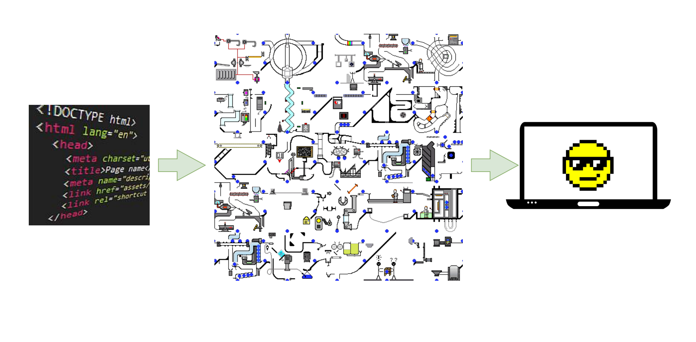

从图中可以看出，左边输入的是 HTML、CSS、JavaScript 数据，这些数据经过中间渲染模块的处理，最终输出为屏幕上的像素。

## 渲染模块

渲染模块可以从两方面来理解，一是渲染的时间点，二是渲染的流水线。

### 渲染的时间点

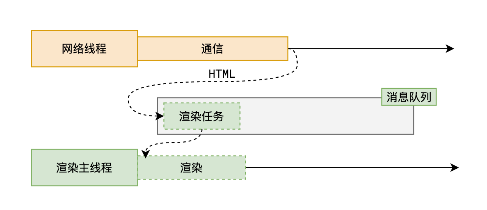

可以看到从拿到 HTML 文件开始，到页面显示完成，中间经历了多个渲染阶段。

### 渲染的流水线

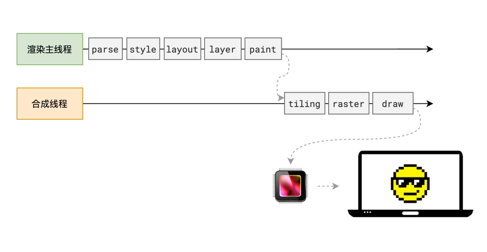

下面分别介绍渲染的各个阶段。

#### 解析 HTML

在得到 HTML 文件后，渲染引擎会解析 HTML 文件，生成浏览器可以理解的 DOM 树。

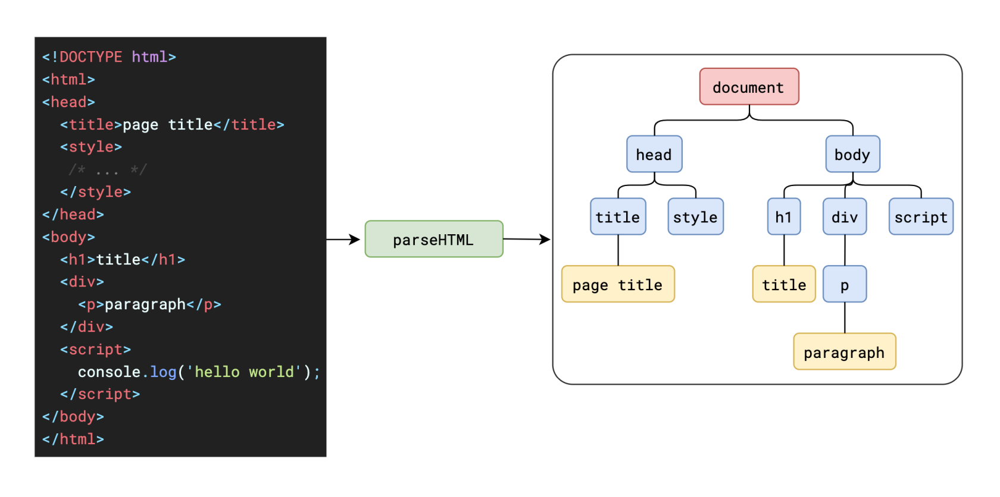

HTML 解析过程中遇到 CSS 代码时，为了提⾼解析效率，浏览器会启动⼀个预解析器率先下载和解析 CSS 文件：

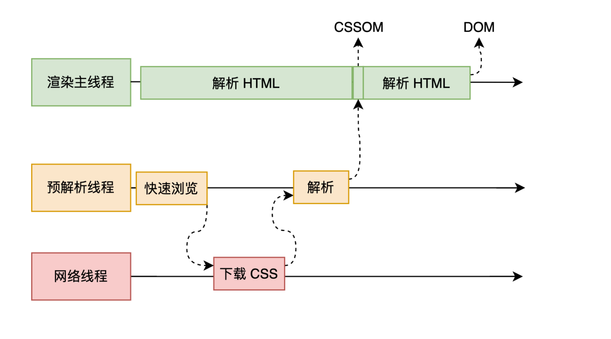

CSS 的下载和解析是异步的，不会阻塞 HTML 的解析。

HTML 解析过程中遇到 JS 代码时，会暂停 HTML 的解析，先执行 JS 代码。如果 JS 需要下载，会等待下载执⾏完后才能继续 HTML 的解析，预解析线程可以分担⼀点下载 JS 的任务。

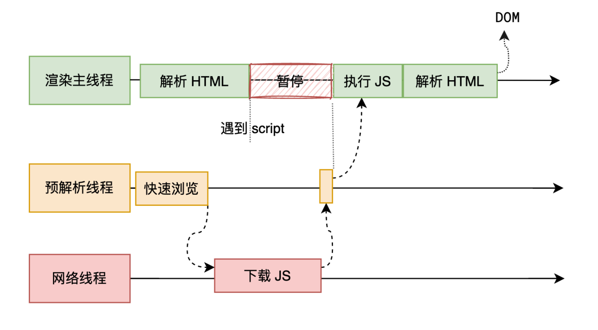

但是 JS 如果使用 defer 属性，会等到 HTML 解析完成后执行 JS 代码；如果使用 async 属性，会异步下载 JS 代码，不会阻塞 HTML 的解析，下载完成后立即执行 JS 代码。

#### 解析 CSS

在解析 HTML 的同时，渲染引擎会解析 CSS 文件，生成浏览器可以理解的样式规则，解析 HTML 和 CSS 是并行进行的。

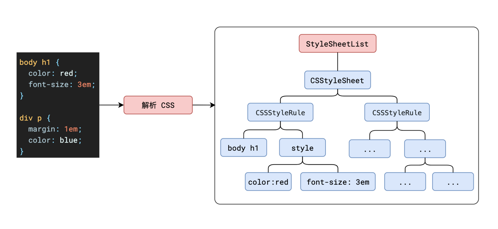

CSS 样式来源有三种：link 标签引入的 CSS、style 标签引入的 CSS 和行内样式。

1. link 标签引入的 CSS 会阻塞渲染，直到 CSSOM 构建完成。
2. style 标签引入的 CSS 和行内样式不会阻塞渲染，但是会阻塞 JavaScript 的执行。
3. CSS 解析是自上而下的，所以 CSS 规则的顺序非常重要。
4. CSS 选择器越具体，优先级越高。
5. CSS 属性优先级：行内样式 > 内部样式 > 外部样式。
6. CSS 权重计算：!important 优先级最高，行内样式权重为 10000，行内样式权重为 1000，id 选择器权重为 100，类（伪类）选择器权重为 10，标签（伪元素）选择器权重 1，属性选择器权重为 0.1。
7. CSS 继承：继承的属性权重为 0，非继承的属性权重为 1。

#### 样式计算 - Recalculate Style

解析完 HTML 和 CSS 后，渲染引擎会根据 CSSOM 计算出 DOM 节点的样式。

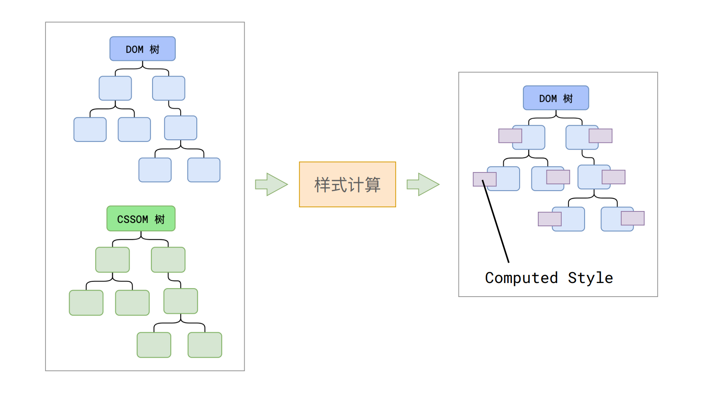

这个过程会做一些单位换算，比如 px 转成 pt、百分比转成绝对值等， CSS 样式规则按照优先级、选择器类型、权重计算出最终的样式值，而没有值的属性，如果可以继承，则从父节点继承；如果不能继承，则使用默认值。

#### 布局 - Layout

DOM 节点有了样式，但是位置信息（宽、高）还没有确定，所以渲染引擎会进入布局阶段。

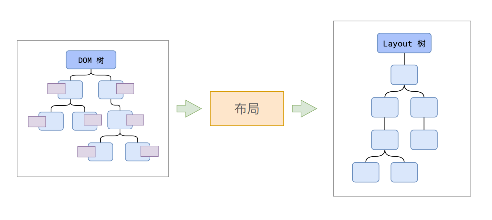

这个过程会自上而下遍历 DOM 树，计算出每个节点在屏幕上的确切位置和大小。对于可视区外的 DOM 节点，会跳过布局阶段。会为伪元素生成内容，比如 :before 和 :after。所以布局树与 DOM 树不⼀定是⼀⼀对应的。

#### 分层 - Layer

布局阶段结束后，渲染引擎会进入分层阶段。

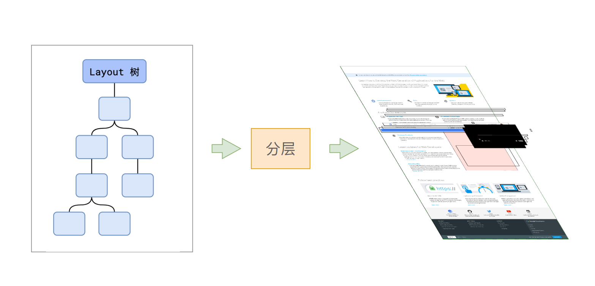

分层的作用是：如果某个 DOM 节点有层叠上下文（z-index），则会单独生成一个图层，这个图层就是该 DOM 节点的层。默认 HTML 根节点是根层，其他图层都是其子层。

层叠上下文可以通过 z-index 属性生成，也可以通过 transform、opacity 等属性生成。

#### 绘制 - Paint

绘制阶段会遍历分层后的图层，为每⼀层⽣成如何绘制的指令，然后发送给合成线程。

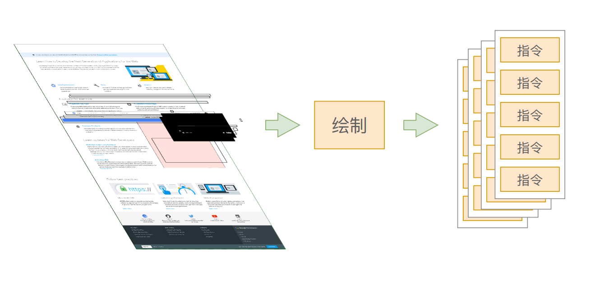

这是渲染主线程最后⼀个阶段，剩下的事情都交给合成线程处理。

#### 分块 - Tiling

合成线程会将每⼀个图层分为多个小的区域，这些区域叫做图块。

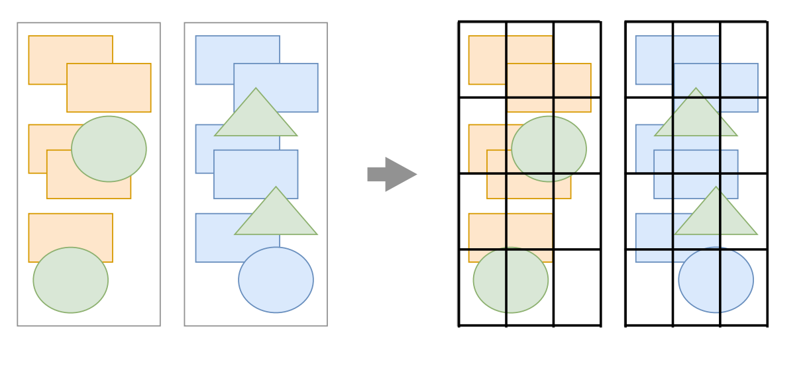

分块的作用是：如果某个 DOM 节点需要重绘，但是该节点在另一个图层中，那么这个 DOM 节点不会发送给该图层的合成线程，而是发送给根层，由根层合并后发送给合成线程。

分块的工作是交给多个线程并行执行，以提高效率。

#### 光栅化 - Raster

合成线程会将图块转换成像素，这个过程叫做光栅化。优先处理靠近视口的图块，因为用户能直接看到的内容越早生成，显示效果越好。

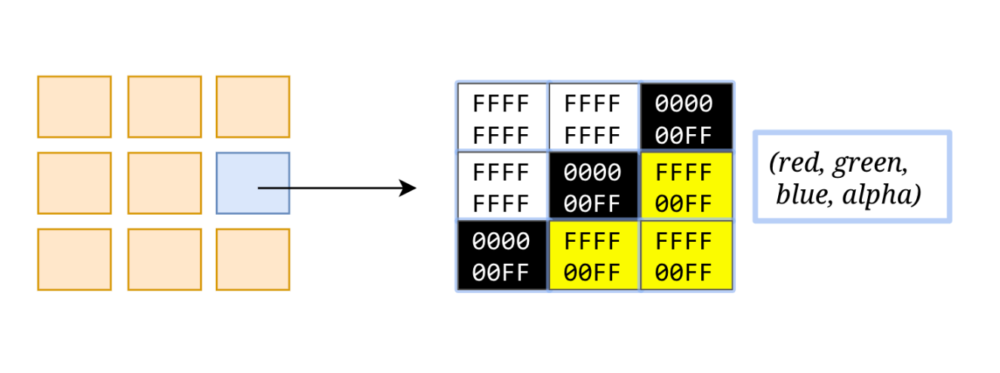

这个过程会用到 GPU 硬件加速，并且结果会缓存到 GPU 内存中，供后续步骤使用。

#### Draw

合成线程计算出每个位图在屏幕上的确切位置，然后发送给 GPU 进行绘制。

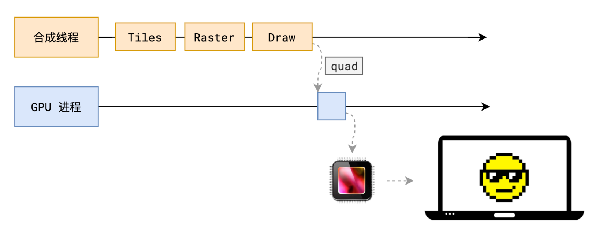

## 扩展

### 什么是 reflow ？

reflow 是指浏览器为了重新渲染部分或全部的文档，重新计算文档中的元素位置和几何尺寸的过程。

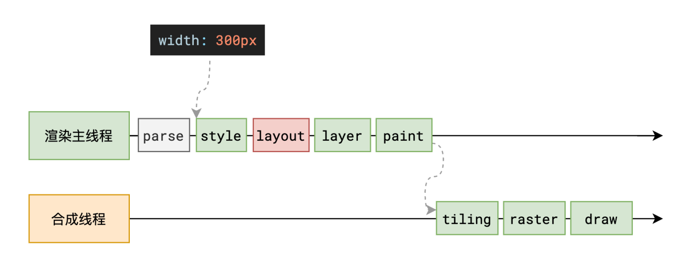

常见造成回流的场景：

1. 添加或删除可见的 DOM 元素。
2. 元素位置改变。
3. 元素尺寸改变。
4. 内容改变。
5. 浏览器窗口尺寸改变。
6. 属性改变。
7. 获取某些属性。

### 什么是 repaint ？

repaint 是指浏览器为了绘制新的一帧而重新渲染前一帧的内容，通常会导致整个文档的重新绘制，但是 reflow 会导致 repaint 的。

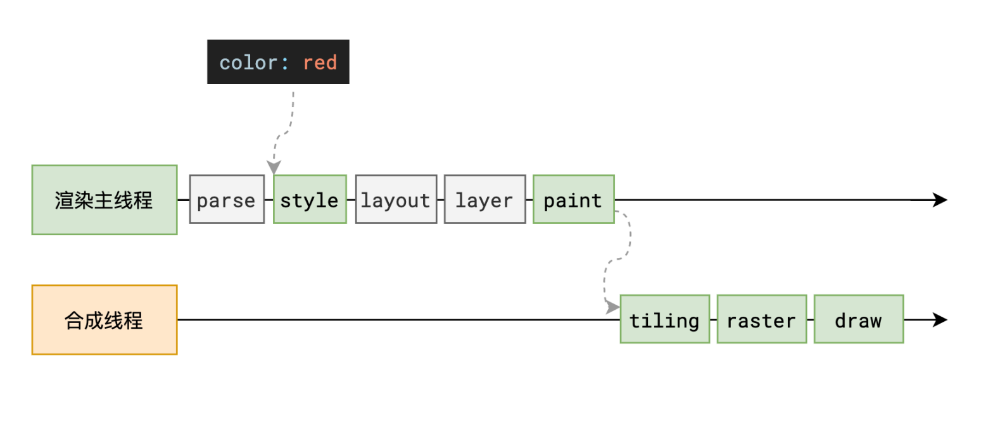

常见造成重绘的场景：

1. 颜色改变。
2. 背景图片改变。
3. 字体大小改变。
4. 字体样式改变。

### 为什么 transform 效率⾼？

transform 不会触发浏览器的重排和重绘，只会触发合成层的合成和层级的重新排序。

## 总结

渲染模块的流水线非常复杂，但是整体流程还是比较简单的。

渲染模块的流水线中，除了解析 HTML 和 CSS 外，其他阶段都是异步进行的，所以渲染引擎会尽可能快的将内容显示在屏幕上。

在网页性能优化中，我们可以从渲染模块的各个阶段入手，优化渲染的性能。比如：

1. 减少重绘和回流。
2. 减少 DOM 节点数量。
3. 合理使用 CSS 选择器。
4. 使用 CSS 动画。
5. 使用 GPU 加速。
6. 合理使用异步加载。
7. 合理使用缓存。
8. 合理使用图片格式。
9. 合理使用压缩。
10. 合理使用 CDN。
11. 合理使用预加载。
12. 合理使用懒加载。
