## 前言

对于前端开发者而言，JavaScript 的内存机制是一个不被经常提及的概念，因此很容易被忽略。

但是，JavaScript 的内存机制对于理解 JavaScript 的运行原理、性能优化以及排查问题都有着重要的意义。

## JavaScript 是什么类型语言？

每一门编程语言都具有内建的数据类型，但它们的数据类型常有不同之处，使用方式也有所差异。比如 C 语言在定义变量之前，就需要确定变量的类型：

```c
int main()
{
   int a = 1;
   char* b = " test ";
   bool c = true;
   return 0;
}
```

上述代码声明变量的特点是：在声明变量之前需要先定义变量类型。我们把这种在使用之前就需要确认其变量数据类型的称为静态语言。

相反的，我们把运行过程中才需要确认其变量数据类型的称为动态语言。JavaScript 就是一门动态语言，在声明变量之前不需要定义变量的类型。

虽然 C 语言是静态的，但是在 C 语言中，我们可以把其他类型数据赋予一个声明好的变量，比如：

```c
c = a;
```

前面代码中，我们把一个整型数据赋予了一个布尔类型变量。这段代码是合法的，因为在赋值过程中，编译器会自动把整型数据转换为布尔类型。我们通常把这种自动转换称为隐式类型转换。而支持隐式类型转换的编程语言，我们称之为弱类型语言。不支持隐式类型转换的编程语言，我们称之为强类型语言。

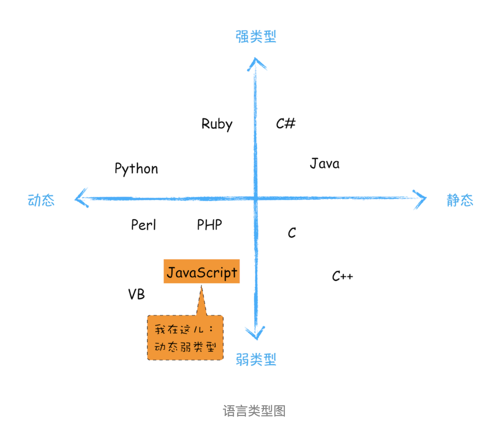

## JavaScript 的数据类型

现在我们知道 JavaScript 是一门弱类型的、动态的语言：

- 弱类型：意味着我们不需要告诉 JavaScript 引擎变量的数据类型，JavaScript 引擎会在运行过程中自动识别。
- 动态：意味着我们可以随时改变变量的数据类型。

javascrip 的数据类型一共有 8 种，分别是：

| 类型      | 描述                                                                         |
| --------- | ---------------------------------------------------------------------------- |
| Undefined | 未定义，当声明一个变量但未初始化时，该变量的默认值是 undefined。             |
| Null      | 空值，用于初始化对象，只有一个字 null。                                      |
| Boolean   | 布尔值，只有 true 和 false。                                                 |
| String    | 字符串。用于表示文本数据，不同于类 C 语言，JavaScript 的字符串是不可更改的。 |
| Number    | 数字，整数和浮点数。                                                         |
| Symbol    | 符号，一种唯一且不可修改的数据类型。                                         |
| BigInt    | 大整数，用于表示大于 2^53 - 1 的整数。                                       |
| Object    | 对象，一种复杂的数据类型，可以看作是一组属性的集合。                         |

在 JavaScript 中，如果你想要查看一个变量到底是什么类型，可以使用“typeof”运算符。不过，需要注意的是：

- 使用 typeof 运算符检测 null 会返回 object，这是 JavaScript 语言的一个设计错误，为兼容性而保留。

我们把前面 7 种称为原始数据类型，最后一种 Object 称为引用数据类型。之所以这样称呼，是因为引用数据类型在内存中存储的是地址。

## 内存空间

要理解 JavaScript 在运行过程中数据是如何存储的，首先需要了解其存储空间的种类：代码空间、栈空间和堆空间。

其中，代码空间主要存储可执行的 JavaScript 代码；栈空间主要存储运行过程中的变量和方法的临时数据；堆空间主要存储对象。下面重点先介绍栈空间和堆空间。

### 栈空间与堆空间

这里的栈空间就是我们通常所说的调用栈，是用于存储执行上下文的。为了搞清楚栈空间是如何存储代码的，先看下面代码：

```js
function foo() {
  var a = ' 极客时间 ';
  var b = a;
  var c = { name: ' 极客时间 ' };
  var d = c;
}
foo();
```

我们知道，当执行一段代码时，需要先编译并创建一个全局执行上下文，然后再按顺序执行代码，过程中遇到函数的调用也需要从代码空间里面拿到函数定义来进行编译并创建函数执行上下文，然后压入调用栈中。

所以上面示例执行到 foo 函数第 3 行时，其调用栈的状态如下图所示：

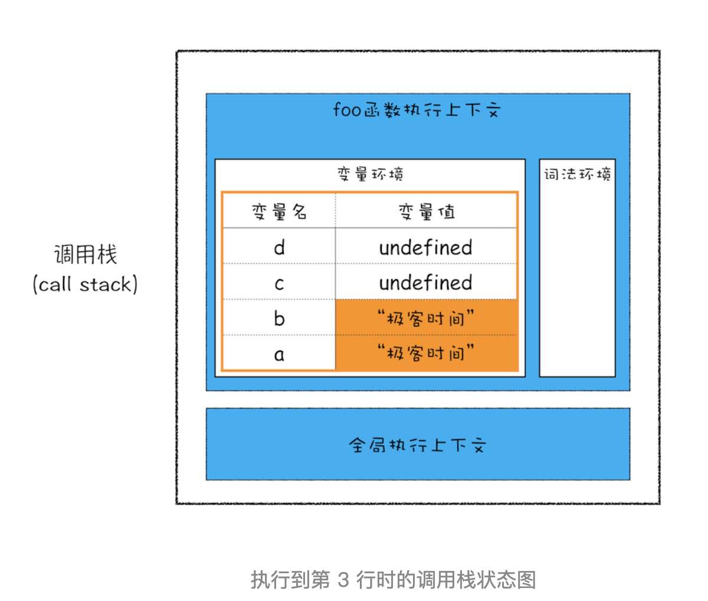

接下来继续执行第 4 行代码，由于 JavaScript 引擎判断右边的值是一个引用类型，这时候处理的情况就不一样了，JavaScript 引擎并不是直接将该对象存放到变量环境中，而是将它分配到堆空间里面，分配后该对象会有一个在“堆”中的地址，然后再将该数据的地址写进 c 的变量值，最终分配好内存的示意图如下所示：

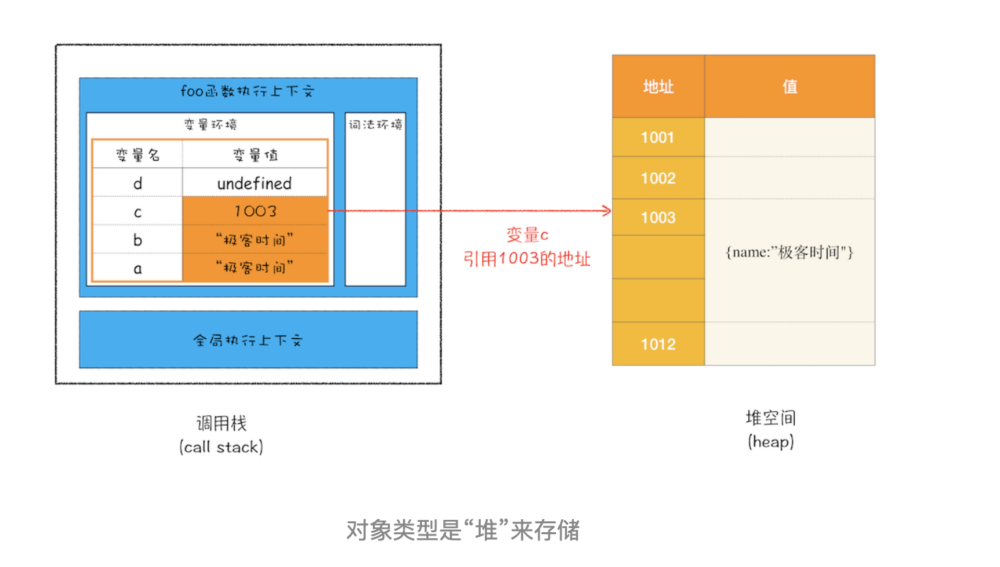

可以看到 JavaScript 需要访问该数据的时候，是通过栈中的引用地址来访问的，不过我们也许会好奇，为什么一定要分“堆”和“栈”两个存储空间呢？所有数据直接存放在“栈”中不就可以了吗？

答案是不可以的。这是因为 JavaScript 引擎需要用栈来维护程序执行期间上下文的状态，如果栈空间大了话，所有的数据都存放在栈空间里面，那么会影响到上下文切换的效率，进而又影响到整个程序的执行效率。

回到上面代码，继续执行 foo 函数的第 4 行代码，这个赋值操作是怎么执行的呢？

在 JavaScript 中，赋值操作和其他语言不一样，原始类型的赋值会完整地复制变量值，而引用类型的赋值则是复制对象的地址。

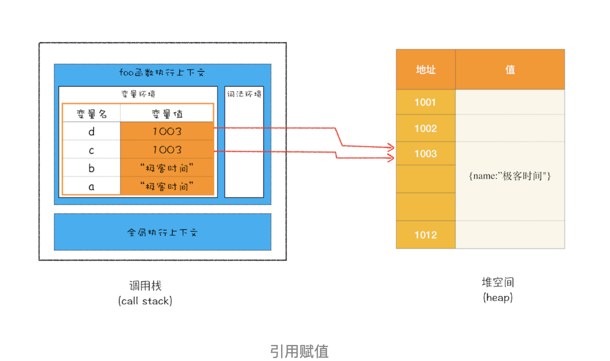

> JavaScript 中几乎都是按值传递；ES Module 中 export 导出的变量是 JavaScript 中唯一的按引用传递，这被称作 live bindings。另外 export 导出的变量是只读的，在模块外部不允许修改它的值，通常可以额外导出一个方法用来修改这个变量。

### 闭包

现在我们知道了作用域内的原始类型变量是存储在栈空间中，引用类型的变量是存储在堆空间中的。基于这两点认识，我们再来看看闭包的内存模型。

```js
function foo() {
  var myName = ' 极客时间 ';
  let test1 = 1;
  const test2 = 2;
  var innerBar = {
    setName: function (newName) {
      myName = newName;
    },
    getName: function () {
      console.log(test1);
      return myName;
    },
  };
  return innerBar;
}
var bar = foo();
bar.setName(' 极客邦 ');
bar.getName();
console.log(bar.getName());
```

当执行这段代码的时候，执行到 foo 函数的时候，由于 myNmae、test1 和 test2 是原始类型，所以会被存储在栈空间中，当 foo 函数执行完毕后，这三个变量会被从栈空间中移除。然而 myName、test1 并没有被从栈空间中移除，要解析这个现象，我们就得站在内存模型的角度来分析这段代码的执行流程。

- 当 JavaScript 引擎执行到 foo 函数时，首先会编译，并创建一个空执行上下文。
- 在编译过程中，遇到内部函数 setName，JavaScript 引擎还要对内部函数做一次快速的词法扫描，发现该内部函数引用了 foo - 函数中的 myName 变量，由于是内部函数引用了外部函数的变量，所以 JavaScript 引擎判断这是一个闭包，于是在堆空间创建换一个“closure(foo)”的对象（这是一个内部对象，JavaScript 是无法访问的），用来保存 myName 变量。
- 接着继续扫描到 getName 方法时，发现该函数内部还引用变量 test1，于是 JavaScript 引擎又将 test1 添加到“closure(foo)”对象中。这时候堆中的“closure(foo)”对象中就包含了 myName 和 test1 两个变量了。
- 由于 test2 并没有被内部函数引用，所以 test2 依然保存在调用栈中。

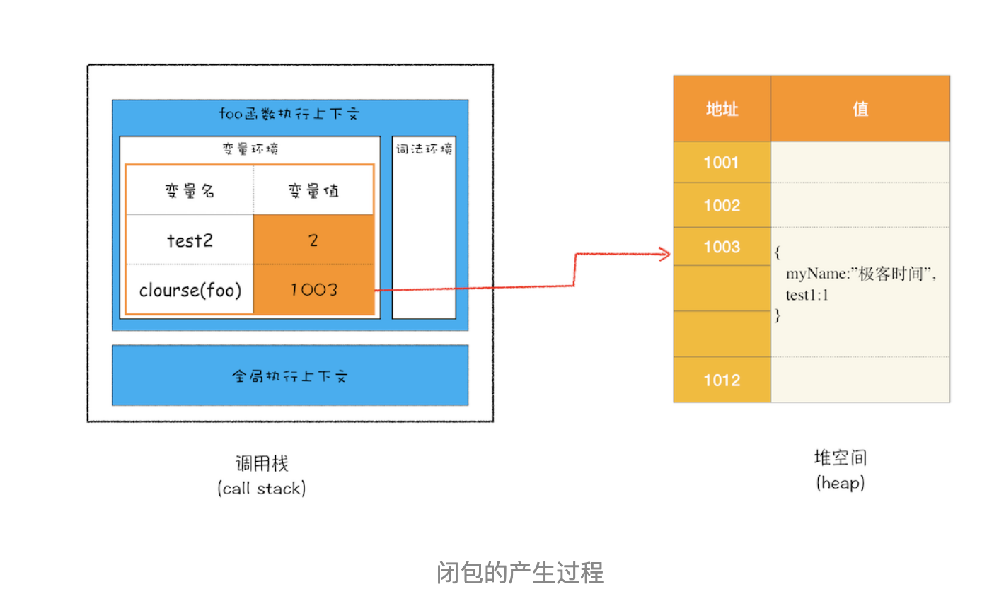

从上图你可以清晰地看出，当执行到 foo 函数时，闭包就产生了；当 foo 函数执行结束之后，返回的 getName 和 setName 方法都引用“clourse(foo)”对象，所以即使 foo 函数退出了，“clourse(foo)”依然被其内部的 getName 和 setName 方法引用。所以在下次调用 bar.setName 或者 bar.getName 时，创建的执行上下文中就包含了“clourse(foo)”。

总的来说，产生闭包的核心有两步：第一步是需要预扫描内部函数；第二步是把内部函数引用的外部变量保存到堆中。

## 垃圾回收

前面我们知道了 JavaScript 引擎在运行过程中，需要使用栈空间和堆空间来存储数据。那么当变量执行完毕后，这些数据从内存中如何被清理呢？

因为数据是存储在栈和堆两种内存空间中的，所以接下来我们分别介绍“栈中的垃圾数据”和“堆中的垃圾数据”是如何回收的。

### 调用栈中的数据是如何回收的

首先是调用栈中的数据，我们还是通过一段示例代码的执行流程来分析其回收机制，具体如下：

```js
function foo() {
  var a = 1;
  var b = { name: ' 极客邦 ' };
  function showName() {
    var c = ' 极客时间 ';
    var d = { name: ' 极客时间 ' };
  }
  showName();
}
foo();
```

当执行到第 6 行代码时，其调用栈和堆空间状态图如下所示：

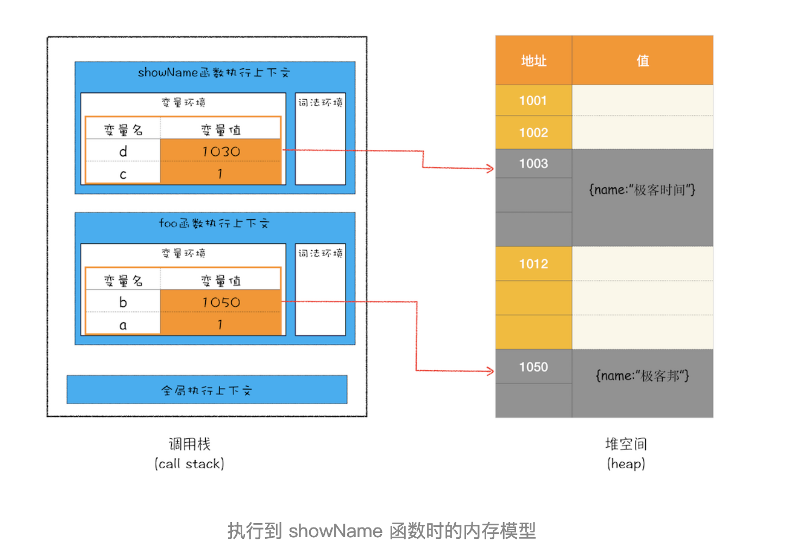

如图所示，执行到 showName 函数时，那么 JavaScript 引擎会创建 showName 函数的执行上下文，并将 showName 函数的执行上下文压入到调用栈中。其实与此同时，还有一个记录当前执行状态的指针（称为 ESP），指向调用栈中 showName 函数的执行上下文，表示当前正在执行 showName 函数。

接着，当 showName 函数执行完毕，其执行上下文出栈，ESP 指针将下移指向 foo 函数的执行上下文。这个下移操作就是销毁 showName 函数执行上下文的过程。

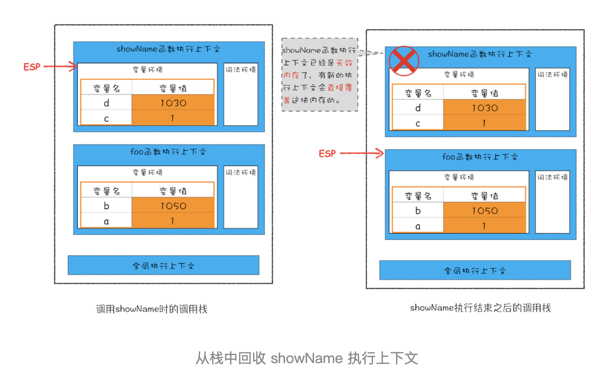

当 showName 函数执行结束之后，ESP 向下移动到 foo 函数的执行上下文中，上面 showName 的执行上下文虽然保存在栈内存中，但是已经是无效内存了。比如当 foo 函数再次调用另外一个函数时，这块内容会被直接覆盖掉，用来存放另外一个函数的执行上下文。所以说，当一个函数执行结束之后，JavaScript 引擎会通过向下移动 ESP 来销毁该函数保存在栈中的执行上下文。

### 堆中的数据是如何回收的

通过上面的讲解，我们已经知道，当上面那段代码的 foo 函数执行结束之后，ESP 应该是指向全局执行上下文的，那这样的话，showName 函数和 foo 函数的执行上下文就处于无效状态了，不过保存在堆中的两个对象依然占用着空间，如下图所示：

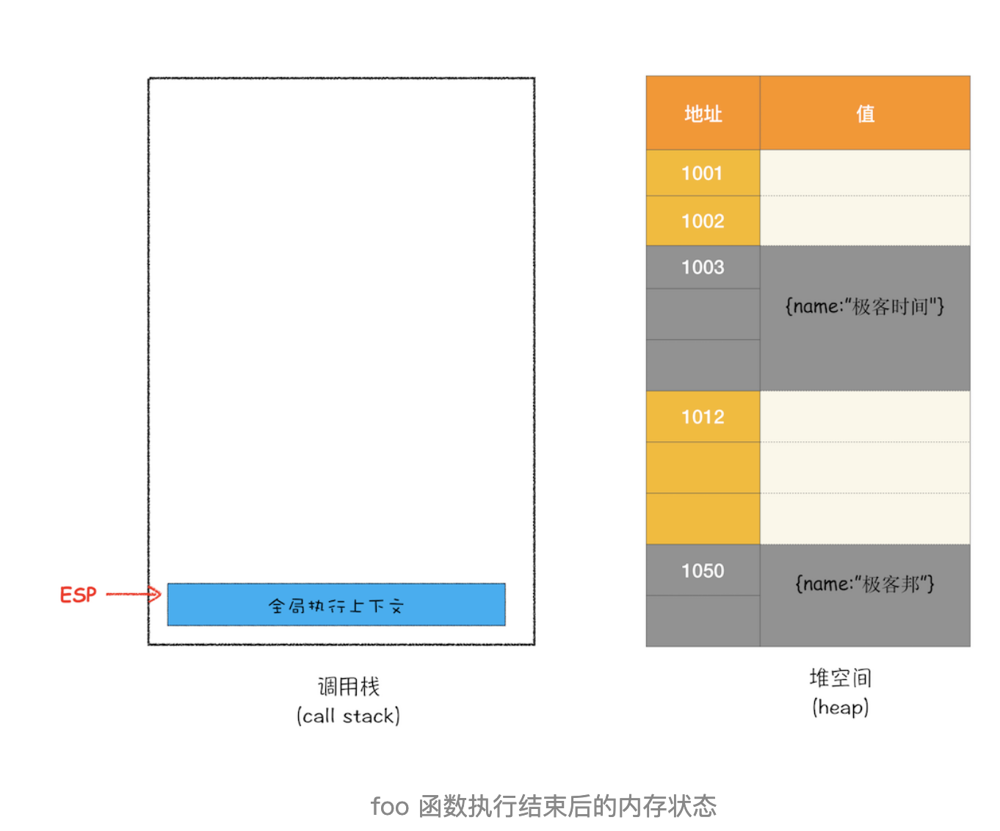

可以看到，1003 和 1050 这两块内存依然被占用。要回收堆中的垃圾数据，就需要用到 JavaScript 中的垃圾回收器了。

所以，接下来我们就来通过 Chrome 的 JavaScript 引擎 V8 来分析下堆中的垃圾数据是如何回收的。

### 代际假说和分代收集

在正式介绍 V8 是如何实现回收之前，我们需要先了解下代际假说（The Generational Hypothesis）的内容，这是垃圾回收领域中一个重要的术语，后续垃圾回收的策略都是建立在该假说的基础之上的，所以很是重要。

代际假说有如下两个观点：

- 大多数对象在创建后很快就会变得不可用。
- 不死的对象，会活得更久。

其实这两个特点不仅仅适用于 JavaScript，同样适用于大多数的动态语言，如 Java、Python 等。

通常，垃圾回收算法有很多种，但是并没有哪一种能胜任所有的场景，你需要权衡各种场景，根据对象的生存周期的不同而使用不同的算法，以便达到最好的效果。

所以，在 V8 中会把堆分为新生代和老生代两个区域，新生代中存放的是生存时间短的对象，老生代中存放的生存时间久的对象。

新生区通常只支持 1 ～ 8M 的容量，而老生区支持的容量就大很多了。对于这两块区域，V8 分别使用两个不同的垃圾回收器，以便更高效地实施垃圾回收。

- 副垃圾回收器，主要负责新生代的垃圾回收。
- 主垃圾回收器，主要负责老生代的垃圾回收。

### GC 的工作流程

了解了 V8 把堆分为两个区域：新生代与老生代，并分别使用两个不同的垃圾回收器。其实不论是主垃圾回收器还是副垃圾回收器，其执行流程都是一样的。

1. 标记空间中活动对象和非活动对象。所谓活动对象就是还在使用的对象，非活动对象就是可以进行垃圾回收的对象；
2. 回收非活动对象所占据的内存。其实就是在所有的标记完成之后，统一清理内存中所有被标记为可回收的对象；
3. 做内存整理，一般来说，频繁回收对象后，内存中就会存在大量不连续空间，我们把这些不连续的内存空间称为内存碎片。当内存中出现了大量的内存碎片之后，如果需要分配较大连续内存的时候，就有可能出现内存不足的情况。所以最后一步需要整理这些内存碎片，但这步其实是可选的，因为有的垃圾回收器不会产生内存碎片，比如接下来我们要介绍的副垃圾回收器。

### 副垃圾回收器

副垃圾回收器主要负责新生代的垃圾回收。通常情况下，大多数小的对象都会被分配在新生代的内存空间中，所以副垃圾回收器会频繁地执行垃圾回收操作。

新生代中用 Scavenge 算法来处理。所谓 Scavenge 算法，是把新生代空间对半划分为两个区域，一半是对象区域，一半是空闲区域，如下图所示：

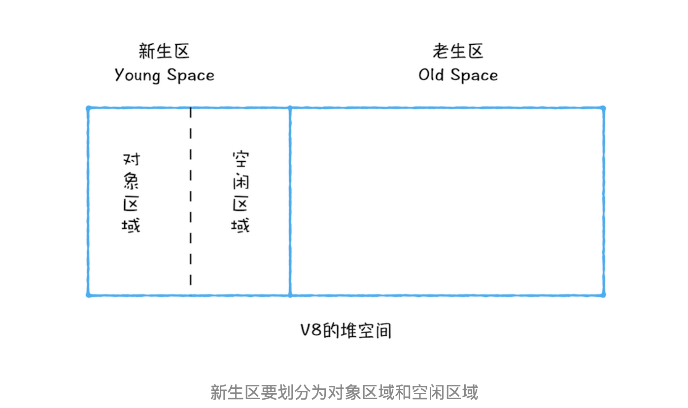

新加入的对象都会存放到对象区域，当对象区域快被写满时，就需要执行一次垃圾清理操作。

在垃圾回收过程中，首先要对对象区域中的垃圾做标记；标记完成之后，就进入垃圾清理阶段，副垃圾回收器会把这些存活的对象复制到空闲区域中，同时它还会把这些对象有序地排列起来，所以这个复制过程，也就相当于完成了内存整理操作，复制后空闲区域就没有内存碎片了。

完成复制后，对象区域与空闲区域进行角色翻转，也就是原来的对象区域变成空闲区域，原来的空闲区域变成了对象区域。这样就完成了垃圾对象的回收操作，同时这种角色翻转的操作还能让新生代中的这两块区域无限重复使用下去。

由于新生代中采用的 Scavenge 算法，所以每次执行清理操作时，都需要将存活的对象从对象区域复制到空闲区域。但复制操作需要时间成本，如果新生区空间设置得太大了，那么每次清理的时间就会过久，所以为了执行效率，一般新生区的空间会被设置得比较小。

也正是因为新生代空间小，所以很容易被存活的对象填满，为了解决这个问题，V8 引入了对象晋升策略，也就是记得一定次数垃圾回收依然存活的对象，就会被直接转移到老生代中。

### 主垃圾回收器

主垃圾回收器主要负责老生代的垃圾回收，这里除了新生区晋升的对象，还有一些大的对象会直接被分配到老生区。因此老生区中的对象有两个特点：一是这些对象比较大，复制成本很高；二是这些对象存活时间较长。

也由于老生区的对象比较大，若要在老生区使用 Scavenger 算法，那么每次清理操作的时间成本就很高了。所以老生区的垃圾回收通常会采用 Mark-Sweep（标记-清除） 和 Mark-Compact（标记-整理） 两种策略。

- 标记-清除策略：标记阶段从一组根对象开始，递归遍历整个堆中所有的对象，把能达到的对象标记为存活状态，没有到达的元素就可以判断为垃圾数据。清除阶段再扫描堆中的全部对象，清除所有未标记的对象。

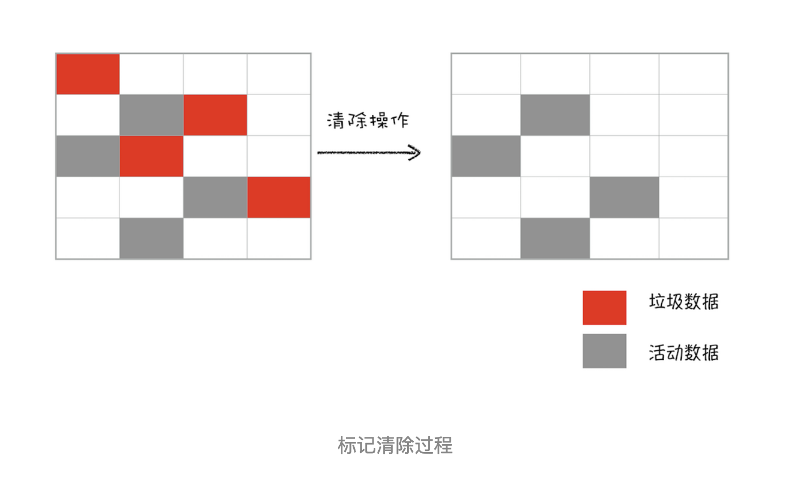

- 标记-整理策略：在对一块内存多次执行标记 - 清除算法后，会产生大量不连续的内存碎片。而碎片过多会导致大对象无法分配到足够的连续内存，于是产生了另外一种算法——标记 - 整理（Mark-Compact），这个标记过程仍然与标记 - 清除算法里的是一样的，但后续步骤不是直接对可回收对象进行清理，而是让所有存活的对象都向一端移动，然后直接清理掉端边界以外的内存。

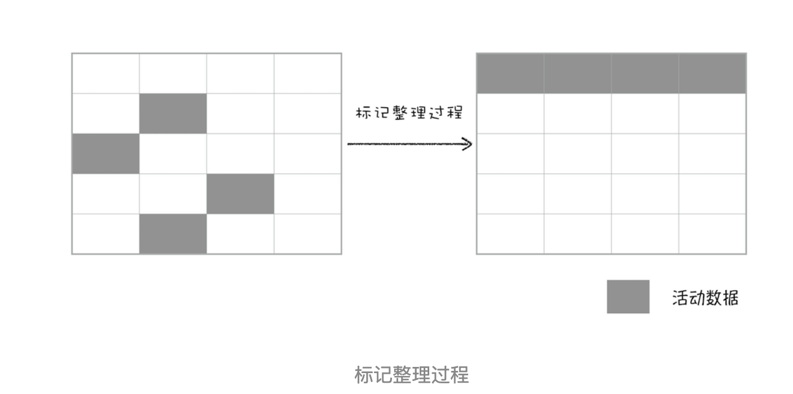

### 全停顿

前面我们介绍了 V8 垃圾回收器的两种策略，但其实这两种策略都存在一个问题：当执行垃圾回收时，需要暂停程序中所有的 JavaScript 代码。

因为垃圾回收器需要在整个堆中遍历对象，所以如果堆中包含大量对象，那么垃圾回收的时间就会很长，这就会导致浏览器出现卡顿的现象。

为了解决这个问题，V8 引入了增量标记和并发标记技术。

- 增量标记：在主垃圾回收器执行垃圾回收的过程中，副垃圾回收器会一边执行垃圾回收，一边执行 JavaScript 代码。
- 并发标记：副垃圾回收器在执行垃圾回收的同时，主垃圾回收器也在执行，这样就不会出现长时间卡顿的现象。

## V8 如何执行一段 JavaScript 代码的

前端工具与框架的自身更新速度非常快，而且还不断有新的出现。要想追赶上前端工具与框架的更新速度，我们就需要抓住那些本质的知识，然后才能更加轻松地理解与掌握那些上层应用。通过了解 V8 的执行机制，能帮助你从底层了解 JavaScript，也能帮助你深入理解语言转换器 Babel、语法检查工具 ESLint、前端框架 Vue 和 React 的一些底层实现机制。因此，了解 V8 的编译流程能让你对语言以及相关工具有更加充分的认识。

要深入理解 V8 的工作原理，我们需要搞清楚一些概念与原理，比如：编译器（Compiler）、解释器（Interpreter）、抽象语法树（Abstract Syntax Tree）、字节码（Bytecode）、即时编译器（Just-In-Time Compiler）等等。

### 编译器和解释器

之所以存在编译器和解释器，是因为计算机不能直接理解高级语言。需要我们先把高级语言翻译成计算机能读懂的机器码，这个过程就叫做编译。按语言的执行流程，可以把语言分成编译型和解释型两种。

编译型语言在程序执行之前，先会通过编译器对程序进行编译，编译后程序就不需要编译器了，而是作为可执行文件直接运行。

而解析型语言就没有编译的过程，在每次运行时都需要通过解释器对程序进行动态解释和执行，如 Python、JavaScript 等。

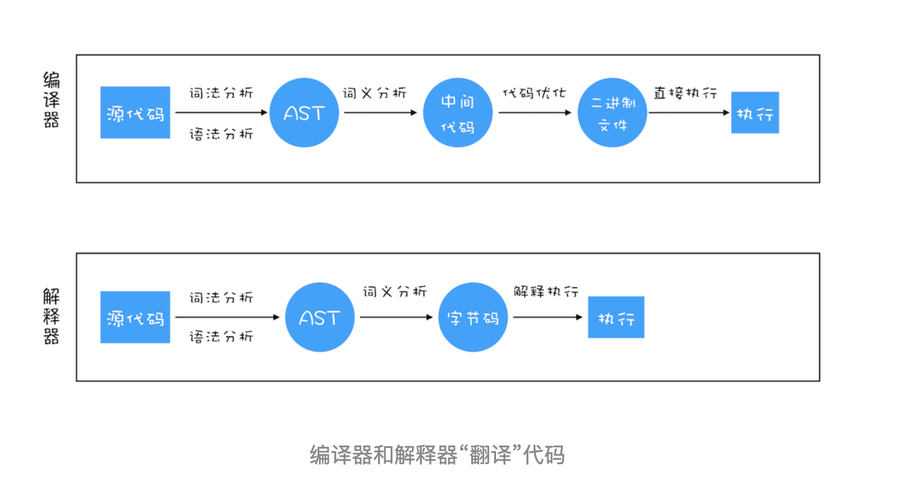

从上图可以看到这两者的执行流程，大致如下：

1. 在编译型语言的编译过程中，编译器会对源码进行词法分析、语法分析，生成抽象语法树（AST），然后优化代码，最后生成机器码。如果编译成功，将会生成一个可执行文件。
2. 在解释型语言的解释过程中，解释器同样会对源码进行词法分析、语法分析，生成抽象语法树（AST），不过它会再基于抽象语法树生成字节码，最后再根据字节码生成机器码。如果解释成功，将会执行程序。

### V8 是如何执行一段 JavaScript 代码的

了解了编译器和解释器的执行流程，接下来我们来看下 V8 是如何执行一段 JavaScript 代码的。

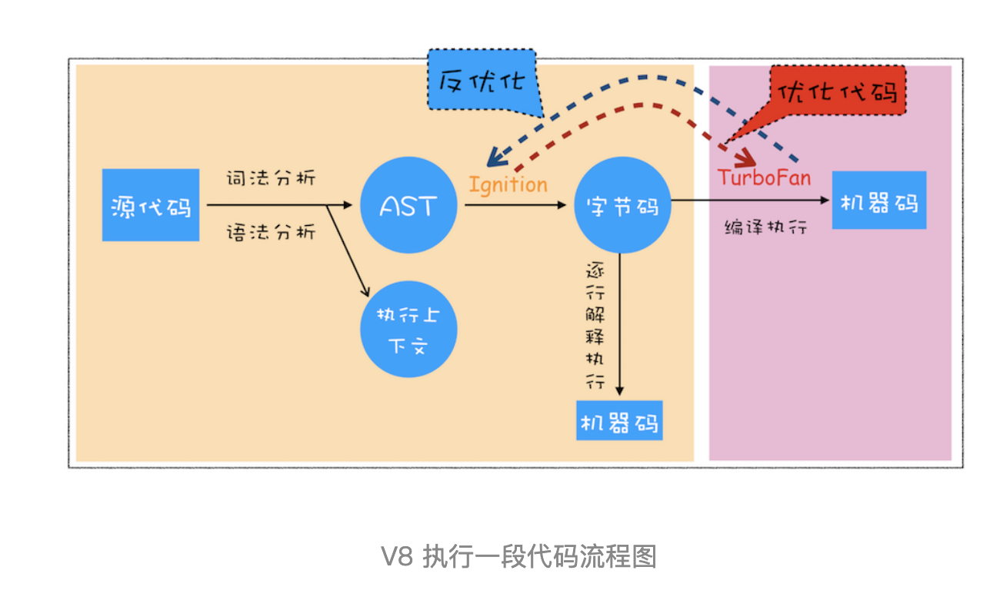

从图中可以清楚地看到，V8 在执行过程中既有解释器 Ignition，又有编译器 TurboFan，那么它们是如何配合去执行一段 JavaScript 代码的呢? 下面我们就按照上图来一一分解其执行流程。

#### 生成抽象语法树（AST）和执行上下文

首先，V8 引擎会先通过 Ignition 解释器对 JavaScript 代码进行词法分析、语法分析，生成抽象语法树（AST），并生成执行上下文。

高级语言是开发者可以理解的语言，但是让编译器或者解释器来理解就非常困难了。对于编译器或者解释器来说，它们可以理解的就是 AST 了。所以无论你使用的是解释型语言还是编译型语言，在编译过程中，它们都会生成一个 AST。这和渲染引擎将 HTML 格式文件转换为计算机可以理解的 DOM 树的情况类似。

比如下面这段代码：

```js
var myName = ' 极客时间 ';
function foo() {
  return 23;
}
myName = 'geektime';
foo();
```

这段代码经过 javascript-ast 站点处理后，生成的 AST 结构如下：

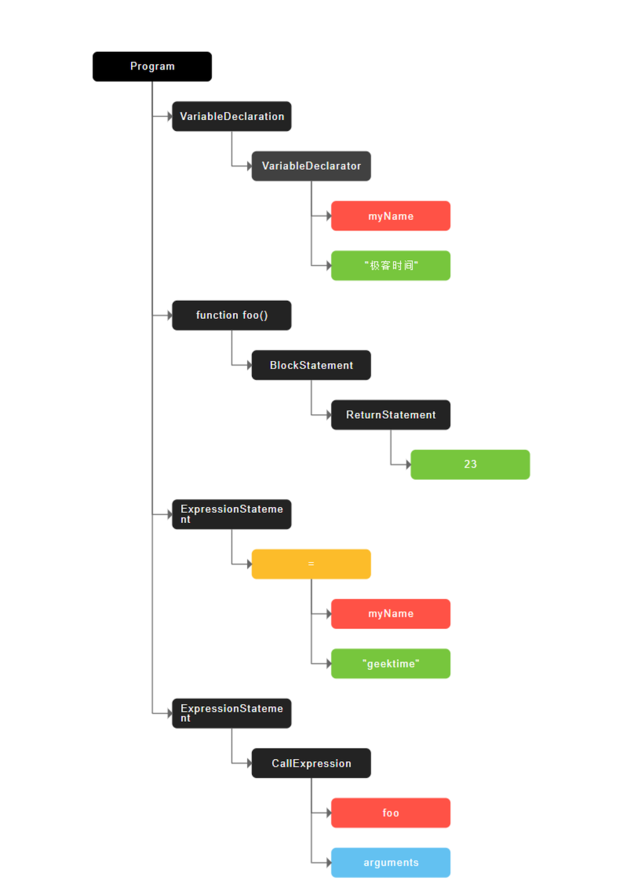

从图中可以看出，AST 的结构和代码的结构非常相似，其实你也可以把 AST 看成代码的结构化的表示，编译器或者解释器后续的工作都需要依赖于 AST，而不是源代码。

AST 是非常重要的一种数据结构，在很多项目中有着广泛的应用。其中最著名的一个项目是 Babel。通常，生成 AST 需要经过两个阶段。

- 第一阶段是分词（tokenize），又称为词法分析，其作用是将一行行的源码拆解成一个个 token。所谓 token，指的是语法上不可能再分的、最小的单个字符或字符串。
- 第二阶段是解析（parse），又称为语法分析，其作用是将上一步生成的 token 数据，根据语法规则转为 AST。如果源码符合语法规则，这一步就会顺利完成。但如果源码存在语法错误，这一步就会终止，并抛出一个“语法错误”。

这就是 AST 的生成过程，先分词，再解析。

有了 AST 后，那接下来 V8 就会生成该段代码的执行上下文。

#### 生成字节码

有了 AST 和执行上下文后，那接下来的第二步，解释器 Ignition 会根据 AST 生成字节码，并解释执行字节码。

其实一开始 V8 并没有字节码，而是直接将 AST 转换为机器码，由于执行机器码的效率是非常高效的，所以这种方式在发布后的一段时间内运行效果是非常好的。但是随着 Chrome 在手机上的广泛普及，特别是运行在 512M 内存的手机上，内存占用问题也暴露出来了，因为 V8 需要消耗大量的内存来存放转换后的机器码。为了解决内存占用问题，V8 团队大幅重构了引擎架构，引入字节码，并且抛弃了之前的编译器，最终花了将进四年的时间，实现了现在的这套架构。

字节码就是介于 AST 和机器码之间的一种代码。但是与特定类型的机器码无关，字节码需要通过解释器将其转换为机器码后才能执行。机器码所占用的空间远远超过了字节码，所以使用字节码可以减少系统的内存使用。

#### 执行程序

生成字节码之后，接下来就要进入执行阶段了。

通常，如果有一段第一次执行的字节码，解释器 Ignition 会逐条解释执行。在执行字节码的过程中，如果发现有热点代码（HotSpot），比如一段代码被重复执行多次，这种就称为热点代码，那么后台的编译器 TurboFan 就会把该段热点的字节码编译为高效的机器码，然后当再次执行这段被优化的代码时，只需要执行编译后的机器码就可以了，这样就大大提升了代码的执行效率。

字节码配合解释器和编译器是最近一段时间很火的技术，比如 Java 和 Python 的虚拟机也都是基于这种技术实现的，我们把这种技术称为**即时编译（JIT）**。具体到 V8，就是指解释器 Ignition 在解释执行字节码的同时，收集代码信息，当它发现某一部分代码变热了之后，TurboFan 编译器便闪亮登场，把热点的字节码转换为机器码，并把转换后的机器码保存起来，以备下次使用。

JIT 的工作流程如下图所示：

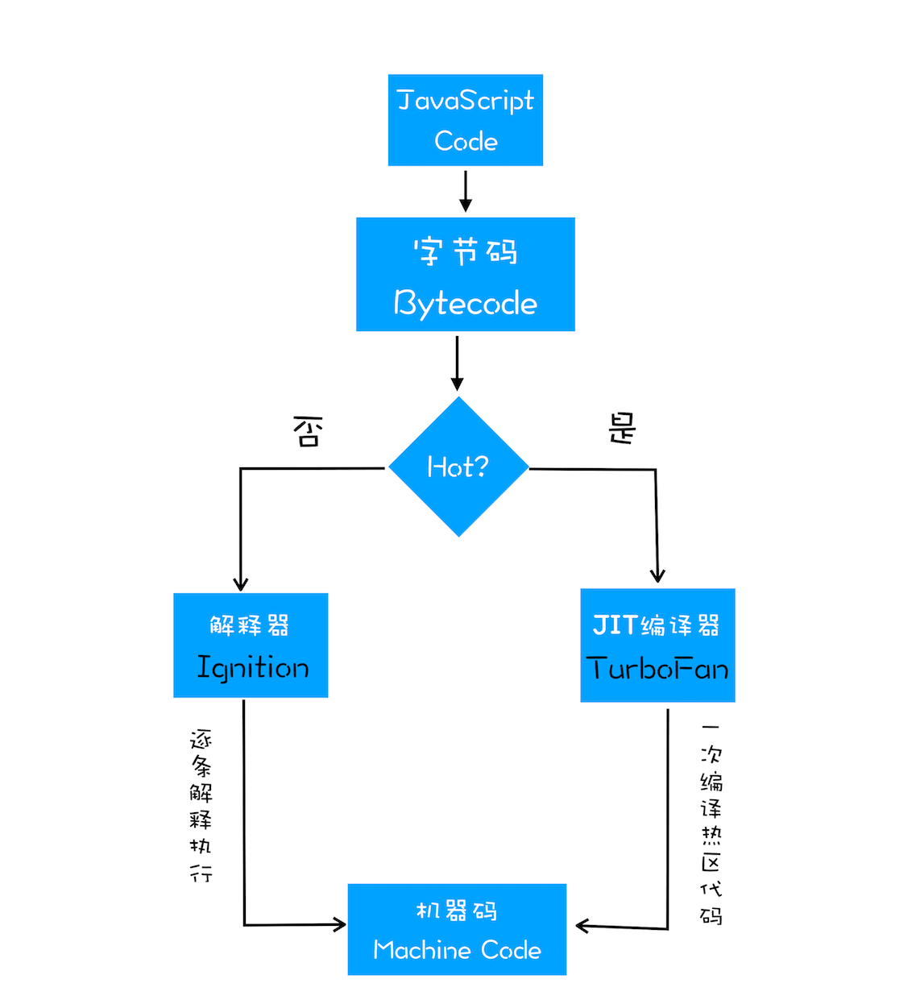

### JavaScript 的性能优化

到这里相信你现在已经了解 V8 是如何执行一段 JavaScript 代码的了。在过去几年中，JavaScript 的性能得到了大幅提升，这得益于 V8 团队对解释器和编译器的不断改进和优化。

虽然在 V8 诞生之初，也出现过一系列针对 V8 而专门优化 JavaScript 性能的方案，比如隐藏类、内联缓存等概念都是那时候提出来的。不过随着 V8 的架构调整，你越来越不需要这些微优化策略了，相反，对于优化 JavaScript 执行效率，你应该将优化的中心聚焦在单次脚本的执行时间和脚本的网络下载上，主要关注以下三点内容：

- 提升单次脚本的执行效率，避免 JavaScript 的长任务霸占主线程；
- 避免大的内联脚本，因为在解析 HTML 时，浏览器会停止渲染，等待所有脚本执行完毕，解析和编译也会占用主线程；
- 减少 JavaScript 文件的大小，因为更小体积的脚本文件意味着更快的下载速度，并且占用更低的内存。

## 总结

我们来总结下今天的内容。

首先我们介绍了编译器和解释器的区别。
紧接着又详细分析了 V8 是如何执行一段 JavaScript 代码的：V8 依据 JavaScript 代码生成 AST 和执行上下文，再基于 AST 生成字节码，然后通过解释器执行字节码，通过编译器来优化编译字节码。
基于字节码和编译器，我们又介绍了 JIT 技术。
最后我们延伸说明了下优化 JavaScript 性能的一些策略。
之所以在本专栏里讲 V8 的执行流程，是因为我觉得编译器和解释器的相关概念和理论对于程序员来说至关重要，向上能让你充分理解一些前端应用的本质，向下能打开计算机编译原理的大门。通过这些知识的学习能让你将很多模糊的概念关联起来，使其变得更加清楚，从而拓宽视野，上升到更高的层次。
